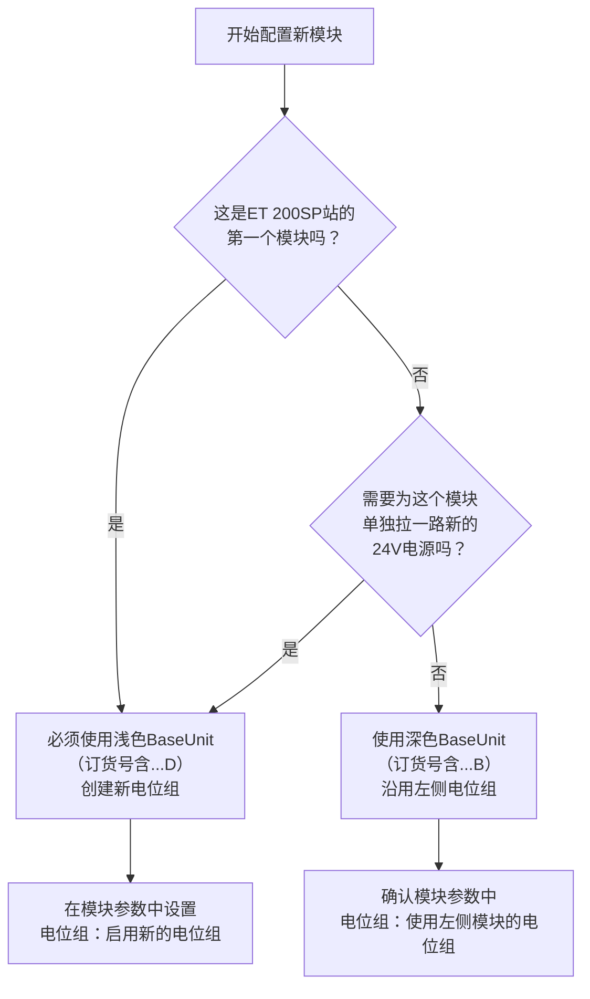

# 1.OSI模型

OSI（Open Systems Interconnection，开放系统互连）模型，是国际标准化组织（ISO）在1984年提出的一个**概念模型**。它的核心目的是：**将复杂的网络通信过程，拆解成7个相对独立、相互协作的层次**。这样做的好处是，不同的厂商可以专注于某一层的技术，只要遵循统一的标准，就能相互通信，就像乐高积木一样。

我们用一个日常的“寄快递”类比，来帮助理解这7层模型。

------

## 🌐 OSI 七层模型概览

| 层级  | 名称           | 核心作用（一句话）                                     | “寄快递”类比                                       | 常见协议/设备                |
| :---- | :------------- | :----------------------------------------------------- | :------------------------------------------------- | :--------------------------- |
| **7** | **应用层**     | 为应用软件提供网络服务接口                             | 你写的信、包裹里的物品                             | HTTP, FTP, SMTP, Telnet      |
| **6** | **表示层**     | 翻译、加密、压缩数据                                   | 把信翻译成对方懂的语言、加密或压缩文件             | JPEG, ASCII, SSL/TLS         |
| **5** | **会话层**     | 建立、管理和终止会话连接                               | 与对方约定好何时通话、如何确认身份                 | NetBIOS, RPC                 |
| **4** | **传输层**     | 提供可靠或不可靠的端到端传输，并负责分段重组、流量控制 | 挂号信（可靠） vs 平信（尽力）。分割大包裹、并编号 | TCP, UDP                     |
| **3** | **网络层**     | 寻址和路由，选择最佳路径                               | 规划包裹从北京到上海的路线，处理中转站             | IP, ICMP, 路由器             |
| **2** | **数据链路层** | 在相邻节点间可靠传输数据帧                             | 把包裹装进运输车厢，检查车厢是否破损（校验）       | 以太网, PPP, 交换机, MAC地址 |
| **1** | **物理层**     | 定义物理介质、电压、引脚、速率                         | 确定用卡车还是飞机，路面的宽度和限速               | 网线, 光纤, 无线频率, 集线器 |

------

📦 从下往上：每层详细拆解

###### 第1层：物理层（Physical Layer）

- **做什么**：最底层，负责**把数据变成可以在物理介质上传输的信号**（比特流 0/1）。它规定了线缆类型、接头形状、引脚数量、电压高低、传输速率等。
- **关键点**：只关心比特，不关心数据含义。典型问题：插上网线后灯亮不亮？信号有没有干扰？
- **设备/介质**：网线（双绞线）、同轴电缆、光纤、无线频谱；集线器、中继器。

###### 第2层：数据链路层（Data Link Layer）

- **做什么**：将物理层传来的比特流**封装成“帧”**，并提供**差错控制**和**流量控制**。它在相邻的两个节点（比如你的电脑和路由器）之间，提供可靠的数据传输。
- **关键点**：引入了**MAC地址**（物理地址），用于在同一个局域网内唯一标识设备。它能发现数据是否在传输中损坏（但一般不重传）。
- **设备**：交换机、网桥。

###### 第3层：网络层（Network Layer）

- **做什么**：负责**路由**和**逻辑寻址**。它决定从源到目的地的最佳路径，并跨越不同的网络。这一层引入的**IP地址**，是互联网能联通世界的基石。
- **关键点**：数据被封装成“包”或“数据报”。路由器工作在这一层，根据IP地址转发数据。
- **协议**：IP（IPv4/IPv6）、ICMP（ping命令用的）、ARP（IP转MAC）。

###### 第4层：传输层（Transport Layer）

- **做什么**：这是**端到端**的第一层，也是整个模型的关键。它负责**把应用层的数据分段**，交给网络层，并在接收端重组。同时提供两种服务：**可靠的TCP**和**不可靠但高效的UDP**。还处理流量控制、拥塞控制。
- **关键点**：引入**端口号**，让同一台设备上的不同应用（比如浏览器和邮件客户端）能区分自己的数据包。
- **协议**：TCP（传输控制协议）、UDP（用户数据报协议）。

###### 第5层：会话层（Session Layer）

- **做什么**：**建立、维护、终止**应用程序之间的会话。它管理对话的规则（比如谁先说话、说多久、如何恢复中断的对话）。
- **关键点**：通常与应用层紧密配合。很多实际协议（如TCP）已部分替代了它的功能，所以纯会话层协议在现代不那么显眼。
- **例子**：NetBIOS（早期Windows网络共享）、RPC（远程过程调用）。

###### 第6层：表示层（Presentation Layer）

- **做什么**：**翻译**不同系统间的数据格式。解决“同一段二进制数据，一个系统认为是整数，另一个认为是字符”的问题。它还负责**加密/解密**和**压缩/解压缩**。
- **关键点**：让你的图片（JPEG/PNG）、文本（ASCII/UTF-8）在不同设备上能正确显示。
- **例子**：SSL/TLS协议（虽然实际多位于传输层以上，但功能属于表示层）、JPEG、GIF。

###### 第7层：应用层（Application Layer）

- **做什么**：最靠近用户的一层。**为具体的应用程序提供网络服务**。它不是指应用程序本身（比如浏览器），而是应用程序用来通信的**协议**。
- **关键点**：用户能直接感受到的一层。比如发邮件、看网页、传文件。
- **协议**：HTTP（网页）、SMTP/POP3（邮件）、FTP（文件传输）、Telnet/SSH（远程登录）、DNS（域名解析）。

------

###### 🔄 数据是怎么穿过这7层的？（封装与解封装）

当你在浏览器里输入 `www.baidu.com` 并回车，数据是这样“穿行”的：

1. **发送方（你的电脑）**：
   - **应用层（7）→ 表示层（6）→ 会话层（5）**：浏览器生成一个HTTP请求。表示层可能加密（HTTPS），会话层可能建立连接。这一般被视为“上层数据”。
   - **传输层（4）**：将上层数据加上TCP头（包含源端口、目的端口、序号等），形成一个**段**。
   - **网络层（3）**：将TCP段加上IP头（包含源IP、目的IP），形成一个**包**。
   - **数据链路层（2）**：将IP包加上MAC头（包含源MAC、下一跳MAC）和尾部（校验），形成一个**帧**。
   - **物理层（1）**：将帧转化为电信号或光信号，通过网线发送出去。
   - *这个过程就像套信封：数据 = 信纸；应用层头 = 套一个“中文说明”信封；TCP头 = 再套一个“挂号信说明”；IP头 = “发往xx城市”；MAC头 = “交给某街道某号”。*
2. **接收方（百度服务器）**：
   - **物理层（1）**：收到信号，还原成比特流。
   - **数据链路层（2）**：检查MAC地址是否匹配，通过校验确认帧无错误，然后去掉MAC头尾，把里面的包交给网络层。
   - **网络层（3）**：检查IP地址是否是自己，去掉IP头，把里面的段交给传输层。
   - **传输层（4）**：根据TCP头判断属于哪个应用（端口80/443），确认数据完整后，去掉TCP头，把里面的数据交给上层。
   - **应用层（7）**：解析HTTP请求，生成响应，再沿着同样的路径返回给你的浏览器。
   - *这就是解封装：每层剥掉一个信封，直到看到真正的信纸。*

------

###### 🤝 OSI模型 vs. TCP/IP模型（实际使用的模型）

你可能会问：既然有了OSI，为什么平时我们听到更多的是TCP/IP？

- **OSI模型**：**理论上的完美模型**。7层清晰，每层概念严谨。但实现起来过于复杂，且推出时市场已被TCP/IP抢占。
- **TCP/IP模型**：**实践上的事实模型**。通常被描述为4层或5层。它将OSI的**5、6、7层合并为“应用层”**，1、2层合并为“网络接口层”。互联网实际运行的就是这个精简模型。

| OSI七层        | TCP/IP四层 (常见)       | 对应协议/概念        |
| :------------- | :---------------------- | :------------------- |
| 应用层 (7)     | **应用层**              | HTTP, FTP, SMTP, DNS |
| 表示层 (6)     | （合并入应用层）        | SSL/TLS, 编码格式    |
| 会话层 (5)     | （合并入应用层）        | NetBIOS, RPC         |
| 传输层 (4)     | **传输层**              | TCP, UDP             |
| 网络层 (3)     | **网络层 / 互联网层**   | IP, ICMP, ARP        |
| 数据链路层 (2) | **网络接口层 / 链路层** | 以太网, Wi-Fi, PPP   |
| 物理层 (1)     | （合并入网络接口层）    | 双绞线, 光纤, 无线电 |

**总结：** OSI模型是完美的教科书，帮助你**理解通信的本质**；TCP/IP模型是粗糙但有效的工具，让你**学会在实际工程中**解决问题。两者都值得掌握，但初学者可以先以OSI为骨架，再映射到TCP/IP的世界中。

# 2.为什么硬件通讯间,并联一个电阻会增加抗干扰性

硬件通讯间并联的这颗电阻，通常被称为**终端电阻**（或匹配电阻）。它增加抗干扰性的核心原理，是**通过实现“阻抗匹配”来消除“信号反射”**。

这就像在山谷里喊话，回声会干扰原声。在高速、长距离的通信线缆中，电信号也会遇到类似的“回声”问题，即**信号反射**。

###### 🔍 问题根源：信号为什么会“反射”？

这和“光从空气进入水会发生折射和反射”的原理类似。

1. **阻抗不匹配**：通信线缆本身有固定的**特性阻抗**（如RS-485/485常用120Ω）。当信号传至线缆末端，如果末端设备的输入阻抗（通常非常高，如96kΩ）与线缆特性阻抗差异巨大，就相当于信号走到了“悬崖边”。
2. **反射信号产生**：因为阻抗不匹配，一部分信号能量无法被有效接收，就会**反射回总线**，形成干扰源。
3. **干扰后果**：这些反射波会与后续信号叠加，导致**信号畸变、波形失真**，接收端可能无法正确识别数据，造成通信错误。这尤其在**长距离**（如超过200米）或**高波特率**（如超过19.2Kbps）时更为明显。

###### 🛠️ 解决方案：终端电阻如何“消除回声”？

在总线两端各并联一个阻值与**线缆特性阻抗相等**的电阻（通常是120Ω），就是让信号到达终点时，面对的阻抗是“匹配”的。

- **吸收能量**：匹配的阻抗能让信号能量被**完全吸收**，而不是被反射回去。
- **消除干扰**：没有了反射波，原始的传输信号就不会被干扰。

这个原理在**RS-485**和**CAN总线**等长距离差分通信中都是通用的。

###### 🎯 终端电阻的“附加技能”：提升抗干扰能力

除了消除自身信号反射，终端电阻还能从物理层面提升总线抗外部干扰的能力。

以CAN总线为例，它通过差分电压表示“显性”（0）和“隐性”（1）两种状态。在“隐性”状态时，总线驱动器输出高阻态，极易受外界噪声干扰。

- **增强“免疫力”**：并联的终端电阻为总线提供了一个**稳定的差分负载**。根据欧姆定律，这能有效**分流和抑制**外部耦合进来的噪声能量，使总线不那么容易被“误触发”。
- **加速状态转换**：终端电阻还能为线缆寄生电容提供**快速放电回路**，确保总线能从“显性”快速、可靠地回到“隐性”状态。

需要注意的是，终端电阻并非在所有场景下都需要。在**短距离、低速**的通信中，不加也可能正常工作，甚至加了反而可能因驱动能力不足导致通信失败。通常建议在**通信速率大于19.2Kbps**或**线路长度大于200米**时考虑添加。

# 3.电工接线中很多要求绕圈5-8圈或者说绕圈电线直径的10倍,依据是什么或者说是怎么得出来的结论

电工接线中“绕圈5-8圈”和“缠绕长度为直径10倍”的要求，主要源于**行业规范与长期实践经验的总结**，其核心目的是确保接头**牢固可靠**和**导电良好**。

###### 📜 “绕圈5-8圈”的依据

这个要求主要针对单股或多股铜芯导线的**手工铰接**（缠绕连接）。

- **核心规范来源**：要求主要源于 **《电气安装工程施工及验收规范》** 以及 **《建筑施工安装图集 电气》** 等。这些是电工领域的通用工艺标准。
- **圈数的具体规定**：虽然“5-8圈”是常见说法，但更严谨的规范常要求 **6～8圈**。对于线径较细的（0.4～0.5mm），可能要求6-8圈；线径稍粗的（0.6～1.0mm），4-6圈也可。
- **为何是这些圈数？**
  - **少于5圈**：接触面积不足，导致**接触电阻增大**，通电后易发热，存在烧毁风险；同时**机械强度不够**，接头容易松动、脱落。
  - **多于8圈**：对接头的电气性能提升有限，反而**浪费材料**，并使接头**过粗**，影响后续绝缘处理。

###### 📏 “缠绕长度为直径10倍”的依据

这个要求更多用于**大截面导线**或使用**辅助绑线**的场景。

- **等效关系**：对于线径为d的导线，紧密缠绕10圈的长度约为`10 × π × d`，远大于10d。因此“缠绕长度≥10d”是一个更**宽松、易操作的下限**，确保有足够的接触面积。
- **操作实例**：对于直径5mm以下的导线，缠绕长度约60mm；5mm以上则要求90mm，即直径的10倍以上。

###### 🎯 这些要求的共同目的

无论是绕够圈数还是保证长度，最终目的都是为了实现一个**合格的电线接头**：

- **降低接触电阻**：紧密且足够的缠绕能增大导体的有效接触面积，从而减小接触电阻，防止接头发热。
- **保证机械强度**：足够的圈数能确保接头有足够的抗拉强度，不易因外力而松脱。
- **规范化操作**：将定量的圈数和长度作为施工和验收的明确标准，避免了操作的随意性，保证了工程质量的统一。

###### 💎 总结

简单来说，“绕圈5-8圈”和“缠绕长度10倍直径”是电工行业为确保接头质量，基于规范和实践总结出的**黄金标准**。它们的目的就是确保每一个接头都**既“强壮”又“通畅”**。

> **需要注意的是**，在现代建筑电气施工中，对于**接地跨接线**等特定用途的导线，规范更推荐**短而直的路径**，以避免增加电阻或电感。但对于常规的导线手工连接，上述缠绕要求依然是核心工艺。

# 4.使用PLC的模拟量输出来控制变频器的频率,这在实际工业或者现实中有什么用处

使用PLC的模拟量输出来控制变频器频率，这在实际工业中非常普遍。其核心目的，就是**实现电机转速的连续、自动且精确调节**，以满足复杂的工艺需求。

具体来说，主要有以下几种应用：

- **实现连续的过程控制**：这是最核心的用途。PLC通过传感器（如压力、流量、温度传感器）采集当前值，与目标值比较后，通过模拟量输出实时调节变频器频率，形成闭环控制系统。典型例子就是**恒压供水**：通过检测管道压力，PLC控制变频器让水泵转速变化，无论用水量如何，都能维持水压恒定。类似应用还包括恒温控制、恒张力控制和风道恒压控制。
- **实现精确的同步与协同控制**：在多电机系统中，通过模拟量控制可以简化设计，实现多台电机转速的精准比例关系。比如，在**印刷机械**中，多个印刷单元间的物料传送必须完全同步，PLC就给每个单元的变频器发送同一个速度指令。在**纺织机械**中，收卷和放卷的转速需要按特定比例变化，以保证张力恒定。
- **满足设备的多段速或无级调速需求**：相比机械调速或手动控制，模拟量控制能提供更平滑、精准的无级变速。例如在**自动化生产线**上，可以根据工艺要求随时改变输送带速度；在**离心机、搅拌机**中，可以编写程序实现低速启动、高速运行、再平稳停车的最佳速度曲线。
- **实现节能优化运行**：很多设备（如风机、水泵）的负载特性是，流量与转速成正比，而功耗与转速的三次方成正比。通过PLC模拟量控制变频器，当只需要50%的流量时，可以把转速降到50%，理论功耗仅为原来的12.5%，**节能效果非常显著**。这正是变频驱动替代传统风门、阀门控制的主要原因之一。
- **实现远程与自动化操作**：在中央控制室，操作员可以直接在HMI（人机界面）上输入一个转速值，PLC收到指令后立即通过模拟量输出改变变频器频率。这完全替代了手动调节电位器的方式，实现了高度自动化和远程集中控制。

------

**一个典型的控制过程是这样的：**

1. **PLC输入**：读取传感器信号（如压力变送器的4-20mA信号）。
2. **PLC运算**：内部PID（比例-积分-微分）算法将实际压力与设定压力比较，计算出修正后的控制值（比如 0-100%）。
3. **PLC输出**：将这个百分比转换为模拟量信号（例如，0%对应4mA，100%对应20mA，标准的线性关系）。
4. **变频器接收**：接收模拟量信号，并根据内部参数（如20mA对应50Hz）来驱动电机旋转。

总而言之，这种控制方式能综合实现**节能降耗、工艺优化、系统简化、精度提升和自动化集成**等多重目标，是工业自动化的标准做法。除了标准的4-20mA电流信号，有时也会采用0-10V电压信号，不过4-20mA的抗干扰能力更强，更适合工业现场。

# -----------------------------------------------------------

# 5.传感器信号给到PCL这是 数字转模拟量 还是模拟量转数字

这是一个很容易混淆的概念。简单直接地回答：

**传感器信号给到PLC，这个过程是：模拟量转数字量。**

为了让你彻底搞清楚，我们需要区分一下 **输入** 和 **输出** 两个方向。你之前问的是PLC给变频器信号（输出），现在问的是传感器给PLC信号（输入），这两个方向刚好是相反的。

###### 1. 传感器 → PLC：模拟量转数字（A/D转换）

- **为什么？** 传感器测量到的物理量（温度、压力、流量、液位等）是连续变化的，比如0-10V的电压或4-20mA的电流。这就是**模拟量**。
- **但是**，PLC内部的CPU是一个数字处理器，它只能识别0和1，无法直接理解“5.3V电压”或“12.8mA电流”是什么意思。
- **所以**，PLC需要一个专门的硬件模块（**模拟量输入模块**）来完成转换。它会每隔一段极短的时间（例如1毫秒）测量一次模拟信号的大小，然后把这个数值（比如0-27648之间的一个数字）交给CPU去处理。
- **结论：** 传感器 **→** 模拟量 **→** 模拟量输入模块 **→** 数字量 **→** PLC CPU

###### 2. PLC → 变频器：数字转模拟（D/A转换）

- **为什么？** PLC的CPU计算后，内部得出的结果是一个数字（比如0-27648），代表“我要让电机转50%的转速”。
- **但是**，变频器的控制端子通常只接收模拟电压或电流信号（如0-10V或4-20mA），它看不懂这个数字。
- **所以**，PLC需要一个**模拟量输出模块**，把CPU送来的数字重新转换成连续的电压或电流信号，再发送给变频器。
- **结论：** PLC CPU **→** 数字量 **→** 模拟量输出模块 **→** 模拟量（0-10V）**→** 变频器

###### 一个简单的对比表格

| 方向     | 信号流程         | 转换过程           | 使用的PLC模块      |
| :------- | :--------------- | :----------------- | :----------------- |
| **输入** | 传感器 **→** PLC | **模数转换** (A/D) | **模拟量输入模块** |
| **输出** | PLC **→** 变频器 | **数模转换** (D/A) | **模拟量输出模块** |

###### 一句话记忆技巧

- **传感器是“感觉”世界的（模拟的），PLC是“思考”世界的（数字的）**。所以传感器告诉PLC，必须先把模拟的“感觉”翻译成数字的“语言”，这个过程就是**模拟量转数字**。

希望这个解释能帮你彻底理清这个概念！

# 6.你介绍一下PLC pid命令 和全称是什么意思

我们需要解释PLC中的PID命令，全称，以及其含义。用户问的是“PID命令”，实际上是PID控制功能块或指令。全称：Proportional-Integral-Derivative，比例-积分-微分。解释它在PLC中的作用：用于闭环控制，如温度、压力、流量等。需要通俗易懂，结合之前模拟量输入输出背景。最后可以给出简要说明。

在PLC编程中，经常提到的 **PID 命令**，其全称是 **Proportional-Integral-Derivative**，中文意为 **比例-积分-微分**。

它不是一条单一的指令，而是一个**闭环控制算法**，通常以功能块（Function Block）的形式提供给编程者调用（例如西门子的 `FB41`，三菱的 `PIDINIT` 等）。

###### 1. PID 的核心作用

**让被控制的物理量（如温度、压力、流量）尽可能快速、稳定地达到并保持在用户设定的目标值。**

想象一下你用手调节水龙头的热水温度：

- 你希望水温恒定为40℃（**目标值**）。
- 温度计显示当前水温（**实际值**）。
- 你的大脑根据误差（目标值 - 实际值）决定如何转动把手（**控制输出**）。

**PID命令就是代替你的大脑，自动计算出一个最佳的控制信号（通常是0~100%的数值），然后通过模拟量输出去驱动变频器、加热器、阀门等执行机构。**

###### 2. PID 三个字母的含义

| 字母  | 中文 | 通俗理解                 | 在控制中的作用                                               |
| :---- | :--- | :----------------------- | :----------------------------------------------------------- |
| **P** | 比例 | **“当前误差有多大”**     | 偏差越大，输出越猛。能让系统快速响应，但会产生**余差**（永远差一点达不到目标）。 |
| **I** | 积分 | **“过去误差累加有多大”** | 专门消除余差。只要没到目标，就一点点累加力量，直到完全消除偏差。但会带来**超调**（冲过头）。 |
| **D** | 微分 | **“未来误差变化趋势”**   | 预测偏差会变大还是变小。在偏差爆发前提前干预，抑制超调和震荡，提高稳定性。 |

###### 3. 一个结合你之前问题的完整例子

假设我们做一个 **恒压供水** 系统：

1. **传感器（压力变送器）** 检测当前管道压力，发出 4-20mA 信号给 PLC 的**模拟量输入模块**。 → 这是 **模拟量转数字**（A/D）。
2. **PLC 的 CPU** 运行 **PID 命令**：将“目标压力”（如0.5MPa）与“实际压力”（传感器传来的值）进行比较，计算出输出值（比如 0~100%）。
3. **PID 输出结果** 通过 **模拟量输出模块** 给到变频器，变成 4-20mA 信号。 → 这是 **数字转模拟**（D/A）。
4. **变频器** 根据收到的模拟信号改变输出频率（FWD正转），从而调节水泵转速，让压力稳定在目标值。

**整个过程的核心大脑，就是 PLC 内部的 PID 命令。**

###### 4. 为什么叫“命令”而不是“指令”

- 在 PLC 梯形图或结构化文本中，它确实以一条“命令”的形式存在（如 `PID` 或 `CONTROL`）。
- 你需要为其提供输入参数（目标值、实际值、P/I/D参数等），它执行后输出控制值。
- 现代 PLC 通常提供了**自整定**功能：你可以让 PLC 自动测试系统响应，然后自动计算出合适的 P、I、D 参数，大大简化了调试。

###### 总结

- **全称**：Proportional-Integral-Derivative
- **本质**：一种用于闭环自动控制的**算法**。
- **在PLC中**：它是一条功能强大的**命令/功能块**，用来根据传感器反馈计算输出，实现对变频器、加热器等设备的精准、自动调节。

# 7.你给我讲解一下fx3u 通过模拟量输出外接台达变频器的接线

用FX3U的模拟量输出（如4-20mA或0-10V信号）来控制台达变频器的转速，是工业现场非常标准的方案。核心是做好PLC与变频器之间的**硬件接线**和**软件参数匹配**。

下面以最常见的电压输出（0-10V）模式为例，详细说明整个过程。

###### ✍️ 第一步：准备工作与确认

1. **明确设备型号**：确认你使用的模拟量模块具体型号，如 `FX3U-4DA` (特殊功能模块，位于PLC右侧) 或 `FX3U-4DA-ADP` (适配器，位于PLC左侧)。不同型号的硬件接线端子定义略有不同，请以你的模块用户手册为准。
2. **检查变频器端子**：确认台达变频器上的模拟量输入端子，通常是 `AVI` (电压输入，0-10V) 和 `ACM` (模拟量公共端)。

###### 🔌 第二步：硬件接线 (以0-10V电压输出为例)

这是最核心的环节。原则是将PLC模块的电压输出端连接到变频器的 `AVI` 和 `ACM` 端子上。以 `FX3U-4DA` 模块为例：

- `FX3U-4DA` 的 **VI-** 或 **V-** 端子 (电压输出负极) -> 台达变频器的 **ACM** 端子。
- `FX3U-4DA` 的 **V+** 端子 (电压输出正极) -> 台达变频器的 **AVI** 端子。

| PLC侧 (FX3U-4DA模块)        | 连接方式 | 变频器侧 (台达)          | 说明                 |
| :-------------------------- | :------- | :----------------------- | :------------------- |
| **V+** (输出电压正极)       | 连接 →   | **AVI** (模拟量电压输入) | 传递0-10V控制信号    |
| **VI- / V-** (输出电压负极) | 连接 →   | **ACM** (模拟量公共端)   | 提供信号回路，需共地 |

> **关键**：此方案中，变频器的 `AVI` 和 `ACM` 就是PLC输出的负载。PLC模块**不需要**像输入模块那样将V+和I+短接，直接接V+即可。

> **Tips**：模拟量信号极易受干扰，请务必使用**2芯屏蔽双绞线**。若现场干扰严重，可在PLC模块的V+与VI-端子间并联一个 **0.1μF 至 0.47μF, 25V** 的电容来增强稳定性。建议将屏蔽层单端接地（在PLC侧接地）。

###### ⚙️ 第三步：变频器参数设置

正确的接线只是基础，必须修改台达变频器的参数，告诉它我们要用外部模拟量信号来控制。以台达VFD系列变频器为例：

1. **选择主频率来源**：将参数 `P00` (主频率输入来源设定) 设置为 `01`，表示主频率由**外部模拟信号 (AVI)** 输入控制。
2. **设定运行指令来源**：根据你的实际需求，将参数 `P01` 设置为 `00` (由数字操作器控制) 或 `01` (由外部端子控制)。如果设为 `00`，修改完参数后，需要按下面板上的 `RUN` 键来启动变频器。

###### 💻 第四步：PLC 程序编写

硬件和变频器参数都搞定后，就可以着手编写PLC程序了。这里以 `FX3U-4DA` 模块为例，演示如何将频率值转换为模拟量信号。

首先，理解信号对应关系：程序中的数字量 `0` 对应 `0V` (0Hz)，`4096` 对应 `10V` (50Hz)。变频器频率与输出模拟量、PLC数字量的线性关系表如下：

| 变频器目标频率 | 对应模拟量输出电压 | PLC 数字量值 (0-4095) |
| :------------- | :----------------- | :-------------------- |
| 0 Hz (停止)    | 0V                 | 0                     |
| 25 Hz (半速)   | 5V                 | 2048                  |
| 50 Hz (全速)   | 10V                | 4096                  |

因此，`FX3U-4DA` 模块的程序逻辑如下：

1. **硬件初始化 (BFM #0)**：在第一扫描周期，通过 `TO` 指令向缓冲区 `#0` 写入 `H0000` (十六进制)，将第1通道设置为电压输出模式 (模式0，即0-10V)。
2. **数据写入 (BFM #1)**：将目标数字量 (存储在 `D0` 中) 通过 `TO` 指令写入模块的第1通道数据缓冲区 `#1`，即可从对应端子输出稳定的模拟电压信号。

为了更精确地控制频率，可以利用PLC的浮点运算指令和定坐标指令(SCL)将目标频率(HZ)线性转换为数字量值，其换算公式为：`数字量输出 = (目标频率 / 50Hz) × 4096`。

一个简单的梯形图程序实例如下：

text

```
// 1. 初始化：设置通道1为电压输出模式 (0-10V)
[M8002]       |---[TO    H0    K0    H0000    K1]---|
//               (模块号)(BFM#)(写入值)(写入点数)

// 2. 将存储在D0中的目标数字量 (0-4095) 写入模块的通道1数据缓冲区
[    ]        |---[TO    H0    K1    D0       K1]---|
//               (模块号)(BFM#)(源地址)(写入点数)
```


把需要输出的数字量放到 `D0` 里，用 `TO` 指令写到模块的 `#1` 缓冲区，PLC就能自动输出对应的模拟信号了。

###### 💡 两种主流控制方式对比

除了上述模拟量控制，Modbus RTU通讯也是一种高精度、抗干扰的常用方式。这里将两种主流控制方式做个简单对比，方便你根据实际需求选择：

| 对比维度       | 模拟量控制 (0-10V / 4-20mA)                    | Modbus RTU 通讯控制 (RS485)                                  |
| :------------- | :--------------------------------------------- | :----------------------------------------------------------- |
| **接线方式**   | 只需连接两根模拟量信号线，简单直观             | 需连接RS485的A、B线（如SDA/SDB），注意极性，抗干扰更强       |
| **成本与特点** | 需购买模拟量输出模块，成本较高                 | 通讯板（如FX3U-485-BD）成本较低，信号无衰减，抗干扰能力强    |
| **调试侧重点** | 核心是匹配信号类型与量程                       | 核心在于PLC与变频器的通讯参数（波特率、校验位等）必须严格一致 |
| **适用场景**   | 对成本不敏感，且对速度反馈实时性要求极高的场合 | 绝大多数需要远程监控、多段速、高精度控制的现代工业场景       |

如果你现在不确定需要使用哪种控制方式，或者想了解它们更详细的优劣对比，都可以告诉我，我来帮你进一步分析～


# 8.再加一步,通过输出模拟量来通过变频器控制电机

好的，我们接着之前搭建好的硬件通路，来看看让PLC通过模拟量信号控制电机运转的最后几步：变频器参数设定和PLC程序编写。

简单来说，整个流程就是你通过PLC程序，告诉它“让电机以XX赫兹转动”，PLC把这个指令数字（0-4095）送给模拟量模块，模块将其转换成对应的电压信号（0-10V），变频器接收到这个电压信号后，就按照你的设定驱动电机以指定的频率运行了。

下面我们把每个步骤拆解一下：

###### ⚙️ 第四步：变频器参数设定（以台达VFD系列为例）

变频器出厂时，通常默认是用操作面板控制的。我们需要修改几个关键参数，让它“听”PLC的话。设定前，建议执行一次**参数重置（如`P76=09`或`00-02=9`）**，恢复到出厂状态，避免被之前的设置干扰。

| 参数号                              | 参数名称           | 设定值      | 说明                                                         |
| :---------------------------------- | :----------------- | :---------- | :----------------------------------------------------------- |
| **`P00`** (VFD-M) / `00-20` (MS300) | **主频率指令来源** | `01` 或 `2` | 设定变频器的频率由外部端子**模拟量输入（AVI）** 给定。       |
| **`P01`** (VFD-M) / `00-21` (MS300) | **运转指令来源**   | `00` 或 `1` | 这是关键一步。你可以选择 **`00`**，先用**面板上的RUN/STOP键**来控制启停，可以简化前期调试；也可以选择 **`01`** 通过**外部端子控制**，实现PLC远程启停。 |
| **`P03`** (VFD-M) / `01-00`         | **最高操作频率**   | `50.0` (Hz) | 设定电机的最高运转频率，通常设为电机铭牌上的额定频率。       |
| **`P52`** (VFD-M) / `07-00`         | **电机额定电流**   | `根据铭牌`  | **必须参考电机铭牌设定**，防止电机过载烧毁。                 |

> **注意**：不同系列的台达变频器，参数编号可能不同，例如**VFD-M**系列以`Pxx`开头，而**MS300/ME300**系列则以`00-xx`、`01-xx`等形式出现。操作时请以你手中变频器的说明书为准。

###### 💻 第五步：PLC程序编写与数字量换算

完成了硬件连接和变频器参数设定后，就可以通过程序让电机转动起来了。

###### 1. 理解核心：频率与数字量的换算

PLC程序不能直接发送“50Hz”的指令，它发送的是一个数字量。这个数字量和模拟量模块输出的电压（0-10V）成正比，而电压又和变频器的输出频率（0-50Hz）成正比。我们设定模拟量模块的输出为 **0-10V**，对应的数字量范围是 **0-4095**。

因此，换算关系很简单：**“目标数字量” = (“目标频率” / 50Hz) × 4095**。下面是几个关键点的示例：

| 目标频率 (Hz) | 模拟量输出电压 (V) | 应输出的数字量值 |
| :------------ | :----------------- | :--------------- |
| 0             | 0V                 | 0                |
| 25            | 5V                 | 2048 (约)        |
| 50            | 10V                | 4095             |

###### 2. 程序实现：两种方式，代码可复用

无论你使用哪种变频器（比如之前提到的台达VFD），或者用哪种模块（`FX3U-4DA-ADP`适配器或`FX3U-4DA`模块），其核心的PLC编程逻辑是通用的。这里以我上一轮提到的`FX3U-4DA`模块为例，给出更完整的程序示例。

**步骤1：模块初始化**
在PLC的第一个扫描周期（使用`M8002`脉冲继电器），通过`TO`指令设定模块的工作模式。

- **模块硬件位置**：最靠近PLC的第一个特殊模块编号为`0`号。
- **BFM #0设置**：向模块的缓冲区0（BFM #0）写入`H0000`，这会将所有4个通道设置为 **-10V至+10V** 的电压输出模式。如果你的模块型号不同，可以参考其手册进行配置。

**步骤2：数据输出**
将计算好的数字量值写入模块的数据缓冲区。这里我们使用**CH1通道1**为例。

- **BFM #1**：这是CH1通道的数据缓冲区，写入的数字量（0-4095）会被模块转换为对应的电压值输出。

**步骤3：应用逻辑举例**
以下是一个用梯形图实现的简单转速控制逻辑。它演示了如何使用寄存器`D0`（运行频率）和`D1`（目标数字量）来计算并输出数据：

text

```
程序初始化和数据处理逻辑示例
// ① 模块初始化 (仅在PLC上电时执行一次)
// ──[ M8002 ]────────────[ TO  K0  K0  H0000  K1 ]──
//                          (模块0, BFM#0, 写入H0000, 1点)
// 
// ② 频率到数字量的换算 (假设目标频率50Hz存储在D10中)
// ──[ 常开触点 ]─────────[ MOV  D10  D20 ]── (将需要运行的频率值存入临时寄存器)
// 
// ③ 执行线性转换: 数字量 = (D20 * 4095) / 50
// 使用浮点数运算指令可以更精确地完成这个换算，避免整数运算的误差。
// 为简化示例，暂用 'MUL', 'DDIV' 等指令示意。
// 
// ④ 输出最终数字量
// ──[ 常开触点 ]─────────[ TO  K0  K1  D30  K1 ]──
//                          (模块0, BFM#1, 输出D30中的值, 1点)
```


> **模块差异说明**：
>
> - **`FX3U-4DA`**：通常使用`TO`/`FROM`指令通过缓冲区（BFM）进行控制。
> - **`FX3U-4DA-ADP`**：控制方式更直接，通过**特殊数据寄存器（如D8260）** 来写入数据。如果ADP模块连接在第一个位置，直接将换算好的数字量值**写入D8260**，模块的通道1就会自动输出对应的模拟量。

###### 🚀 第六步：启动调试与故障排查

检查无误后，就可以通电调试了。

1. **通电检查**：确认所有接线正确，模块和变频器都已上电。
2. **程序下载**：将编写好的程序通过编程软件下载到FX3U PLC中。
3. **启动运行**：可以按下变频器面板的**RUN键**，或者在PLC程序里使能Y点来触发变频器启动。
4. **电机观察**：查看电机是否按照预设的频率（如25Hz）平稳启动和运行。
5. **在线监控**：通过软件监控PLC程序中`D0`（目标频率）和`D1`（输出数字量）的值，确保数据计算和传递正确。

如果遇到问题，可以按以下思路排查：

- **电机不转**：检查变频器上的`RUN`指示灯是否亮起。如果没亮，确认`P01`（运转指令）参数设置是否与你期望的启停方式一致。
- **电机转速不随指令变化**：检查`P00`（频率来源）参数是否已设为模拟量给定（`01`）。
- **转速抖动或异常**：通常是信号干扰或接线松动。检查屏蔽线接地是否良好，端子是否接实。
- **数值问题**：可以尝试在PLC程序里向输出通道直接写入一个固定值，比如2047（对应25Hz左右），检查变频器是否能稳定地输出约25Hz。

这三个步骤——**变频器参数设定、PLC编程、调试运行**——是环环相扣的，缺一不可。从修改变频器的几个关键参数，到编写逻辑清晰的PLC程序，再到最后的带载调试，每一步都对照着变频器和模块的说明书慢慢来，基本就能顺利实现模拟量控制电机了。

如果在编写PLC程序或换算公式时遇到具体问题，可以带上你的模块型号和变频器系列随时问我～

# 9.你需要重说,输出模拟量怎么接线,控制电机怎么接线

明白了，你希望我重新、清晰地说明**两个关键接线部分**：

1. **PLC模拟量输出模块 → 台达变频器**（信号线）
2. **台达变频器 → 三相电机**（主回路动力线）

下面分步说明，不再重复程序或参数。

------

###### 一、模拟量输出接线（PLC → 变频器）

以 **FX3U-4DA（电压输出0~10V）** 和 **台达变频器（AVI/ACM）** 为例。

| PLC侧 (FX3U-4DA模块)           | 导线       | 变频器侧 (台达VFD系列)   |
| :----------------------------- | :--------- | :----------------------- |
| **V+** (通道1电压输出正)       | 屏蔽双绞线 | **AVI** (模拟量电压输入) |
| **VI- / V-** (通道1电压输出负) | 屏蔽双绞线 | **ACM** (模拟量公共端)   |

> ✅ **注意**：
>
> - 必须使用**屏蔽双绞线**，屏蔽层在PLC侧单端接地。
> - **不要**将V+与VI-短接（那是电流输入的做法，这里是输出）。
> - 如果需要4~20mA电流输出，则接 **I+** 与 **VI-**，同时修改模块模式。

------

###### 二、变频器控制电机接线（变频器 → 电机）

这是**主回路动力线**，属于强电部分，务必断电操作。

| 变频器端子 (台达VFD) | 连接 | 电机端子 (三相异步电机) |
| :------------------- | :--- | :---------------------- |
| **U / T1**           | →    | **U** (或电机接线盒U)   |
| **V / T2**           | →    | **V** (或电机接线盒V)   |
| **W / T3**           | →    | **W** (或电机接线盒W)   |
| **PE** (接地端子)    | →    | **电机接地线** (PE)     |

> ⚠️ **关键安全提醒**：
>
> - 电机接线盒内通常有 **星形（Y）** 或 **三角形（Δ）** 接法，请根据电机铭牌和供电电压正确选择。
> - 变频器输出侧 **不能** 加装接触器或电容补偿器。
> - 电机电缆与信号电缆**必须分开走线**，保持至少20cm距离，避免干扰。

------

###### 三、如果需要远程启停（可选）

如果你希望通过PLC控制变频器**启动/停止**，需要额外接**数字量输出点**到变频器的 **MI1 / DCM** 等端子，并设置变频器参数 `P01=01`。但按你当前问题，只问“控制电机怎么接线”，上面第二部分已给出主回路接线。远程启停属于控制信号线，需要的话可以再补充。

------

这样分开说明是否更清楚？如果还需要**具体某个模块（如FX3U-4DA-ADP）或某个变频器型号（如台达MS300）** 的端子图对比，可以告诉我，我再细化。

# 10.为什么DC/DC/DC 的PLC,习惯于在输出端加一个继电器,说是可以保护plc

对于DC/DC/DC类型的PLC，在输出端加继电器（常称为“**中间继电器**”）是一个经典且有效的工程实践。这并非多此一举，而是出于多重保护与功能扩展的考量，核心作用可以总结为 **“隔离、放大、保护”**。

###### ⚡️ 核心原因：物理隔离与浪涌防护

这是最主要、最关键的保护作用。PLC的输出模块（尤其是晶体管型，DC/DC/DC类型即为此类）非常“娇贵”。

- **抵御“回马枪”**：现场很多负载是**感性负载**，如电磁阀、接触器、电机等。它们在断电瞬间会产生极高的**反向电动势（浪涌电压）**，这个瞬时高压如同“回马枪”，足以击穿脆弱的PLC输出晶体管。
- **物理“防火墙”**：中间继电器的线圈和触点在物理上是隔离的。PLC只驱动继电器的**线圈**（小电流），而负载则由继电器的**触点**控制。
- **结果**：浪涌电压被牢牢限制在继电器的触点回路中，**完全隔离在PLC之外**，从而保护了PLC输出点。即使PLC模块内部有续流二极管等保护，外加继电器仍是一道“超级加倍的保险”。

###### 🔌 核心原因：容量放大与负载驱动

PLC输出点的驱动能力通常很有限，无法直接驱动大功率设备。

- **电流/功率“放大”**：PLC输出点（特别是晶体管型）的驱动电流通常只有**0.5A**左右。而中间继电器的触点容量则大得多，可达**2A、5A甚至更高**。
- **分担重担**：通过在PLC和负载之间加入中间继电器，PLC只需驱动继电器线圈这个小电流负载，而由继电器触点去承受大电流负载的冲击。
- **结果**：有效避免了PLC输出模块因直接驱动大负载而**过载甚至烧毁**。

###### ⚠️ 特殊情况：应对感性负载的冲击

除了稳态电流，感性负载（如接触器线圈）在启动瞬间的**冲击电流**远大于其额定电流。这种瞬时大电流对PLC输出点的威胁很大。中间继电器作为缓冲，可以承受这种冲击，而不会让PLC输出点直接“受伤”。

###### 🔧 额外优势：简化设计、便利维护与成本控制

除了保护，这种做法还带来了诸多便利：

- **统一电压，简化设计**：DC/DC/DC型PLC输出均为24VDC。若现场设备电压多样（如220V AC电磁阀），通过继电器可轻松实现不同电压的控制，无需更换PLC模块。
- **隔离故障，方便维护**：若负载端发生短路等故障，只会烧毁外部的中间继电器，而不会波及PLC。更换一个外部继电器成本低廉且迅速。
- **充当“保险丝”**：中间继电器本身可视为一个易更换的“保险丝”，牺牲自己，保全价值更高的PLC。

###### 💎 总结

在DC/DC/DC型PLC的输出端加中间继电器，是一种**成本极低、收益极高**的保护措施。它通过**物理隔离**抵御致命的浪涌电压，通过**容量放大**驱动各类负载，同时**简化了系统设计，方便了后期维护**。简单来说，就是用一个小继电器为昂贵的PLC核心穿上了一层坚固的“铠甲”。

# 11.电机过载保护开关和热继电器有什么区别吗,需要同时使用吗

电机过载保护开关（通常指**电机保护断路器**）和**热继电器**虽然都是用来保护电机的，但它们在功能、原理和应用上有着本质区别。

简单来说：**电机保护断路器是功能更全面的集成型保护装置，而热继电器是专注于过载保护的控制元件。** 是否需要同时使用，取决于你选择哪种保护方案。

###### 🆚 核心区别对比

| 特点             | 电机保护断路器 (过载保护开关)                                | 热继电器                                                   |
| :--------------- | :----------------------------------------------------------- | :--------------------------------------------------------- |
| **核心功能**     | **过载保护 + 短路保护**，集两种保护于一身。                  | **仅过载保护**，对短路电流反应慢，无法起到短路保护作用。   |
| **工作原理**     | 内置**热磁脱扣器**，过载时双金属片动作，短路时电磁机构瞬时动作。 | 利用**双金属片热效应**，电流过大时发热弯曲，推动机构动作。 |
| **电路位置**     | **直接串联在主回路**中，可直接分断大电流。                   | 通常接在**控制回路**中，通过控制接触器来间接切断主回路。   |
| **能否独立使用** | **可以**，自身即可独立完成保护。                             | **不能**，必须与**接触器**配合使用。                       |
| **保护精确度**   | 更高，尤其是电子式，保护特性更准确、可靠。                   | 相对较低，受环境温度影响，动作时间有误差。                 |
| **附加功能**     | 许多产品支持**报警、通信、故障记录**等智能功能。             | 功能单一，通常只提供过载保护。                             |
| **成本与空间**   | 相对较高，但集成度高，节省柜内空间。                         | 经济实惠，体积小。                                         |

###### 🤔 需要同时使用吗？

**通常情况下，不需要同时使用。** 它们属于两种不同的保护方案，选择其一即可。

- **方案一：使用电机保护断路器**
  当你选用**电机保护断路器**时，它本身已集成了过载和短路保护功能，因此**不需要再额外安装热继电器**。这是现代电气设计中更简洁、集成度更高的方案。
- **方案二：使用热继电器**
  当你选用**热继电器**时，因为其本身无法保护短路，所以**必须**在电路中搭配**短路保护器件**（如**熔断器**或**仅有瞬动保护的断路器**）一起使用。这是传统的经典方案。

###### 💎 总结与建议

如何选择，可以参考以下几点：

1. **看项目要求与预算**：如果追求设计简洁、保护全面且预算充足，**电机保护断路器**是首选。如果项目有严格的成本控制，**热继电器+接触器+短路保护**的经典方案依然可靠。
2. **看电机重要性**：对于关键、昂贵或大功率的电机，建议选用功能更全、保护更精准的**电机保护断路器**或**智能电动机保护器**。
3. **看控制复杂度**：在需要频繁启停或与PLC等上位机通信的复杂控制柜中，集成了多种功能的**电机保护断路器**更具优势。

# 12.物联网为什么普遍用MQTT,而不是用HTTP

物联网设备普遍使用MQTT而非HTTP，根本原因在于两者设计的初衷不同：**HTTP是为传统的Web应用设计的，而MQTT是专为物联网场景量身定制的轻量级协议**。这一核心差异导致MQTT在资源受限、网络不稳定的物联网环境中具备显著优势。

两者的核心区别如下：

| 特性维度       | MQTT                                                         | HTTP                                                         |
| :------------- | :----------------------------------------------------------- | :----------------------------------------------------------- |
| **设计初衷**   | 专为低带宽、不可靠网络和资源受限设备设计                     | 为万维网（WWW）设计，面向通用Web通信                         |
| **通信模式**   | **发布/订阅（Publish/Subscribe）** 模式，支持异步、一对多通信 | **请求/响应（Request/Response）** 模式，同步、点对点通信     |
| **消息头大小** | 固定头部仅 **2字节**，非常轻量                               | 头部通常 **几百字节**，开销大                                |
| **连接方式**   | **长连接**，一次连接可维持，支持心跳检测和断线重连           | **短连接**，每次请求需重新建立，虽支持Keep-Alive但开销依然较大 |
| **消息推送**   | **支持**，服务器可主动向订阅者推送消息                       | **不支持**，客户端需通过轮询（Polling）获取新数据            |
| **消息可靠性** | 内置 **三级QoS**（Quality of Service）等级，确保消息可靠传输 | 依赖TCP，**本身无消息确认机制**，需应用层自行实现            |

下面我们来详细展开其中的关键点。

###### 📡 通信模式：异步“推送” vs 同步“拉取”

这是两者最根本的区别。

- **MQTT的发布/订阅模式**：设备（发布者）将数据发送到一个“主题”（Topic），而所有订阅了该主题的设备（订阅者）都会自动收到消息。这种模式是**异步**的，发送者和接收者无需知道对方存在，实现了设备间的**解耦**。服务器还可以主动向设备推送控制指令，实现真正的实时通信。
- **HTTP的请求/响应模式**：通信由客户端发起，向服务器请求数据或提交数据，然后等待服务器响应。这是一种**同步**模式。若想获取最新状态，客户端只能通过**轮询**（Polling）方式，即反复发送请求询问，这不仅效率低、实时性差，还浪费资源。

###### ⚖️ 资源消耗：为“小数据”与“低功耗”而生

物联网设备通常计算能力弱、内存小、依赖电池供电。MQTT的轻量级设计在此优势明显。

- **极小的网络开销**：MQTT的消息头最小仅**2字节**，而HTTP的头部通常有**几百字节**。对于传感器这类频繁发送小数据包（如几字节的温度值）的场景，MQTT能节省**80%以上**的网络流量。有测试表明，传输1000条10字节的温度数据，MQTT仅需约12KB流量，而HTTP则需要约35KB。
- **更低功耗**：更小的数据包和更少的连接次数，意味着设备无线模块的工作时间更短，从而**显著降低功耗**，这对电池供电的设备至关重要。

###### 🌐 连接与可靠性：为“不稳定网络”而生

物联网设备常处于移动或信号不佳的环境，网络连接不稳定是常态。

- **持久连接与自动重连**：MQTT建立的是**长连接**，并有心跳机制维持连接。一旦意外断开，它能**自动重连**并恢复会话。
- **消息质量保障（QoS）**：MQTT提供了三个级别的服务质量（QoS）：
  - **QoS 0**：最多一次（可能丢失）。
  - **QoS 1**：至少一次（保证到达，可能重复）。
  - **QoS 2**：恰好一次（保证到达且不重复）。
    开发者可根据数据重要性灵活选择。而HTTP协议本身并不提供类似的消息可靠性保障。

###### 🚀 可扩展性：轻松应对海量设备

在动辄上万甚至百万级设备的物联网系统中，可扩展性至关重要。

- **解耦架构**：MQTT的发布/订阅模式让发布者和订阅者相互独立，新设备的接入就像订阅一个新话题一样简单，系统扩展非常灵活。
- **高效并发**：MQTT的长连接和轻量级特性，使其能轻松处理海量设备的并发连接，而HTTP的短连接模式在设备数量激增时会给服务器带来巨大压力。

###### 💎 总结：各司其职，而非相互替代

MQTT因其轻量、高效、可靠和实时等特性，成为物联网**数据面**通信（如传感器数据上报、设备控制指令下发）的事实标准。

但这**并不意味着HTTP在物联网领域无用武之地**。HTTP在**管理面**通信上依然不可或缺，例如：

- 设备的注册、配置和固件升级等管理操作。
- 提供RESTful API，供Web应用或手机App查询设备历史数据、进行数据分析。

在实际项目中，**MQTT和HTTP往往是协同工作、各展所长的**。

# 13.博图1200 地址前百分号什么意思

在博途（TIA Portal）中，S7-1200地址前的百分号 `%` 是**IEC 61131-3 国际编程标准规定的一个必需前缀**-[-22](http://bbs.gongkong.com/d/201701/703036/703036_1.shtml)，用来**明确标识其后的内容是一个“绝对地址”**。

简单来说，`%` 的作用就是将物理地址（如 `I0.0`）与用户自定义的符号名称（如 `"启动按钮"`）清晰地区分开来[-22](http://bbs.gongkong.com/d/201701/703036/703036_1.shtml)。

###### 地址的结构

一个完整的带 `%` 的地址通常遵循以下格式-[-11](https://blog.csdn.net/Airfrozen/article/details/107008304)：
**`%` + `范围前缀` + `长度前缀` + `数字`**

各部分含义如下：

- **`%` (百分号)**：固定前缀，标识这是一个绝对地址-。
- **范围前缀**：表示变量所在的存储区域-。
  - `I` (Input)： 数字量输入过程映像区
  - `Q` (Output)： 数字量输出过程映像区
  - `M` (Memory)： 位存储区（内部标志位）
  - `DB` (Data Block)： 数据块
- **长度前缀（可选）**：指明访问的数据长度[-11](https://blog.csdn.net/Airfrozen/article/details/107008304)。
  - `X`： 位（Bit），如 `%IX0.0`
  - `B`： 字节（Byte），如 `%IB0`
  - `W`： 字（Word），如 `%IW0`
  - `D`： 双字（Double Word），如 `%ID0`
- **数字**：具体的地址编号。

###### 常见示例

| 地址示例      | 含义                                                         |
| :------------ | :----------------------------------------------------------- |
| `%I0.0`       | 输入过程映像区的第0个字节的第0位[-1](https://www.hxedu.com.cn/hxeduRes/simplecharacter/1657526688778.pdf#5#2) |
| `%Q0.1`       | 输出过程映像区的第0个字节的第1位[-1](https://www.hxedu.com.cn/hxeduRes/simplecharacter/1657526688778.pdf#5#2) |
| `%M10.2`      | 位存储区的第10个字节的第2位[-1](https://www.hxedu.com.cn/hxeduRes/simplecharacter/1657526688778.pdf#5#2) |
| `%IW2`        | 输入过程映像区的第2个字（16位）                              |
| `%QD4`        | 输出过程映像区的第4个双字（32位）                            |
| `%DB1.DBX2.3` | 数据块DB1中的第2个字节的第3位                                |

###### 重要说明

1. **自动添加**：当你直接在程序或变量表中输入 `I0.0` 时，博途软件通常会自动为你补上 `%` 前缀，将其转换为 `%I0.0`[-1](https://www.hxedu.com.cn/hxeduRes/simplecharacter/1657526688778.pdf#5#2)[-28](https://www.plctalk.net/forums/threads/tia-portal-operand.94525/#post-636737)。因此，你常常无法手动“去掉”它-[-22](http://bbs.gongkong.com/d/201701/703036/703036_1.shtml)。
2. **无法移除的原因**：这个 `%` 是软件遵循国际标准（IEC 61131-3）的体现，无法在软件设置中彻底移除-。它对于编译器正确识别和解析物理地址至关重要。
3. **如何“避免”它**：在实际编程中，更推荐的做法是**使用符号寻址**。即为每个变量起一个有意义的符号名（如 `"电机启动"`），并在程序中使用这个符号名[-2](https://www.e-com-net.com/article/1949512106982305792.htm)。这样，你就不需要直接面对带 `%` 的物理地址，程序的可读性和可维护性也会更高-。

总而言之，地址前的 `%` 是一个符合国际标准的**强制标识符**，用于向系统和编程者明确表示这是一个绝对的物理地址。你可以在编程时输入不带 `%` 的地址，软件会自动帮你处理。

# 14.博图1200和三菱fx3u的基本单位是多少位

博图（TIA Portal）中为S7-1200 PLC分配地址时，**INT (MW) 类型的数据地址必须从偶数开始，并且下一个可用地址是 MW2，而不是 MW1**-[-1](https://blog.csdn.net/weixin_44870066/article/details/144894945)[-7](https://gdzrlj.com/article/83986.html)。

###### 📝 核心原因：地址重叠

这背后的核心原因是**地址重叠**。S7-1200的存储器是以 **8位（1个字节）** 为基本单位进行编址的-。一个`INT`类型的`MW`（字）占用**16位（2个连续的字节）**-[-1](https://blog.csdn.net/weixin_44870066/article/details/144894945)。

- **MW0** 占用了 `MB0` 和 `MB1` 这两个字节。
- 如果下一个变量使用 **MW1**，它占用的将是 `MB1` 和 `MB2`-[-1](https://blog.csdn.net/weixin_44870066/article/details/144894945)。

这样一来，`MB1`这个字节就被 **MW0** 和 **MW1** 同时使用了，造成了**地址重叠**。这会导致数据混乱，是编程中需要避免的错误[-1](https://blog.csdn.net/weixin_44870066/article/details/144894945)[-7](https://gdzrlj.com/article/83986.html)。

###### 📋 地址分配规则速查

为了避免地址重叠，S7-1200的地址分配遵循以下规则：

| 数据类型                | 名称 | 位宽 | 组成          | 地址步长  | 示例                                                         |
| :---------------------- | :--- | :--- | :------------ | :-------- | :----------------------------------------------------------- |
| **BOOL**                | 位   | 1位  | -             | 按位递增  | `M0.0`, `M0.1` ...                                           |
| **BYTE**                | 字节 | 8位  | 8个连续的位   | 递增1     | `MB0`, `MB1`, `MB2` ...                                      |
| **INT / WORD**          | 字   | 16位 | 2个连续的字节 | **递增2** | `MW0`, `MW2`, `MW4` ...-[-1](https://blog.csdn.net/weixin_44870066/article/details/144894945) |
| **DINT / DWORD / REAL** | 双字 | 32位 | 4个连续的字节 | **递增4** | `MD0`, `MD4`, `MD8` ...[-1](https://blog.csdn.net/weixin_44870066/article/details/144894945) |

简单来说，在S7-1200中，`INT`类型的`MW`地址必须以**偶数**开始（如0, 2, 4...），下一个可用地址是 **`MW2`**


###### ----------------------


三菱FX3U PLC**不是**以16位为基本编址单位，它的编址方式更为灵活。

它与西门子S7-1200的核心区别在于：**S7-1200的地址分配是“面向字节”的，而FX3U的地址分配是“面向元件”的**。

###### 📊 FX3U vs. S7-1200：编址方式对比

| 特性                  | 三菱 FX3U                                                    | 西门子 S7-1200 (博图)                          |
| :-------------------- | :----------------------------------------------------------- | :--------------------------------------------- |
| **基本编址单位**      | **位 (1-bit)** 和 **字 (16-bit)** 并存-[-19](https://blog.csdn.net/L251210269/article/details/128351690) | **字节 (8-bit)**-                              |
| **地址分配逻辑**      | 每种**软元件**（如X, Y, M, D）有独立的、从0开始的编号空间[-6](https://www.thingscloud.io/docs/basics/protocol/mitsubishi-plc-fx3u-memory.html) | 所有数据共享一个统一的、以字节为单位的存储空间 |
| **字元件(如D)的步长** | **递增1**（如`D0`后是`D1`）[-33](https://blog.csdn.net/bug7073/article/details/134047895) | **递增2**（如`MW0`后是`MW2`）                  |
| **地址重叠风险**      | **无**，每个`D`寄存器都是独立的16位空间[-33](https://blog.csdn.net/bug7073/article/details/134047895) | **有**，使用不当（如`MW0`和`MW1`）会重叠       |

###### 🔍 FX3U的地址分配规则详解

FX3U的地址之所以看起来更“简单”，是因为它采用了“软元件”的概念：

1. **独立的编号空间**：不同类型的软元件（如输入`X`、输出`Y`、辅助继电器`M`、数据寄存器`D`）拥有各自独立的编号系统[-6](https://www.thingscloud.io/docs/basics/protocol/mitsubishi-plc-fx3u-memory.html)。例如，`X0`和`D0`是两个完全不同的地址，分别代表一个输入点和数据寄存器。
2. **数据寄存器 (D) 的步长是1**：每个`D`寄存器都是一个16位的存储单元-[-33](https://blog.csdn.net/bug7073/article/details/134047895)。因此，`D0`之后的下一个寄存器就是`D1`，这与西门子`MW`地址必须间隔偶数完全不同。
3. **组合使用实现32位**：当需要存储32位数据时，FX3U会**将两个相邻的16位`D`寄存器组合使用**[-33](https://blog.csdn.net/bug7073/article/details/134047895)。例如，`D0`和`D1`组合成一个32位寄存器。为了编程清晰和避免混淆，习惯上会使用**偶数编号**的寄存器作为32位数据的首地址（如`D0`, `D2`, `D4`）[-33](https://blog.csdn.net/bug7073/article/details/134047895)。

###### 💎 总结

简单来说：

- **西门子S7-1200**的地址系统像一条连续的道路，地址（如`MB0`, `MB1`）是道路上的里程碑，每种数据按大小占用不同的“路段”。
- **三菱FX3U**的地址系统则像一栋大楼，不同的“房间”（软元件`X`, `Y`, `M`, `D`）有各自的编号。`D`寄存器这类“房间”每个都是16位大小，所以房间号是连续的（`D0`, `D1`, `D2`...）。

# 15.plc中PID调节,给我讲讲P,I,D分别代表什么意思

在PLC（尤其是西门子S7-1200）的闭环控制中，**PID** 是应用最广泛的控制算法。它就好比一个“智能调节器”，通过计算**设定值**（目标）与**实际值**（反馈）的偏差，来输出一个控制信号，让实际值无限接近目标值。

你可以把P、I、D理解为三个各司其职的“调节委员”，它们分别负责处理**现在**、**过去**和**未来**的误差：

------

###### 📈 P（Proportional，比例）—— “现在”的力度

- **核心作用**：**即时反应**。当实际值与目标值出现偏差时，P立即按照比例给出一个输出。偏差越大，输出的控制力（如阀门开度、变频器频率）就越大。
- **比喻理解**：就像用手去扶一个倾斜的杯子。杯子歪得越厉害，你扶正它的力气就越大。
- **优缺点**：响应快，能让系统快速反应；但**无法消除余差（静差）**。也就是说，单用P控制，实际值很难精确等于目标值，总会差那么一点（比如设定50℃，实际只能到48℃）。
- **参数 Kp**：Kp越大，响应越快，但过大时系统会剧烈震荡。

------

###### 🧠 I（Integral，积分） —— “过去”的积累

- **核心作用**：**消除余差**。它会不断累加过去所有时刻的微小偏差。只要系统存在偏差，积分量就会一直增大，直到把偏差彻底“吃掉”为止。
- **比喻理解**：就像杯子总会有一点点轻微渗水，你扶正后手一松它又会歪。于是你持续盯着它，不断根据过去积累的歪斜角度增加修正力，直到把它彻底扶回正中。
- **优缺点**：能将实际值精确拉到设定值（无静差）；但反应较慢，而且存在 **“积分饱和”** 风险（积分量累积过大，导致超调严重）。
- **参数 Ti（积分时间）**：Ti越小，积分作用越强，消除偏差越快，但容易引起超调和振荡。

------

###### 🔮 D（Derivative，微分） —— “未来”的预判

- **核心作用**：**预测变化趋势**。它根据偏差的变化速度（斜率）来输出修正量。如果实际值正在快速偏离目标，D会提前输出一个反向力来“刹车”，抑制过冲。
- **比喻理解**：就像开车时，你不仅看当前的偏移量，还提前看到前方有个急弯（变化趋势），于是提前减速打方向，避免冲出去。
- **优缺点**：能增强系统稳定性，抑制超调；但**对测量噪声极其敏感**。如果传感器信号有毛刺，D会放大这些噪声，导致执行器乱动。所以在实际工程中，D经常被禁用或设置得很小。
- **参数 Td（微分时间）**：Td越大，预判作用越强，但过大系统会变得敏感、不稳定。

------

###### 🔧 三者的关系与调节口诀

在S7-1200的 `PID_Compact` 指令块中，这三者是协同工作的：

| 角色          | 关注点             | 作用                       | 副作用                 |
| :------------ | :----------------- | :------------------------- | :--------------------- |
| **P（比例）** | **当前**误差       | **快**速响应，让系统动起来 | 留下残余偏差（静差）   |
| **I（积分）** | **过去**误差累积   | 彻底**准**确，消除静态偏差 | 积分饱和，引起超调     |
| **D（微分）** | **未来**误差变化率 | **稳**住系统，提前抑制过冲 | 放大高频噪声，导致震荡 |

💡 **工程调试“黄金顺序”（针对S7-1200）**：

1. **先调P**：从小到大增加Kp，直到系统开始轻微振荡，然后将Kp设为当前值的60%~70%。
2. **后加I**：逐步减小Ti（增强积分），直到消除静差，且系统振荡不明显。
3. **慎用D**：除非系统反应极慢（如大惯性温度控制），否则默认将微分作用设为 **0**（禁用）。如果要用，先从小到大加，并务必对反馈值进行**滤波**处理。

西门子TIA Portal中的 `PID_Compact` 自带**自整定（Tuning）**功能，你可以让PLC自动跑一遍“首次启动自整定”或“运行中自整定”，它会自动算出一组较优的P、I、D参数，非常方便。不过理解了它们各自的含义，你才能根据工艺效果手动微调得更好。

# 16.为什么变频器后面一般加一个滤波器

变频器后加滤波器，核心是为了解决它自身工作原理带来的“副作用”。变频器内部通过高速开关（IGBT）产生PWM（脉宽调制）电压来调节电机转速，这个过程会不可避免地产生**高次谐波、电压尖峰（dv/dt）和电磁干扰（EMI）**。滤波器就是为了抑制这些负面影响而存在的。

具体来说，主要有以下三大作用：

###### 🛡️ 保护电机与电缆

这是最直接、最重要的作用，主要体现在：

- **抑制电压尖峰（dv/dt）**：变频器输出的陡峭电压脉冲会严重损害电机绕组绝缘。滤波器能有效降低电压变化率，保护电机。
- **滤除高频谐波**：高频谐波会导致电机额外发热、振动和噪音。滤波器可滤除这些谐波，降低电机温升和运行噪音。
- **保护电缆**：高频电压尖峰和反射波会加速电缆绝缘老化。安装滤波器后，可有效缓解这一问题。

###### 🧲 保障周边设备稳定

变频器产生的谐波会通过电网传导，干扰PLC、传感器、仪表等敏感设备，可能导致其误动作甚至损坏。滤波器如同“屏障”，能有效抑制变频器产生的谐波向外部辐射，防止其对其他设备造成干扰。

###### ✅ 满足电磁兼容（EMC）标准

工业设备对电磁兼容有严格标准。在变频器输出侧加装滤波器是满足这些标准、确保系统整体兼容性的必要措施。它能显著降低设备对外部环境的电磁干扰，使系统运行更稳定可靠。

###### ⚙️ 不同类型的滤波器

根据具体需求，可以选择不同类型的输出滤波器：

- **输出电抗器**：基础的谐波抑制器件，常用于补偿长线电容效应。
- **dv/dt滤波器**：专门用于抑制电压变化率，保护电机绝缘。
- **正弦波滤波器**：效果最好，能将PWM电压波形修正为标准正弦波，提供最优保护。
- **EMI滤波器**：主要用于抑制高频电磁干扰。

因此，在变频器后面加装滤波器，是保护电机、保障系统稳定、并满足电磁兼容标准的必要措施。

# 17.步进电机中,是由一圈多少脉冲数得到的步距角,还是步距角得到的一圈多少脉冲数

步进电机中，**步距角是因，一圈所需的脉冲数是果**。

这是一个由电机物理结构决定的因果关系。步距角是步进电机的固有属性，它定义了一个脉冲能让电机转动多少角度。因此，一圈所需的脉冲数是由这个步距角计算得出的。

### ⚙️ 关系与计算

两者的核心关系由以下公式定义：

**一圈所需脉冲数 = 360° / 步距角**

- **步距角越大，每步转过的角度越大，转一圈所需的脉冲数就越少。**
- **步距角越小，每步转过的角度越小，转一圈所需的脉冲数就越多。**

举例来说：

- **步距角 1.8°**：`360° / 1.8° = 200 个脉冲/圈`。
- **步距角 0.9°**：`360° / 0.9° = 400 个脉冲/圈`。

### 💡 细分技术的影响

“细分”技术会改变这个计算结果。它通过驱动器精确控制电流，让电机能在“半步”之间停留，从而将每一步分割成更小的微步。

引入细分后，计算公式变为：

**一圈所需脉冲数 = (360° / 步距角) × 细分数**

例如，一个1.8°的步进电机：

- 不细分时，一圈需要200个脉冲。
- 设定为10细分时，一圈则需要 `200 × 10 = 2000` 个脉冲。

# 18.M0.2全称是什么 mb0.2吗 ,和mw1地址冲突吗


关于 `M0.2` 和 `MW1` 的关系，简单来说：**`M0.2` 是 `MW1` 的一部分，它们确实存在地址重叠，因此不能同时使用。**

### 📍 `M0.2` 的全称是什么？

`M0.2` 就是它的**全称**，这是一个标准的“字节.位”寻址格式。

- **`M`**：代表**位存储区**（Merker），是PLC内部的标志位区域。
- **`0`**：代表**字节地址**，即M区第0个字节（MB0）。
- **`2`**：代表**位号**，即该字节内的第2位。

所以，`M0.2` 就是指M区第0个字节的第2位。你提到的 `MB0.2` 这种写法是不正确的，应该是 `M0.2`。

### ⚠️ `M0.2` 与 `MW1` 地址冲突吗？

**是的，它们地址冲突，因为 `M0.2` 位于 `MW1` 所占据的存储空间内。**

要理解这一点，需要先弄清 `MW1` 的构成：

- **`MW1` (字)**：占用 **MB1** 和 **MB2** 两个字节。

而 `M0.2` 位于 **MB0** 这个字节内。看到这里，`M0.2` 属于 `MB0`，而 `MW1` 包含 `MB1` 和 `MB2`，它们似乎没有重叠？实际上，冲突的关键在于**字节的起始地址**。

让我们仔细看 `MW1` 包含的位：

- **`MW1`** 由 `MB1` (高8位) 和 `MB2` (低8位) 组成。
- `MB1` 包含的位是 `M1.0` 到 `M1.7`。
- `MB2` 包含的位是 `M2.0` 到 `M2.7`。
- 因此，**`MW1` 包含的位地址范围是 `M1.0` 到 `M2.7`**。

显然，`M0.2` 并不在这个范围内。**那么，为什么会说它们冲突呢？**

这是因为在PLC的寻址规则中，**`MW1` 的起始字节地址是1（奇数）**。虽然从位地址上看，它只包含 `MB1` 和 `MB2`，但这种**未对齐的字访问**在实践中极易引发问题。

为了确保数据访问的正确性和效率，强烈建议**字（Word）地址从偶数开始**（如 `MW0`, `MW2`, `MW4`...），**双字（Double Word）地址从4的倍数开始**（如 `MD0`, `MD4`, `MD8`...）。

使用 `MW1` 这种奇数地址，虽然语法上允许，但会带来以下风险：

1. **数据覆盖**：当你在程序中对 `MW1` 进行写入操作时，它实际上会修改 `MB1` 和 `MB2` 的数据。如果程序中其他地方直接操作了 `M1.x` 或 `M2.x` 这些位，就会发生数据覆盖，导致逻辑混乱。
2. **性能问题**：对于某些CPU或通信协议，非对齐的地址访问可能会降低CPU的处理效率。
3. **可读性差**：使用非对齐地址会使程序地址规划显得混乱，增加后期维护和排查问题的难度。

### 💎 总结与建议

1. **`M0.2` 的正确全称就是 `M0.2`**，它代表M区第0个字节的第2位。
2. **`M0.2` 与 `MW1` 存在地址重叠的风险**，因为 `MW1` 这种非对齐的地址使用方式容易与周边位地址（如 `M1.x`, `M2.x`）产生冲突。
3. **强烈建议遵循地址对齐原则**：
   - **位地址**：可以连续使用，如 `M0.0`, `M0.1`...`M0.7`, `M1.0`...
   - **字节地址**：可以连续使用，如 `MB0`, `MB1`, `MB2`...
   - **字地址**：起始地址为**偶数**，如 `MW0`, `MW2`, `MW4`...
   - **双字地址**：起始地址为**4的倍数**，如 `MD0`, `MD4`, `MD8`...

另外，需要注意 **`M0.0` 到 `M7.7`（即 `MB0` 到 `MB7`）是系统保留区**，可能会被CPU在启动或模式切换时自动使用。为安全起见，建议你的用户程序从 `M100.0` 或更高的地址开始使用。

# 19.为什么1200里面 上升沿指令需要两个参数

在S7-1200中，上升沿指令（如 `P_TRIG` 或 `R_TRIG`）需要两个参数，其根本原因是为了**记住信号过去的状态**，从而准确地检测出信号从“0”变为“1”的那一瞬间。

这两个参数分别是：

1. **输入信号 (CLK)**：你要检测的那个信号，比如一个按钮或一个变量的状态。
2. **存储位 (Q/M等)**：一个用于“记忆”的辅助位，它会在后台自动保存输入信号**上一个周期**的状态。

### ⚙️ 它的工作原理：一个“记忆”与“比较”的过程

PLC的程序是**循环扫描**执行的。上升沿指令在每个扫描周期都会进行以下三步操作：

1. **记录历史**：指令会先读取 `存储位` 里保存的“上一个周期”的信号状态。
2. **读取当前**：然后，它再读取 `输入信号` 在当前周期的状态。
3. **比较并输出**：
   - 如果“上一周期为0” **且** “当前周期为1”，则说明信号发生了从0到1的跳变，`输出` 为 **TRUE (1)**。
   - 否则，`输出` 为 **FALSE (0)**。
4. **更新记忆**：最后，指令会用当前周期的信号状态去更新 `存储位`，为下一个周期的判断做准备。

### 💡 为什么不能省略 `存储位`？

如果不使用 `存储位`，指令就无法知道信号“上一个周期”是什么状态，也就无法判断当前是否是“上升沿”。你可以把 `存储位` 想象成PLC的一个“便签”或“历史记录”，它记下了信号过去的样子，用于和现在做对比。

### 🆚 梯形图(LAD)与SCL语言的差异

需要注意的是，`存储位` 的必要性在不同编程语言中表现不同：

- **梯形图 (LAD)**：在梯形图中，`P_TRIG` 和 `R_TRIG` 指令**必须**指定一个 `存储位` 参数。这是强制性的。
- **SCL语言**：在SCL中，可以使用更简洁的 `P_TRIG` 或 `N_TRIG` 函数，它们不需要显式的 `存储位` 参数。这是因为SCL编译器会在后台自动为你分配一个静态变量来充当这个角色。

### 📝 总结

上升沿指令的两个参数，一个（`CLK`）是你要观察的“现在”，另一个（`存储位`）是它记录下来的“过去”。通过比较“过去”和“现在”，PLC才能精准地捕捉到信号变化的那个瞬间。

# 20. 1200中,我在一个数据块中创建了一个定时器,程序里面有100个地方需要定时器,可以公用这一个吗,有什么问题,还是说需要在数据块里面创建100个定时器

**不能共用这1个定时器，必须创建100个独立的定时器实例。**

在S7-1200中，每个定时器都需要自己独立的数据存储空间来记录它的运行状态、当前时间等。让100个地方共用同一个定时器，会导致程序逻辑混乱，无法正常工作。

### ⚠️ 为什么不能共用1个定时器？

- **数据覆盖与逻辑冲突**：当多个地方共用同一个定时器时，它们会不断争相修改同一个定时器的状态。例如，第一个地方启动定时器后，第二个地方可能会立即将其复位或修改其当前值，导致计时结果完全不可预测。
- **官方明确不建议**：西门子官方手册明确指出，虽然技术上可以将同一个定时器结构分配给多个定时器指令，但为了避免意外交互，**每个定时器结构应该只用于一个定时器指令**。

### ✅ 正确的做法：创建100个独立的定时器

你有几种标准方法来实现，可以根据你的程序结构来选择：

| 方法                           | 适用场景                               | 核心操作                                                     | 优点                                                         |
| :----------------------------- | :------------------------------------- | :----------------------------------------------------------- | :----------------------------------------------------------- |
| **方法一：多重实例**           | 定时器在**同一个FB块**内被多次调用     | 在FB的`Static`区定义多个`TON`（或`TOF`等）类型的变量         | 所有定时器数据都存放在FB的背景数据块中，不产生额外的DB块，程序结构紧凑 |
| **方法二：全局DB数组**         | 定时器在**FC、OB或多个不同FB**中被调用 | 创建一个全局DB，在其中定义一个`Array[1..100] of IEC_TIMER`的数组 | 将所有定时器集中管理，便于维护和查找                         |
| **方法三：单个实例（不推荐）** | 极少量的定时器调用                     | 每次拖放定时器指令时，让系统自动生成一个新的背景DB           | 操作简单直接                                                 |

**总结建议**：

- 如果你的100个定时器都用在同一个FB里，**优先使用方法一（多重实例）**。
- 如果定时器分散在FC、OB等多个地方，**使用方法二（全局DB数组）** 是更清晰、更易于维护的方案。
- **请务必避免**让100个地方共用同一个定时器变量。

这两种方法都能有效避免生成100个零散的数据块，让你的项目结构更清晰。

# 21. 博图 1200PLC 分布式IO中,我添加的配件DI,DQ,AI,AQ中,有个电位组属性,里面有个baseunit,是根据什么依据来选择的

在博途（TIA Portal）中为S7-1200配置ET 200SP分布式I/O时，`BaseUnit`（基座单元）的`电位组`属性，其选择核心依据是：**明确该I/O模块是需要“创建新的电位组”，还是“使用左侧已有的电位组”**。

这个选择主要取决于硬件的物理安装顺序和供电规划。以下是详细的选择依据和操作指南：

### 什么是电位组 (Potential Group)？

一个“电位组”指的是ET 200SP站内，由**同一个电源供电**的一组直接相邻的I/O模块。把它想象成一个用电“组团”，组团内的模块共享一路电源。

### `BaseUnit`的两种角色与选择依据

`BaseUnit`在电位组中扮演两种角色，由颜色和型号区分：

- **电位组的“起点” - 浅色BaseUnit (Light BaseUnit)**：用于**创建一个新的电位组**。它会在电气上与左侧相邻的模块/电位组隔离开来，并需要独立接入一路新的外部24V电源，为自身及右侧的本组内模块供电。**ET 200SP站的第一个BaseUnit必须是浅色的**。
- **电位组的“延续” - 深色BaseUnit (Dark BaseUnit)**：**不创建新电位组**，而是从左侧的模块（或接口模块）取电，沿用已有的电源。它的供电来自于左侧模块的“电源连接器”。

### 如何在博途中进行选择？

在博途硬件组态中，你不需要手动去改一个叫“BaseUnit”的选项。正确的做法是：

1. **根据硬件安装位置，选择正确的BaseUnit订货号**：
   - **作为新电位组的起点**：为这个位置的I/O模块，选择订货号结尾为 **`...D`** 的浅色BaseUnit。例如`BU15-P16+A0+2D`。
   - **接续现有电位组**：为这个位置的I/O模块，选择订货号结尾为 **`...B`** 的深色BaseUnit。例如`BU20-P12+A4+0B`。
2. **检查I/O模块的参数**：对于安装在**浅色BaseUnit (`...D`)** 上的模块，必须在其设备组态的参数中，将“**电位组 (Potential group)**”设置为“**启用新的电位组 (Enable new potential group)**”。如果设置错误，CPU可能会停止运行并报错。对于深色BaseUnit，此参数默认或应设置为“使用左侧模块的电位组”。

### 其他选择依据：模块类型与宽度

除了电位组功能，选择BaseUnit还必须匹配I/O模块的**电气类型**和**物理宽度**。

- **匹配I/O模块类型**：不同类型的I/O模块必须配合特定的BaseUnit。
  - **A0型**：适用于大多数标准数字量、模拟量（不带测温）、通信及工艺模块。
  - **A1型**：适用于带温度测量（如热电偶、热电阻）的模拟量模块。
  - **B0/B1型**：适用于继电器输出或高电压（如230VAC）的数字量模块。
  - **C0型**：适用于AS-i主站模块。
  - **D0型**：适用于电能测量模块。
- **匹配模块宽度**：BaseUnit有**15mm**和**20mm**两种宽度，必须与所选I/O模块的宽度一致。

### 选择流程图解



简单来说，选择BaseUnit就是回答两个问题：**“这个位置是不是新电源的起点？”** 和 **“这个模块该配哪种底座？”**。

建议你在组态时，先在硬件目录中按I/O模块的订货号找到对应的BaseUnit，再根据其型号（`...D`或`...B`）来确定其在电位组中的角色和参数设置。
