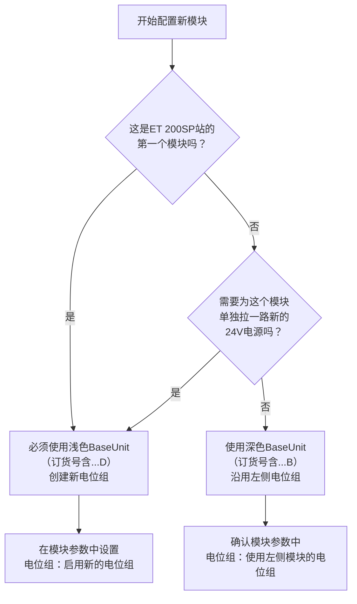
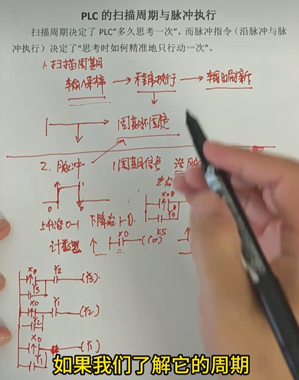
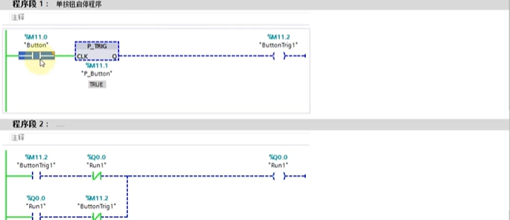
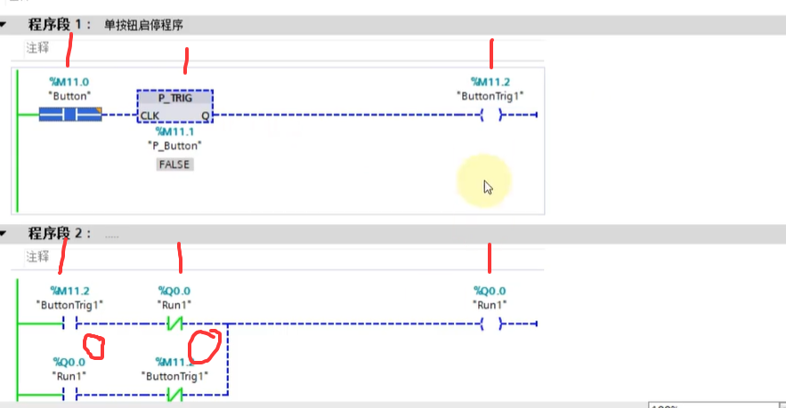
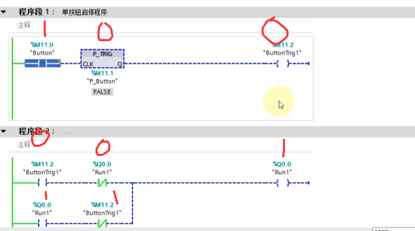
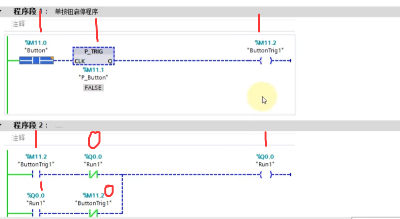
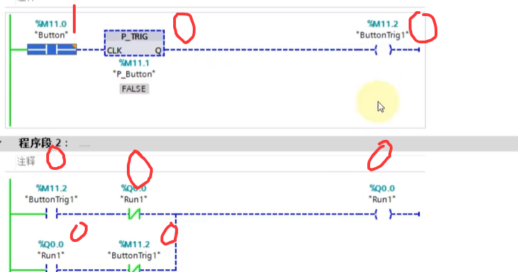
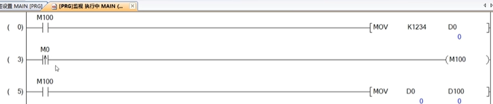
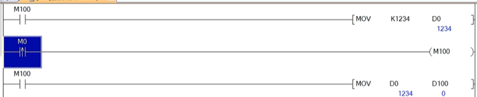
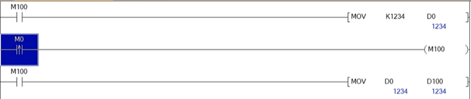

# 1.OSI模型

OSI（Open Systems Interconnection，开放系统互连）模型，是国际标准化组织（ISO）在1984年提出的一个**概念模型**。它的核心目的是：**将复杂的网络通信过程，拆解成7个相对独立、相互协作的层次**。这样做的好处是，不同的厂商可以专注于某一层的技术，只要遵循统一的标准，就能相互通信，就像乐高积木一样。

我们用一个日常的“寄快递”类比，来帮助理解这7层模型。

------

## 🌐 OSI 七层模型概览

| 层级  | 名称           | 核心作用（一句话）                                     | “寄快递”类比                                       | 常见协议/设备                |
| :---- | :------------- | :----------------------------------------------------- | :------------------------------------------------- | :--------------------------- |
| **7** | **应用层**     | 为应用软件提供网络服务接口                             | 你写的信、包裹里的物品                             | HTTP, FTP, SMTP, Telnet      |
| **6** | **表示层**     | 翻译、加密、压缩数据                                   | 把信翻译成对方懂的语言、加密或压缩文件             | JPEG, ASCII, SSL/TLS         |
| **5** | **会话层**     | 建立、管理和终止会话连接                               | 与对方约定好何时通话、如何确认身份                 | NetBIOS, RPC                 |
| **4** | **传输层**     | 提供可靠或不可靠的端到端传输，并负责分段重组、流量控制 | 挂号信（可靠） vs 平信（尽力）。分割大包裹、并编号 | TCP, UDP                     |
| **3** | **网络层**     | 寻址和路由，选择最佳路径                               | 规划包裹从北京到上海的路线，处理中转站             | IP, ICMP, 路由器             |
| **2** | **数据链路层** | 在相邻节点间可靠传输数据帧                             | 把包裹装进运输车厢，检查车厢是否破损（校验）       | 以太网, PPP, 交换机, MAC地址 |
| **1** | **物理层**     | 定义物理介质、电压、引脚、速率                         | 确定用卡车还是飞机，路面的宽度和限速               | 网线, 光纤, 无线频率, 集线器 |

------

📦 从下往上：每层详细拆解

###### 第1层：物理层（Physical Layer）

- **做什么**：最底层，负责**把数据变成可以在物理介质上传输的信号**（比特流 0/1）。它规定了线缆类型、接头形状、引脚数量、电压高低、传输速率等。
- **关键点**：只关心比特，不关心数据含义。典型问题：插上网线后灯亮不亮？信号有没有干扰？
- **设备/介质**：网线（双绞线）、同轴电缆、光纤、无线频谱；集线器、中继器。

###### 第2层：数据链路层（Data Link Layer）

- **做什么**：将物理层传来的比特流**封装成“帧”**，并提供**差错控制**和**流量控制**。它在相邻的两个节点（比如你的电脑和路由器）之间，提供可靠的数据传输。
- **关键点**：引入了**MAC地址**（物理地址），用于在同一个局域网内唯一标识设备。它能发现数据是否在传输中损坏（但一般不重传）。
- **设备**：交换机、网桥。

###### 第3层：网络层（Network Layer）

- **做什么**：负责**路由**和**逻辑寻址**。它决定从源到目的地的最佳路径，并跨越不同的网络。这一层引入的**IP地址**，是互联网能联通世界的基石。
- **关键点**：数据被封装成“包”或“数据报”。路由器工作在这一层，根据IP地址转发数据。
- **协议**：IP（IPv4/IPv6）、ICMP（ping命令用的）、ARP（IP转MAC）。

###### 第4层：传输层（Transport Layer）

- **做什么**：这是**端到端**的第一层，也是整个模型的关键。它负责**把应用层的数据分段**，交给网络层，并在接收端重组。同时提供两种服务：**可靠的TCP**和**不可靠但高效的UDP**。还处理流量控制、拥塞控制。
- **关键点**：引入**端口号**，让同一台设备上的不同应用（比如浏览器和邮件客户端）能区分自己的数据包。
- **协议**：TCP（传输控制协议）、UDP（用户数据报协议）。

###### 第5层：会话层（Session Layer）

- **做什么**：**建立、维护、终止**应用程序之间的会话。它管理对话的规则（比如谁先说话、说多久、如何恢复中断的对话）。
- **关键点**：通常与应用层紧密配合。很多实际协议（如TCP）已部分替代了它的功能，所以纯会话层协议在现代不那么显眼。
- **例子**：NetBIOS（早期Windows网络共享）、RPC（远程过程调用）。

###### 第6层：表示层（Presentation Layer）

- **做什么**：**翻译**不同系统间的数据格式。解决“同一段二进制数据，一个系统认为是整数，另一个认为是字符”的问题。它还负责**加密/解密**和**压缩/解压缩**。
- **关键点**：让你的图片（JPEG/PNG）、文本（ASCII/UTF-8）在不同设备上能正确显示。
- **例子**：SSL/TLS协议（虽然实际多位于传输层以上，但功能属于表示层）、JPEG、GIF。

###### 第7层：应用层（Application Layer）

- **做什么**：最靠近用户的一层。**为具体的应用程序提供网络服务**。它不是指应用程序本身（比如浏览器），而是应用程序用来通信的**协议**。
- **关键点**：用户能直接感受到的一层。比如发邮件、看网页、传文件。
- **协议**：HTTP（网页）、SMTP/POP3（邮件）、FTP（文件传输）、Telnet/SSH（远程登录）、DNS（域名解析）。

------

###### 🔄 数据是怎么穿过这7层的？（封装与解封装）

当你在浏览器里输入 `www.baidu.com` 并回车，数据是这样“穿行”的：

1. **发送方（你的电脑）**：
   - **应用层（7）→ 表示层（6）→ 会话层（5）**：浏览器生成一个HTTP请求。表示层可能加密（HTTPS），会话层可能建立连接。这一般被视为“上层数据”。
   - **传输层（4）**：将上层数据加上TCP头（包含源端口、目的端口、序号等），形成一个**段**。
   - **网络层（3）**：将TCP段加上IP头（包含源IP、目的IP），形成一个**包**。
   - **数据链路层（2）**：将IP包加上MAC头（包含源MAC、下一跳MAC）和尾部（校验），形成一个**帧**。
   - **物理层（1）**：将帧转化为电信号或光信号，通过网线发送出去。
   - *这个过程就像套信封：数据 = 信纸；应用层头 = 套一个“中文说明”信封；TCP头 = 再套一个“挂号信说明”；IP头 = “发往xx城市”；MAC头 = “交给某街道某号”。*
2. **接收方（百度服务器）**：
   - **物理层（1）**：收到信号，还原成比特流。
   - **数据链路层（2）**：检查MAC地址是否匹配，通过校验确认帧无错误，然后去掉MAC头尾，把里面的包交给网络层。
   - **网络层（3）**：检查IP地址是否是自己，去掉IP头，把里面的段交给传输层。
   - **传输层（4）**：根据TCP头判断属于哪个应用（端口80/443），确认数据完整后，去掉TCP头，把里面的数据交给上层。
   - **应用层（7）**：解析HTTP请求，生成响应，再沿着同样的路径返回给你的浏览器。
   - *这就是解封装：每层剥掉一个信封，直到看到真正的信纸。*

------

###### 🤝 OSI模型 vs. TCP/IP模型（实际使用的模型）

你可能会问：既然有了OSI，为什么平时我们听到更多的是TCP/IP？

- **OSI模型**：**理论上的完美模型**。7层清晰，每层概念严谨。但实现起来过于复杂，且推出时市场已被TCP/IP抢占。
- **TCP/IP模型**：**实践上的事实模型**。通常被描述为4层或5层。它将OSI的**5、6、7层合并为“应用层”**，1、2层合并为“网络接口层”。互联网实际运行的就是这个精简模型。

| OSI七层        | TCP/IP四层 (常见)       | 对应协议/概念        |
| :------------- | :---------------------- | :------------------- |
| 应用层 (7)     | **应用层**              | HTTP, FTP, SMTP, DNS |
| 表示层 (6)     | （合并入应用层）        | SSL/TLS, 编码格式    |
| 会话层 (5)     | （合并入应用层）        | NetBIOS, RPC         |
| 传输层 (4)     | **传输层**              | TCP, UDP             |
| 网络层 (3)     | **网络层 / 互联网层**   | IP, ICMP, ARP        |
| 数据链路层 (2) | **网络接口层 / 链路层** | 以太网, Wi-Fi, PPP   |
| 物理层 (1)     | （合并入网络接口层）    | 双绞线, 光纤, 无线电 |

**总结：** OSI模型是完美的教科书，帮助你**理解通信的本质**；TCP/IP模型是粗糙但有效的工具，让你**学会在实际工程中**解决问题。两者都值得掌握，但初学者可以先以OSI为骨架，再映射到TCP/IP的世界中。

# 2.为什么硬件通讯间,并联一个电阻会增加抗干扰性

硬件通讯间并联的这颗电阻，通常被称为**终端电阻**（或匹配电阻）。它增加抗干扰性的核心原理，是**通过实现“阻抗匹配”来消除“信号反射”**。

这就像在山谷里喊话，回声会干扰原声。在高速、长距离的通信线缆中，电信号也会遇到类似的“回声”问题，即**信号反射**。

###### 🔍 问题根源：信号为什么会“反射”？

这和“光从空气进入水会发生折射和反射”的原理类似。

1. **阻抗不匹配**：通信线缆本身有固定的**特性阻抗**（如RS-485/485常用120Ω）。当信号传至线缆末端，如果末端设备的输入阻抗（通常非常高，如96kΩ）与线缆特性阻抗差异巨大，就相当于信号走到了“悬崖边”。
2. **反射信号产生**：因为阻抗不匹配，一部分信号能量无法被有效接收，就会**反射回总线**，形成干扰源。
3. **干扰后果**：这些反射波会与后续信号叠加，导致**信号畸变、波形失真**，接收端可能无法正确识别数据，造成通信错误。这尤其在**长距离**（如超过200米）或**高波特率**（如超过19.2Kbps）时更为明显。

###### 🛠️ 解决方案：终端电阻如何“消除回声”？

在总线两端各并联一个阻值与**线缆特性阻抗相等**的电阻（通常是120Ω），就是让信号到达终点时，面对的阻抗是“匹配”的。

- **吸收能量**：匹配的阻抗能让信号能量被**完全吸收**，而不是被反射回去。
- **消除干扰**：没有了反射波，原始的传输信号就不会被干扰。

这个原理在**RS-485**和**CAN总线**等长距离差分通信中都是通用的。

###### 🎯 终端电阻的“附加技能”：提升抗干扰能力

除了消除自身信号反射，终端电阻还能从物理层面提升总线抗外部干扰的能力。

以CAN总线为例，它通过差分电压表示“显性”（0）和“隐性”（1）两种状态。在“隐性”状态时，总线驱动器输出高阻态，极易受外界噪声干扰。

- **增强“免疫力”**：并联的终端电阻为总线提供了一个**稳定的差分负载**。根据欧姆定律，这能有效**分流和抑制**外部耦合进来的噪声能量，使总线不那么容易被“误触发”。
- **加速状态转换**：终端电阻还能为线缆寄生电容提供**快速放电回路**，确保总线能从“显性”快速、可靠地回到“隐性”状态。

需要注意的是，终端电阻并非在所有场景下都需要。在**短距离、低速**的通信中，不加也可能正常工作，甚至加了反而可能因驱动能力不足导致通信失败。通常建议在**通信速率大于19.2Kbps**或**线路长度大于200米**时考虑添加。

# 3.电工接线中很多要求绕圈5-8圈或者说绕圈电线直径的10倍,依据是什么或者说是怎么得出来的结论

电工接线中“绕圈5-8圈”和“缠绕长度为直径10倍”的要求，主要源于**行业规范与长期实践经验的总结**，其核心目的是确保接头**牢固可靠**和**导电良好**。

###### 📜 “绕圈5-8圈”的依据

这个要求主要针对单股或多股铜芯导线的**手工铰接**（缠绕连接）。

- **核心规范来源**：要求主要源于 **《电气安装工程施工及验收规范》** 以及 **《建筑施工安装图集 电气》** 等。这些是电工领域的通用工艺标准。
- **圈数的具体规定**：虽然“5-8圈”是常见说法，但更严谨的规范常要求 **6～8圈**。对于线径较细的（0.4～0.5mm），可能要求6-8圈；线径稍粗的（0.6～1.0mm），4-6圈也可。
- **为何是这些圈数？**
  - **少于5圈**：接触面积不足，导致**接触电阻增大**，通电后易发热，存在烧毁风险；同时**机械强度不够**，接头容易松动、脱落。
  - **多于8圈**：对接头的电气性能提升有限，反而**浪费材料**，并使接头**过粗**，影响后续绝缘处理。

###### 📏 “缠绕长度为直径10倍”的依据

这个要求更多用于**大截面导线**或使用**辅助绑线**的场景。

- **等效关系**：对于线径为d的导线，紧密缠绕10圈的长度约为`10 × π × d`，远大于10d。因此“缠绕长度≥10d”是一个更**宽松、易操作的下限**，确保有足够的接触面积。
- **操作实例**：对于直径5mm以下的导线，缠绕长度约60mm；5mm以上则要求90mm，即直径的10倍以上。

###### 🎯 这些要求的共同目的

无论是绕够圈数还是保证长度，最终目的都是为了实现一个**合格的电线接头**：

- **降低接触电阻**：紧密且足够的缠绕能增大导体的有效接触面积，从而减小接触电阻，防止接头发热。
- **保证机械强度**：足够的圈数能确保接头有足够的抗拉强度，不易因外力而松脱。
- **规范化操作**：将定量的圈数和长度作为施工和验收的明确标准，避免了操作的随意性，保证了工程质量的统一。

###### 💎 总结

简单来说，“绕圈5-8圈”和“缠绕长度10倍直径”是电工行业为确保接头质量，基于规范和实践总结出的**黄金标准**。它们的目的就是确保每一个接头都**既“强壮”又“通畅”**。

> **需要注意的是**，在现代建筑电气施工中，对于**接地跨接线**等特定用途的导线，规范更推荐**短而直的路径**，以避免增加电阻或电感。但对于常规的导线手工连接，上述缠绕要求依然是核心工艺。

# 3.2 线径我该怎么选择,或者说使用什么公式,有没有什么口诀

PLC接线的线径选择，核心是**根据电流定粗细，根据距离验压降**。这有一套成熟的口诀和公式，可以帮你快速估算。

### ⚡️ 第一步：估算电流，确定基础线径

#### 1. 经典口诀：“十下五，百上二”

这是电工最常用的估算口诀，能快速根据负载电流（I）选出线径（S）。口诀针对**铝线**，用铜线时需“升级算”。

- **口诀详解**：
  - **“十下五”**：截面积 ≤ 10mm²的导线，载流量 ≈ 截面积 × 5。
  - **“百上二”**：截面积 ≥ 100mm²的导线，载流量 ≈ 截面积 × 2。
  - **“25、35，四三界”**：
    - 截面积 16mm²、25mm²的导线，载流量 ≈ 截面积 × 4。
    - 截面积 35mm²、50mm²的导线，载流量 ≈ 截面积 × 3。
  - **“70、95，两倍半”**：截面积 70mm²、95mm²的导线，载流量 ≈ 截面积 × 2.5。
- **“铜线升级算”**：这是口诀的精髓。计算铜线载流量时，**按比它大一个规格的铝线**来计算。
  - **举例**：要算 **16mm²铜线** 的载流量，就查 **25mm²铝线** 的载流量：25 × 4 = **100A**。
- **估算速查表（铜线）**：
  这是根据口诀整理出的一些常用铜线载流量估算值，供快速参考。

| 铜线线径 (mm²) | 估算载流量 (A) | 参考功率 (220V) |
| :------------- | :------------- | :-------------- |
| 1.5            | 约 14A - 20A   | 约 3kW          |
| 2.5            | 约 22.5A - 26A | 约 5kW          |
| 4              | 约 32A         | 约 7kW          |
| 6              | 约 42A - 47A   | 约 9kW          |
| 10             | 约 60A         | -               |
| 16             | 约 80A - 92A   | -               |
| 25             | 约 100A - 120A | -               |

> **注意**：上表为估算值，实际选型需结合敷设方式、环境温度等调整。

#### 2. 精确公式：S = IL / (K * ΔU)

当线路很长（比如超过100米），必须用公式精确计算压降，确保设备端电压足够。

- **公式解释**：
  - **S**：导线截面积 (mm²)
  - **I**：负载电流 (A)
  - **L**：导线长度 (m)（注意：通常指**单程**长度）
  - **ΔU**：允许的压降 (V)（一般要求≤5%，如220V系统压降＜11V）
  - **K**：材料系数（铜线≈**54.4**，铝线≈**34**）
- **计算示例**：
  一个 **5kW** 的单相设备（电流约 **23A**），距PLC柜 **150米**，使用铜线，允许压降 **11V**。
  `S = (23 × 150) / (54.4 × 11) ≈ 5.77 mm²`
  计算结果大于5.77mm²，需向上选择标准线径，即 **6mm²**。

### 🔌 第二步：PLC不同接口的线径参考

除了根据电流选择，PLC的接口类型也决定了线径范围。

- **数字量I/O (DI/DO)**：传递24V DC的开关信号，电流很小（通常<0.5A）。为满足机械强度，**推荐使用1.0mm²或1.5mm²**的软线。
- **模拟量I/O (AI/AO)**：传递4-20mA或0-10V信号，极易受干扰。**必须使用双绞屏蔽电缆**，线径推荐 **0.5mm² - 1.25mm²**，工程上常用 **0.75mm² 或 1.0mm²**。
- **通信线 (RS-485, Profibus等)**：必须使用**专用通信电缆**（如西门子的Profibus电缆），其特性阻抗（通常为150Ω）是保证通信质量的关键，不能随意用普通电线代替。
- **PLC系统电源 (220V AC / 24V DC)**：为整个系统供电，电流较大。**推荐线径不小于2mm²**。PLC主电源（如给CPU和I/O模块供电）建议 **2.5mm²** 起步。
- **接地线 (PE)**：直接关系系统安全。PLC柜的**接地主线，推荐不小于6mm²**。

### 💎 总结

PLC接线选线径，可以遵循“三步走”：

1. **分类型**：先判断是**电源线、信号线还是接地线**，不同类型有各自的选型侧重点。
2. **算电流**：对于**电源线**，计算出负载电流，优先用 **“铜线升级算”口诀** 快速估算。
3. **验压降**：如果线路很长（例如超过50米），用 **`S = IL / (54.4 \* ΔU)` 公式** 验算，确保压降不超标。

# 3.3 估算口诀你给我分别说一下铝线和铜线的

针对你的要求，我把口诀拆分成**铝线（原始基准）**和**铜线（升级算法）**两套，并配上详细的解读表格，方便你在现场快速查用。

核心口诀依然是电工界通用的 **“十下五，百上二，二五三五四三界，七零九五两倍半，穿管温度八九折，铜线升级算”**。

------

### 1. 铝芯绝缘线（基准口诀）

这是口诀的“原始版本”，所有倍率都是针对**铝线**、在**明敷**状态下的估算载流量。

**口诀拆解与对应表：**

| 口诀内容           | 对应的铝线截面积 (mm²)                | 载流量估算倍数 | 估算载流量 (A) |
| :----------------- | :------------------------------------ | :------------- | :------------- |
| **十下五**         | **10 及以下** (1, 1.5, 2.5, 4, 6, 10) | × **5**        | 10mm² → 50A    |
| **百上二**         | **100 及以上** (100, 120, 150...)     | × **2**        | 100mm² → 200A  |
| **二五三五四三界** | **16、25**                            | × **4**        | 25mm² → 100A   |
|                    | **35、50**                            | × **3**        | 50mm² → 150A   |
| **七零九五两倍半** | **70、95**                            | × **2.5**      | 95mm² → 237.5A |

> **实际修正（现场必看）**：口诀算出来的是“明敷”理想值。如果铝线是**穿管敷设**或在**高温**环境，需要打折扣：
>
> - **穿管**：载流量 × **0.8**（散热变差）
> - **高温**：载流量 × **0.9**（环境温度超过25℃）
> - **穿管又高温**：载流量 × **0.8 × 0.9 = × 0.72**

------

### 2. 铜芯绝缘线（升级口诀）

口诀只有一句话：**“铜线升级算”**。

意思是：**计算铜线载流量时，不要直接套上面的倍数，而是按“比它大一个规格”的铝线去套用上面的口诀。**

#### 实战换算举例（铜线 → 铝线升级对照表）：

| 实际铜线截面积 | 升级后按铝线算        | 套用铝线口诀            | 估算载流量 (A) |
| :------------- | :-------------------- | :---------------------- | :------------- |
| **1.5 mm²**    | 按 **2.5 mm²** 铝线算 | 十下五 (2.5 × 5)        | **12.5 A**     |
| **2.5 mm²**    | 按 **4 mm²** 铝线算   | 十下五 (4 × 5)          | **20 A**       |
| **4 mm²**      | 按 **6 mm²** 铝线算   | 十下五 (6 × 5)          | **30 A**       |
| **6 mm²**      | 按 **10 mm²** 铝线算  | 十下五 (10 × 5)         | **50 A**       |
| **10 mm²**     | 按 **16 mm²** 铝线算  | 二五三五四三界 (16 × 4) | **64 A**       |
| **16 mm²**     | 按 **25 mm²** 铝线算  | 二五三五四三界 (25 × 4) | **100 A**      |
| **25 mm²**     | 按 **35 mm²** 铝线算  | 二五三五四三界 (35 × 3) | **105 A**      |
| **35 mm²**     | 按 **50 mm²** 铝线算  | 二五三五四三界 (50 × 3) | **150 A**      |

> **注意**：这个“升级”只是口诀上的速算技巧。实际工程中，为了确保安全和降低压降，**2.5mm²铜线的安全载流量通常按20-25A估算，4mm²按30-35A估算**，会比口诀表里的数值略保守一些。

------

### 3. 终极简化对照表（PLC常用线径）

对于PLC控制柜，你不用记所有的，记住**最常用的6种铜线**就足够了（均已考虑穿管和机械强度）：

| 铜线线径 (mm²) | 口诀升级法估算值 | **工程保守推荐载流量（推荐记这个）** | PLC 典型用途                 |
| :------------- | :--------------- | :----------------------------------- | :--------------------------- |
| **0.5 ~ 0.75** | -                | **3A ~ 5A**                          | 模拟量信号线、通信线（屏蔽） |
| **1.0**        | 约 12.5A         | **6A ~ 8A**                          | 数字量I/O信号线（非常常用）  |
| **1.5**        | 约 12.5A         | **10A ~ 14A**                        | 数字量I/O、小继电器电源线    |
| **2.5**        | 约 20A           | **18A ~ 22A**                        | 单台变频器电源、PLC主电源    |
| **4.0**        | 约 30A           | **28A ~ 32A**                        | 柜内主断路器下口、大功率负载 |
| **6.0**        | 约 50A           | **42A ~ 47A**                        | PLC柜总进线电源              |

### 💡 一个现场最实用的“傻瓜式”口诀

如果你不想记太复杂的换算，现场应急可以直接背这个：

- **1平方（铜）≈ 6A**（明敷散热好时）
- **1平方（铜）≈ 4~5A**（柜内扎带捆扎、散热一般时）
- **为了保险，PLC柜内一律按 1mm² 过 5A 来估算**，这样选的线既不会太粗（不好接线），也不会太细（不会发热）。

比如一个负载是3A，选1mm²足够；如果是8A，选1.5mm²或2.5mm²更稳。永远遵循**“算出来多大，选大一号”**的原则。加上你之前问的公式 `S = IL/(K*ΔU)`，口诀定粗细，公式验长度，两者配合使用，就万无一失了。


# 4.使用PLC的模拟量输出来控制变频器的频率,这在实际工业或者现实中有什么用处

使用PLC的模拟量输出来控制变频器频率，这在实际工业中非常普遍。其核心目的，就是**实现电机转速的连续、自动且精确调节**，以满足复杂的工艺需求。

具体来说，主要有以下几种应用：

- **实现连续的过程控制**：这是最核心的用途。PLC通过传感器（如压力、流量、温度传感器）采集当前值，与目标值比较后，通过模拟量输出实时调节变频器频率，形成闭环控制系统。典型例子就是**恒压供水**：通过检测管道压力，PLC控制变频器让水泵转速变化，无论用水量如何，都能维持水压恒定。类似应用还包括恒温控制、恒张力控制和风道恒压控制。
- **实现精确的同步与协同控制**：在多电机系统中，通过模拟量控制可以简化设计，实现多台电机转速的精准比例关系。比如，在**印刷机械**中，多个印刷单元间的物料传送必须完全同步，PLC就给每个单元的变频器发送同一个速度指令。在**纺织机械**中，收卷和放卷的转速需要按特定比例变化，以保证张力恒定。
- **满足设备的多段速或无级调速需求**：相比机械调速或手动控制，模拟量控制能提供更平滑、精准的无级变速。例如在**自动化生产线**上，可以根据工艺要求随时改变输送带速度；在**离心机、搅拌机**中，可以编写程序实现低速启动、高速运行、再平稳停车的最佳速度曲线。
- **实现节能优化运行**：很多设备（如风机、水泵）的负载特性是，流量与转速成正比，而功耗与转速的三次方成正比。通过PLC模拟量控制变频器，当只需要50%的流量时，可以把转速降到50%，理论功耗仅为原来的12.5%，**节能效果非常显著**。这正是变频驱动替代传统风门、阀门控制的主要原因之一。
- **实现远程与自动化操作**：在中央控制室，操作员可以直接在HMI（人机界面）上输入一个转速值，PLC收到指令后立即通过模拟量输出改变变频器频率。这完全替代了手动调节电位器的方式，实现了高度自动化和远程集中控制。

------

**一个典型的控制过程是这样的：**

1. **PLC输入**：读取传感器信号（如压力变送器的4-20mA信号）。
2. **PLC运算**：内部PID（比例-积分-微分）算法将实际压力与设定压力比较，计算出修正后的控制值（比如 0-100%）。
3. **PLC输出**：将这个百分比转换为模拟量信号（例如，0%对应4mA，100%对应20mA，标准的线性关系）。
4. **变频器接收**：接收模拟量信号，并根据内部参数（如20mA对应50Hz）来驱动电机旋转。

总而言之，这种控制方式能综合实现**节能降耗、工艺优化、系统简化、精度提升和自动化集成**等多重目标，是工业自动化的标准做法。除了标准的4-20mA电流信号，有时也会采用0-10V电压信号，不过4-20mA的抗干扰能力更强，更适合工业现场。

# -----------------------------------------------------------

# 5.传感器信号给到PCL这是 数字转模拟量 还是模拟量转数字

这是一个很容易混淆的概念。简单直接地回答：

**传感器信号给到PLC，这个过程是：模拟量转数字量。**

为了让你彻底搞清楚，我们需要区分一下 **输入** 和 **输出** 两个方向。你之前问的是PLC给变频器信号（输出），现在问的是传感器给PLC信号（输入），这两个方向刚好是相反的。

###### 1. 传感器 → PLC：模拟量转数字（A/D转换）

- **为什么？** 传感器测量到的物理量（温度、压力、流量、液位等）是连续变化的，比如0-10V的电压或4-20mA的电流。这就是**模拟量**。
- **但是**，PLC内部的CPU是一个数字处理器，它只能识别0和1，无法直接理解“5.3V电压”或“12.8mA电流”是什么意思。
- **所以**，PLC需要一个专门的硬件模块（**模拟量输入模块**）来完成转换。它会每隔一段极短的时间（例如1毫秒）测量一次模拟信号的大小，然后把这个数值（比如0-27648之间的一个数字）交给CPU去处理。
- **结论：** 传感器 **→** 模拟量 **→** 模拟量输入模块 **→** 数字量 **→** PLC CPU

###### 2. PLC → 变频器：数字转模拟（D/A转换）

- **为什么？** PLC的CPU计算后，内部得出的结果是一个数字（比如0-27648），代表“我要让电机转50%的转速”。
- **但是**，变频器的控制端子通常只接收模拟电压或电流信号（如0-10V或4-20mA），它看不懂这个数字。
- **所以**，PLC需要一个**模拟量输出模块**，把CPU送来的数字重新转换成连续的电压或电流信号，再发送给变频器。
- **结论：** PLC CPU **→** 数字量 **→** 模拟量输出模块 **→** 模拟量（0-10V）**→** 变频器

###### 一个简单的对比表格

| 方向     | 信号流程         | 转换过程           | 使用的PLC模块      |
| :------- | :--------------- | :----------------- | :----------------- |
| **输入** | 传感器 **→** PLC | **模数转换** (A/D) | **模拟量输入模块** |
| **输出** | PLC **→** 变频器 | **数模转换** (D/A) | **模拟量输出模块** |

###### 一句话记忆技巧

- **传感器是“感觉”世界的（模拟的），PLC是“思考”世界的（数字的）**。所以传感器告诉PLC，必须先把模拟的“感觉”翻译成数字的“语言”，这个过程就是**模拟量转数字**。

希望这个解释能帮你彻底理清这个概念！

# 6.你介绍一下PLC pid命令 和全称是什么意思

我们需要解释PLC中的PID命令，全称，以及其含义。用户问的是“PID命令”，实际上是PID控制功能块或指令。全称：Proportional-Integral-Derivative，比例-积分-微分。解释它在PLC中的作用：用于闭环控制，如温度、压力、流量等。需要通俗易懂，结合之前模拟量输入输出背景。最后可以给出简要说明。

在PLC编程中，经常提到的 **PID 命令**，其全称是 **Proportional-Integral-Derivative**，中文意为 **比例-积分-微分**。

它不是一条单一的指令，而是一个**闭环控制算法**，通常以功能块（Function Block）的形式提供给编程者调用（例如西门子的 `FB41`，三菱的 `PIDINIT` 等）。

###### 1. PID 的核心作用

**让被控制的物理量（如温度、压力、流量）尽可能快速、稳定地达到并保持在用户设定的目标值。**

想象一下你用手调节水龙头的热水温度：

- 你希望水温恒定为40℃（**目标值**）。
- 温度计显示当前水温（**实际值**）。
- 你的大脑根据误差（目标值 - 实际值）决定如何转动把手（**控制输出**）。

**PID命令就是代替你的大脑，自动计算出一个最佳的控制信号（通常是0~100%的数值），然后通过模拟量输出去驱动变频器、加热器、阀门等执行机构。**

###### 2. PID 三个字母的含义

| 字母  | 中文 | 通俗理解                 | 在控制中的作用                                               |
| :---- | :--- | :----------------------- | :----------------------------------------------------------- |
| **P** | 比例 | **“当前误差有多大”**     | 偏差越大，输出越猛。能让系统快速响应，但会产生**余差**（永远差一点达不到目标）。 |
| **I** | 积分 | **“过去误差累加有多大”** | 专门消除余差。只要没到目标，就一点点累加力量，直到完全消除偏差。但会带来**超调**（冲过头）。 |
| **D** | 微分 | **“未来误差变化趋势”**   | 预测偏差会变大还是变小。在偏差爆发前提前干预，抑制超调和震荡，提高稳定性。 |

###### 3. 一个结合你之前问题的完整例子

假设我们做一个 **恒压供水** 系统：

1. **传感器（压力变送器）** 检测当前管道压力，发出 4-20mA 信号给 PLC 的**模拟量输入模块**。 → 这是 **模拟量转数字**（A/D）。
2. **PLC 的 CPU** 运行 **PID 命令**：将“目标压力”（如0.5MPa）与“实际压力”（传感器传来的值）进行比较，计算出输出值（比如 0~100%）。
3. **PID 输出结果** 通过 **模拟量输出模块** 给到变频器，变成 4-20mA 信号。 → 这是 **数字转模拟**（D/A）。
4. **变频器** 根据收到的模拟信号改变输出频率（FWD正转），从而调节水泵转速，让压力稳定在目标值。

**整个过程的核心大脑，就是 PLC 内部的 PID 命令。**

###### 4. 为什么叫“命令”而不是“指令”

- 在 PLC 梯形图或结构化文本中，它确实以一条“命令”的形式存在（如 `PID` 或 `CONTROL`）。
- 你需要为其提供输入参数（目标值、实际值、P/I/D参数等），它执行后输出控制值。
- 现代 PLC 通常提供了**自整定**功能：你可以让 PLC 自动测试系统响应，然后自动计算出合适的 P、I、D 参数，大大简化了调试。

###### 总结

- **全称**：Proportional-Integral-Derivative
- **本质**：一种用于闭环自动控制的**算法**。
- **在PLC中**：它是一条功能强大的**命令/功能块**，用来根据传感器反馈计算输出，实现对变频器、加热器等设备的精准、自动调节。

# 7.你给我讲解一下fx3u 通过模拟量输出外接台达变频器的接线

用FX3U的模拟量输出（如4-20mA或0-10V信号）来控制台达变频器的转速，是工业现场非常标准的方案。核心是做好PLC与变频器之间的**硬件接线**和**软件参数匹配**。

下面以最常见的电压输出（0-10V）模式为例，详细说明整个过程。

###### ✍️ 第一步：准备工作与确认

1. **明确设备型号**：确认你使用的模拟量模块具体型号，如 `FX3U-4DA` (特殊功能模块，位于PLC右侧) 或 `FX3U-4DA-ADP` (适配器，位于PLC左侧)。不同型号的硬件接线端子定义略有不同，请以你的模块用户手册为准。
2. **检查变频器端子**：确认台达变频器上的模拟量输入端子，通常是 `AVI` (电压输入，0-10V) 和 `ACM` (模拟量公共端)。

###### 🔌 第二步：硬件接线 (以0-10V电压输出为例)

这是最核心的环节。原则是将PLC模块的电压输出端连接到变频器的 `AVI` 和 `ACM` 端子上。以 `FX3U-4DA` 模块为例：

- `FX3U-4DA` 的 **VI-** 或 **V-** 端子 (电压输出负极) -> 台达变频器的 **ACM** 端子。
- `FX3U-4DA` 的 **V+** 端子 (电压输出正极) -> 台达变频器的 **AVI** 端子。

| PLC侧 (FX3U-4DA模块)        | 连接方式 | 变频器侧 (台达)          | 说明                 |
| :-------------------------- | :------- | :----------------------- | :------------------- |
| **V+** (输出电压正极)       | 连接 →   | **AVI** (模拟量电压输入) | 传递0-10V控制信号    |
| **VI- / V-** (输出电压负极) | 连接 →   | **ACM** (模拟量公共端)   | 提供信号回路，需共地 |

> **关键**：此方案中，变频器的 `AVI` 和 `ACM` 就是PLC输出的负载。PLC模块**不需要**像输入模块那样将V+和I+短接，直接接V+即可。

> **Tips**：模拟量信号极易受干扰，请务必使用**2芯屏蔽双绞线**。若现场干扰严重，可在PLC模块的V+与VI-端子间并联一个 **0.1μF 至 0.47μF, 25V** 的电容来增强稳定性。建议将屏蔽层单端接地（在PLC侧接地）。

###### ⚙️ 第三步：变频器参数设置

正确的接线只是基础，必须修改台达变频器的参数，告诉它我们要用外部模拟量信号来控制。以台达VFD系列变频器为例：

1. **选择主频率来源**：将参数 `P00` (主频率输入来源设定) 设置为 `01`，表示主频率由**外部模拟信号 (AVI)** 输入控制。
2. **设定运行指令来源**：根据你的实际需求，将参数 `P01` 设置为 `00` (由数字操作器控制) 或 `01` (由外部端子控制)。如果设为 `00`，修改完参数后，需要按下面板上的 `RUN` 键来启动变频器。

###### 💻 第四步：PLC 程序编写

硬件和变频器参数都搞定后，就可以着手编写PLC程序了。这里以 `FX3U-4DA` 模块为例，演示如何将频率值转换为模拟量信号。

首先，理解信号对应关系：程序中的数字量 `0` 对应 `0V` (0Hz)，`4096` 对应 `10V` (50Hz)。变频器频率与输出模拟量、PLC数字量的线性关系表如下：

| 变频器目标频率 | 对应模拟量输出电压 | PLC 数字量值 (0-4095) |
| :------------- | :----------------- | :-------------------- |
| 0 Hz (停止)    | 0V                 | 0                     |
| 25 Hz (半速)   | 5V                 | 2048                  |
| 50 Hz (全速)   | 10V                | 4096                  |

因此，`FX3U-4DA` 模块的程序逻辑如下：

1. **硬件初始化 (BFM #0)**：在第一扫描周期，通过 `TO` 指令向缓冲区 `#0` 写入 `H0000` (十六进制)，将第1通道设置为电压输出模式 (模式0，即0-10V)。
2. **数据写入 (BFM #1)**：将目标数字量 (存储在 `D0` 中) 通过 `TO` 指令写入模块的第1通道数据缓冲区 `#1`，即可从对应端子输出稳定的模拟电压信号。

为了更精确地控制频率，可以利用PLC的浮点运算指令和定坐标指令(SCL)将目标频率(HZ)线性转换为数字量值，其换算公式为：`数字量输出 = (目标频率 / 50Hz) × 4096`。

一个简单的梯形图程序实例如下：

text

```
// 1. 初始化：设置通道1为电压输出模式 (0-10V)
[M8002]       |---[TO    H0    K0    H0000    K1]---|
//               (模块号)(BFM#)(写入值)(写入点数)

// 2. 将存储在D0中的目标数字量 (0-4095) 写入模块的通道1数据缓冲区
[    ]        |---[TO    H0    K1    D0       K1]---|
//               (模块号)(BFM#)(源地址)(写入点数)
```


把需要输出的数字量放到 `D0` 里，用 `TO` 指令写到模块的 `#1` 缓冲区，PLC就能自动输出对应的模拟信号了。

###### 💡 两种主流控制方式对比

除了上述模拟量控制，Modbus RTU通讯也是一种高精度、抗干扰的常用方式。这里将两种主流控制方式做个简单对比，方便你根据实际需求选择：

| 对比维度       | 模拟量控制 (0-10V / 4-20mA)                    | Modbus RTU 通讯控制 (RS485)                                  |
| :------------- | :--------------------------------------------- | :----------------------------------------------------------- |
| **接线方式**   | 只需连接两根模拟量信号线，简单直观             | 需连接RS485的A、B线（如SDA/SDB），注意极性，抗干扰更强       |
| **成本与特点** | 需购买模拟量输出模块，成本较高                 | 通讯板（如FX3U-485-BD）成本较低，信号无衰减，抗干扰能力强    |
| **调试侧重点** | 核心是匹配信号类型与量程                       | 核心在于PLC与变频器的通讯参数（波特率、校验位等）必须严格一致 |
| **适用场景**   | 对成本不敏感，且对速度反馈实时性要求极高的场合 | 绝大多数需要远程监控、多段速、高精度控制的现代工业场景       |

如果你现在不确定需要使用哪种控制方式，或者想了解它们更详细的优劣对比，都可以告诉我，我来帮你进一步分析～


# 8.再加一步,通过输出模拟量来通过变频器控制电机

好的，我们接着之前搭建好的硬件通路，来看看让PLC通过模拟量信号控制电机运转的最后几步：变频器参数设定和PLC程序编写。

简单来说，整个流程就是你通过PLC程序，告诉它“让电机以XX赫兹转动”，PLC把这个指令数字（0-4095）送给模拟量模块，模块将其转换成对应的电压信号（0-10V），变频器接收到这个电压信号后，就按照你的设定驱动电机以指定的频率运行了。

下面我们把每个步骤拆解一下：

###### ⚙️ 第四步：变频器参数设定（以台达VFD系列为例）

变频器出厂时，通常默认是用操作面板控制的。我们需要修改几个关键参数，让它“听”PLC的话。设定前，建议执行一次**参数重置（如`P76=09`或`00-02=9`）**，恢复到出厂状态，避免被之前的设置干扰。

| 参数号                              | 参数名称           | 设定值      | 说明                                                         |
| :---------------------------------- | :----------------- | :---------- | :----------------------------------------------------------- |
| **`P00`** (VFD-M) / `00-20` (MS300) | **主频率指令来源** | `01` 或 `2` | 设定变频器的频率由外部端子**模拟量输入（AVI）** 给定。       |
| **`P01`** (VFD-M) / `00-21` (MS300) | **运转指令来源**   | `00` 或 `1` | 这是关键一步。你可以选择 **`00`**，先用**面板上的RUN/STOP键**来控制启停，可以简化前期调试；也可以选择 **`01`** 通过**外部端子控制**，实现PLC远程启停。 |
| **`P03`** (VFD-M) / `01-00`         | **最高操作频率**   | `50.0` (Hz) | 设定电机的最高运转频率，通常设为电机铭牌上的额定频率。       |
| **`P52`** (VFD-M) / `07-00`         | **电机额定电流**   | `根据铭牌`  | **必须参考电机铭牌设定**，防止电机过载烧毁。                 |

> **注意**：不同系列的台达变频器，参数编号可能不同，例如**VFD-M**系列以`Pxx`开头，而**MS300/ME300**系列则以`00-xx`、`01-xx`等形式出现。操作时请以你手中变频器的说明书为准。

###### 💻 第五步：PLC程序编写与数字量换算

完成了硬件连接和变频器参数设定后，就可以通过程序让电机转动起来了。

###### 1. 理解核心：频率与数字量的换算

PLC程序不能直接发送“50Hz”的指令，它发送的是一个数字量。这个数字量和模拟量模块输出的电压（0-10V）成正比，而电压又和变频器的输出频率（0-50Hz）成正比。我们设定模拟量模块的输出为 **0-10V**，对应的数字量范围是 **0-4095**。

因此，换算关系很简单：**“目标数字量” = (“目标频率” / 50Hz) × 4095**。下面是几个关键点的示例：

| 目标频率 (Hz) | 模拟量输出电压 (V) | 应输出的数字量值 |
| :------------ | :----------------- | :--------------- |
| 0             | 0V                 | 0                |
| 25            | 5V                 | 2048 (约)        |
| 50            | 10V                | 4095             |

###### 2. 程序实现：两种方式，代码可复用

无论你使用哪种变频器（比如之前提到的台达VFD），或者用哪种模块（`FX3U-4DA-ADP`适配器或`FX3U-4DA`模块），其核心的PLC编程逻辑是通用的。这里以我上一轮提到的`FX3U-4DA`模块为例，给出更完整的程序示例。

**步骤1：模块初始化**
在PLC的第一个扫描周期（使用`M8002`脉冲继电器），通过`TO`指令设定模块的工作模式。

- **模块硬件位置**：最靠近PLC的第一个特殊模块编号为`0`号。
- **BFM #0设置**：向模块的缓冲区0（BFM #0）写入`H0000`，这会将所有4个通道设置为 **-10V至+10V** 的电压输出模式。如果你的模块型号不同，可以参考其手册进行配置。

**步骤2：数据输出**
将计算好的数字量值写入模块的数据缓冲区。这里我们使用**CH1通道1**为例。

- **BFM #1**：这是CH1通道的数据缓冲区，写入的数字量（0-4095）会被模块转换为对应的电压值输出。

**步骤3：应用逻辑举例**
以下是一个用梯形图实现的简单转速控制逻辑。它演示了如何使用寄存器`D0`（运行频率）和`D1`（目标数字量）来计算并输出数据：

text

```
程序初始化和数据处理逻辑示例
// ① 模块初始化 (仅在PLC上电时执行一次)
// ──[ M8002 ]────────────[ TO  K0  K0  H0000  K1 ]──
//                          (模块0, BFM#0, 写入H0000, 1点)
// 
// ② 频率到数字量的换算 (假设目标频率50Hz存储在D10中)
// ──[ 常开触点 ]─────────[ MOV  D10  D20 ]── (将需要运行的频率值存入临时寄存器)
// 
// ③ 执行线性转换: 数字量 = (D20 * 4095) / 50
// 使用浮点数运算指令可以更精确地完成这个换算，避免整数运算的误差。
// 为简化示例，暂用 'MUL', 'DDIV' 等指令示意。
// 
// ④ 输出最终数字量
// ──[ 常开触点 ]─────────[ TO  K0  K1  D30  K1 ]──
//                          (模块0, BFM#1, 输出D30中的值, 1点)
```


> **模块差异说明**：
>
> - **`FX3U-4DA`**：通常使用`TO`/`FROM`指令通过缓冲区（BFM）进行控制。
> - **`FX3U-4DA-ADP`**：控制方式更直接，通过**特殊数据寄存器（如D8260）** 来写入数据。如果ADP模块连接在第一个位置，直接将换算好的数字量值**写入D8260**，模块的通道1就会自动输出对应的模拟量。

###### 🚀 第六步：启动调试与故障排查

检查无误后，就可以通电调试了。

1. **通电检查**：确认所有接线正确，模块和变频器都已上电。
2. **程序下载**：将编写好的程序通过编程软件下载到FX3U PLC中。
3. **启动运行**：可以按下变频器面板的**RUN键**，或者在PLC程序里使能Y点来触发变频器启动。
4. **电机观察**：查看电机是否按照预设的频率（如25Hz）平稳启动和运行。
5. **在线监控**：通过软件监控PLC程序中`D0`（目标频率）和`D1`（输出数字量）的值，确保数据计算和传递正确。

如果遇到问题，可以按以下思路排查：

- **电机不转**：检查变频器上的`RUN`指示灯是否亮起。如果没亮，确认`P01`（运转指令）参数设置是否与你期望的启停方式一致。
- **电机转速不随指令变化**：检查`P00`（频率来源）参数是否已设为模拟量给定（`01`）。
- **转速抖动或异常**：通常是信号干扰或接线松动。检查屏蔽线接地是否良好，端子是否接实。
- **数值问题**：可以尝试在PLC程序里向输出通道直接写入一个固定值，比如2047（对应25Hz左右），检查变频器是否能稳定地输出约25Hz。

这三个步骤——**变频器参数设定、PLC编程、调试运行**——是环环相扣的，缺一不可。从修改变频器的几个关键参数，到编写逻辑清晰的PLC程序，再到最后的带载调试，每一步都对照着变频器和模块的说明书慢慢来，基本就能顺利实现模拟量控制电机了。

如果在编写PLC程序或换算公式时遇到具体问题，可以带上你的模块型号和变频器系列随时问我～

# 9.你需要重说,输出模拟量怎么接线,控制电机怎么接线

明白了，你希望我重新、清晰地说明**两个关键接线部分**：

1. **PLC模拟量输出模块 → 台达变频器**（信号线）
2. **台达变频器 → 三相电机**（主回路动力线）

下面分步说明，不再重复程序或参数。

------

###### 一、模拟量输出接线（PLC → 变频器）

以 **FX3U-4DA（电压输出0~10V）** 和 **台达变频器（AVI/ACM）** 为例。

| PLC侧 (FX3U-4DA模块)           | 导线       | 变频器侧 (台达VFD系列)   |
| :----------------------------- | :--------- | :----------------------- |
| **V+** (通道1电压输出正)       | 屏蔽双绞线 | **AVI** (模拟量电压输入) |
| **VI- / V-** (通道1电压输出负) | 屏蔽双绞线 | **ACM** (模拟量公共端)   |

> ✅ **注意**：
>
> - 必须使用**屏蔽双绞线**，屏蔽层在PLC侧单端接地。
> - **不要**将V+与VI-短接（那是电流输入的做法，这里是输出）。
> - 如果需要4~20mA电流输出，则接 **I+** 与 **VI-**，同时修改模块模式。

------

###### 二、变频器控制电机接线（变频器 → 电机）

这是**主回路动力线**，属于强电部分，务必断电操作。

| 变频器端子 (台达VFD) | 连接 | 电机端子 (三相异步电机) |
| :------------------- | :--- | :---------------------- |
| **U / T1**           | →    | **U** (或电机接线盒U)   |
| **V / T2**           | →    | **V** (或电机接线盒V)   |
| **W / T3**           | →    | **W** (或电机接线盒W)   |
| **PE** (接地端子)    | →    | **电机接地线** (PE)     |

> ⚠️ **关键安全提醒**：
>
> - 电机接线盒内通常有 **星形（Y）** 或 **三角形（Δ）** 接法，请根据电机铭牌和供电电压正确选择。
> - 变频器输出侧 **不能** 加装接触器或电容补偿器。
> - 电机电缆与信号电缆**必须分开走线**，保持至少20cm距离，避免干扰。

------

###### 三、如果需要远程启停（可选）

如果你希望通过PLC控制变频器**启动/停止**，需要额外接**数字量输出点**到变频器的 **MI1 / DCM** 等端子，并设置变频器参数 `P01=01`。但按你当前问题，只问“控制电机怎么接线”，上面第二部分已给出主回路接线。远程启停属于控制信号线，需要的话可以再补充。

------

这样分开说明是否更清楚？如果还需要**具体某个模块（如FX3U-4DA-ADP）或某个变频器型号（如台达MS300）** 的端子图对比，可以告诉我，我再细化。

# 10.为什么DC/DC/DC 的PLC,习惯于在输出端加一个继电器,说是可以保护plc

对于DC/DC/DC类型的PLC，在输出端加继电器（常称为“**中间继电器**”）是一个经典且有效的工程实践。这并非多此一举，而是出于多重保护与功能扩展的考量，核心作用可以总结为 **“隔离、放大、保护”**。

###### ⚡️ 核心原因：物理隔离与浪涌防护

这是最主要、最关键的保护作用。PLC的输出模块（尤其是晶体管型，DC/DC/DC类型即为此类）非常“娇贵”。

- **抵御“回马枪”**：现场很多负载是**感性负载**，如电磁阀、接触器、电机等。它们在断电瞬间会产生极高的**反向电动势（浪涌电压）**，这个瞬时高压如同“回马枪”，足以击穿脆弱的PLC输出晶体管。
- **物理“防火墙”**：中间继电器的线圈和触点在物理上是隔离的。PLC只驱动继电器的**线圈**（小电流），而负载则由继电器的**触点**控制。
- **结果**：浪涌电压被牢牢限制在继电器的触点回路中，**完全隔离在PLC之外**，从而保护了PLC输出点。即使PLC模块内部有续流二极管等保护，外加继电器仍是一道“超级加倍的保险”。

###### 🔌 核心原因：容量放大与负载驱动

PLC输出点的驱动能力通常很有限，无法直接驱动大功率设备。

- **电流/功率“放大”**：PLC输出点（特别是晶体管型）的驱动电流通常只有**0.5A**左右。而中间继电器的触点容量则大得多，可达**2A、5A甚至更高**。
- **分担重担**：通过在PLC和负载之间加入中间继电器，PLC只需驱动继电器线圈这个小电流负载，而由继电器触点去承受大电流负载的冲击。
- **结果**：有效避免了PLC输出模块因直接驱动大负载而**过载甚至烧毁**。

###### ⚠️ 特殊情况：应对感性负载的冲击

除了稳态电流，感性负载（如接触器线圈）在启动瞬间的**冲击电流**远大于其额定电流。这种瞬时大电流对PLC输出点的威胁很大。中间继电器作为缓冲，可以承受这种冲击，而不会让PLC输出点直接“受伤”。

###### 🔧 额外优势：简化设计、便利维护与成本控制

除了保护，这种做法还带来了诸多便利：

- **统一电压，简化设计**：DC/DC/DC型PLC输出均为24VDC。若现场设备电压多样（如220V AC电磁阀），通过继电器可轻松实现不同电压的控制，无需更换PLC模块。
- **隔离故障，方便维护**：若负载端发生短路等故障，只会烧毁外部的中间继电器，而不会波及PLC。更换一个外部继电器成本低廉且迅速。
- **充当“保险丝”**：中间继电器本身可视为一个易更换的“保险丝”，牺牲自己，保全价值更高的PLC。

###### 💎 总结

在DC/DC/DC型PLC的输出端加中间继电器，是一种**成本极低、收益极高**的保护措施。它通过**物理隔离**抵御致命的浪涌电压，通过**容量放大**驱动各类负载，同时**简化了系统设计，方便了后期维护**。简单来说，就是用一个小继电器为昂贵的PLC核心穿上了一层坚固的“铠甲”。

# 10.2 其他类型的PLC需要加吗

不同类型的PLC，其输出模块的“体质”不同，因此对加装中间继电器的需求和建议也各有侧重。

简单来说，**虽然必要性有所不同，但在工程实践中，为所有类型的PLC输出都加装中间继电器都是一种值得推荐的“最佳实践”**。

### 不同类型PLC的“体检报告”与建议

我们可以把三种主流PLC输出类型（继电器、晶体管、晶闸管）的“体质”和注意事项梳理一下。

| 输出类型                      | 特点与“体质”                                                 | 对加装继电器的建议                                           | 关键注意事项                                                 |
| :---------------------------- | :----------------------------------------------------------- | :----------------------------------------------------------- | :----------------------------------------------------------- |
| **继电器输出 (Relay)**        | **“皮实耐用的壮汉”** - 可直接驱动交/直流负载 - 驱动电流较大（通常可达2A） - 但存在机械寿命（动作次数有限） - 响应速度慢（约10ms） | **强烈建议加装** 为了**延长其宝贵的机械寿命**，并**隔离大电流冲击**。用PLC的小继电器去控制一个外部的大继电器，相当于让“壮汉”只负责按开关，重活交给“年轻人”干。 | **保护触点寿命**：外部负载的短路或过大电流会直接损伤PLC内部继电器触点。 **应对大负载**：当驱动的接触器线圈较大时，瞬间电流可能烧坏PLC触点。 |
| **晶体管输出 (Transistor)**   | **“反应敏捷的短跑健将”** - 响应极快（<0.2ms），适合高速脉冲输出 - 无机械触点，寿命长 - **但“体弱”，是“瓷娃娃”**： * 只能接**直流**负载 * **驱动电流小**（通常0.2A - 0.5A） * **过载能力差**，极易被浪涌击穿 | **必须加装** 这是**刚性需求**。因为晶体管输出天生驱动能力弱，必须通过中间继电器来“放大”信号，才能驱动大负载。 | **续流二极管是“救命药”**：驱动继电器等感性负载时，**必须在继电器线圈两端反向并联续流二极管**，否则断电时产生的高压反电动势会立刻击穿晶体管。 |
| **晶闸管/可控硅输出 (Triac)** | **“交流电专属的电力电子器件”** - 只能驱动**交流**负载 - 响应快，寿命长 - 驱动能力中等，但有过载风险 | **建议加装** 主要用于**驱动大功率交流负载**或**进行电压隔离与转换**。 | **注意漏电流**：晶闸管在关断时仍有微小漏电流，可能导致小继电器无法正常释放。 **RC吸收回路**：驱动感性交流负载时，需在负载端并联RC吸收回路以保护晶闸管。 |

### 💎 总结：通用原则与最佳实践

综合来看，是否需要加装中间继电器，可以遵循以下几个原则：

1. **看负载类型**：只要负载是**感性负载**（如接触器、电磁阀、电机等），无论PLC是何种输出类型，都**强烈建议加装**中间继电器进行隔离。这是保护PLC最有效的手段。
2. **看负载功率**：如果负载的**电流或电压**超出了PLC输出模块的允许范围，则**必须加装**中间继电器或接触器。
3. **考虑维护成本**：加装中间继电器，相当于为PLC输出点加了一道“保险”。一旦外部负载短路，烧毁的只会是几十元的继电器，而非几百上千元的PLC模块。
4. **考虑信号转换**：当需要用PLC的DC 24V信号去控制AC 220V的设备时，中间继电器是必不可少的电压转换与隔离元件。

因此，虽然在理论上，驱动一个极小功率的纯阻性负载（如LED指示灯）时，某些PLC（如继电器输出型）可以不经过中间继电器。但在实际工程项目中，**出于系统长期稳定性、可靠性和可维护性的考虑，为所有类型的PLC输出都加装中间继电器，是一项成本极低、收益极高的“最佳实践”**。

# 10.3 感性负载 为了保护PLC除了增加中间继电器,还有什么其他的方式吗,或者说加中间继电器的本质是什么

你这个问题问到了工程实践的核心。加中间继电器的**本质**，和你想要的**其他方式**，其实是两个相辅相成的维度。

我们先说本质，再看其他方案。

### ⚙️ 加中间继电器的本质：物理隔离与应力转移

它的本质不是“消灭”浪涌，而是 **“丢卒保车”**。具体包含两层含义：

1. **物理层隔离（切断回路）**：PLC的输出端和负载端在电气上**完全断开**，没有导线直连。感性负载产生的高压反电动势，只能在外部的继电器触点回路里“自生自灭”，根本流不回PLC的晶体管，这是**“防守”**。
2. **应力层转移（承受伤害）**：PLC晶体管只负责给继电器线圈（小电流、纯阻性）供电。而外部负载通断时的**电弧烧蚀、触点粘连、大电流冲击**，全部由外部继电器的机械触点来承受。即使烧坏了，换一个几十块的继电器就行，不用换几百上千块的PLC模块，这是**“牺牲替身”**。

------

### 🛡️ 除了加中间继电器，还有哪些保护方式？

这些方式可以分为**“源头抑制”**（让浪涌不产生或少产生）和**“近端吸收”**（在浪涌进入PLC前干掉它）两类。

#### 1. 源头抑制：在感性负载两端加装吸收元件（最推荐）

这是治本的方法，直接削弱或消除浪涌的源头。根据电源类型不同，选择不同元件：

- **直流感性负载（DC 24V等）——必须加续流二极管（Freewheeling Diode）**
  - **做法**：在电磁阀、继电器线圈的两端，**反向**并联一个二极管（如1N4007或FR107）。
  - **原理**：断电时，线圈产生的反向电动势会被二极管短路掉，转化为线圈自身的热能耗散，电压被钳位在0.7V左右。
  - **注意**：二极管必须**反接**（阴极接正极），接反会短路烧毁；且二极管要**紧挨着**负载接线，离得越远效果越差。
- **交流感性负载（AC 220V等）——加RC吸收电路（阻容吸收）或压敏电阻**
  - **RC吸收**：在接触器线圈两端并联一个电阻和电容串联的回路（如R=100Ω，C=0.1μF）。电容吸收尖峰电压，电阻消耗能量。
  - **压敏电阻（MOV）**：在负载端并联压敏电阻（如471型号），当电压超过阈值时，电阻急剧变小，将尖峰电压泄放掉。

#### 2. 近端保护：在PLC输出端增加保护器件

如果不方便在设备端加装，可以在PLC输出模块的接线端子附近加装保护。

- **TVS管（瞬态抑制二极管）**：在PLC输出端和COM端之间并联一个TVS管。它的响应速度比压敏电阻更快，能将浪涌电压精准地钳位在安全电压（如30V）以内，保护晶体管不被击穿。
- **压敏电阻**：同样可以并接在PLC输出端，但因其反应稍慢且有老化问题，作为PLC末级保护不如TVS管稳妥。

#### 3. 选型替代：采用固态继电器（SSR）或专用驱动模块

- **固态继电器（SSR）**：代替中间继电器。SSR内部有**光耦隔离**，且自带过零触发和浪涌抑制电路。它没有机械触点，寿命长，且隔离效果比普通中间继电器更好（没有触点回弹产生的高频振荡）。
- **专用驱动中继模块**：一些品牌（如西门子、菲尼克斯）有专用的**继电器模组**，内部集成了续流二极管、LED指示和RC回路，直接插在PLC输出端子上，一个模块集成所有保护。

#### 4. 布线优化与接地（容易被忽略）

- **强弱电分离**：PLC的输出线（控制线）绝对不要和感性负载的电源线（动力线）绑在同一个线槽内，保持至少**10cm-20cm**以上的距离，避免浪涌通过**空间辐射耦合**干扰或损坏PLC内部电路。
- **单点接地**：确保PLC的电源COM端和外部负载的电源地线只在开关电源处单点连接，避免形成地线环路，让浪涌电流通过“地”窜入PLC。

------

### 💡 终极工程建议：组合拳最稳妥

在实际工业现场，**“中间继电器 + 续流二极管”** 是成本最低、效果最好、互相补充的黄金组合。

- **续流二极管（装在负载端）**：负责从**物理上抑制**浪涌能量的产生。
- **中间继电器（装在PLC和负载之间）**：负责**最后一道物理隔离**，以防续流二极管失效、击穿或接线松动时，PLC不会瞬间陪葬。

**特别注意**：如果你选择了加装续流二极管，**千万要选对极性**并在负载端（如电磁阀插头处）焊接牢固。只加中间继电器而不加续流二极管，外部继电器的触点寿命会因电弧而大幅缩短，PLC虽然安全了，但外部继电器会频繁烧坏，维护成本依然不低。

# 10.4 RC吸收电路是什么

**RC吸收电路**，全称是**阻容吸收回路**，它是由一个**电阻（R）**和一个**电容（C）\**\**串联**后，再**并联**在感性负载（如交流接触器线圈）两端的保护装置。

你可以把它想象成一个**“电压海绵”**，专门用来吸收和消耗断电瞬间产生的高压尖峰。在交流电路中，它是代替续流二极管的标准保护方案。

### ⚙️ 它是怎么工作的？（两个阶段）

它的工作原理分两步，缺一不可：

1. **电容（C）——吸收尖峰**：当感性负载断电时，会产生极高的瞬时尖峰电压（可达上千伏）。电容两端的电压**不能突变**，这个尖峰电压会先给电容充电，从而**抑制了尖峰的瞬间爆发**，将电压上升速度降下来。
2. **电阻（R）——消耗能量并防止震荡**：电容吸收能量后，需要把电能释放掉。电阻的作用就是**消耗这部分能量**，将其转化为热量散发掉。同时，电阻还起到**阻尼**作用，防止电容与电感（线圈）形成LC振荡，避免产生新的高频干扰。

### 🆚 与续流二极管的本质区别（为什么交流必须用它）

这是一个很容易混淆的点，它们的区别非常关键：

- **续流二极管（直流专用）**：直接将反向能量“短路”掉，释放时间慢，会导致继电器断开延迟（可能慢几十毫秒）。
- **RC吸收电路（交直流通用，尤其适合交流）**：它是**无极性**的，因此可以安全用于交流回路。更重要的是，它不会显著延长负载的释放时间，对于需要**快速脱扣**的设备（如急停电路）至关重要。

### 🔧 工程中的具体参数与选型

在工业现场（如220V交流接触器），你不需要自己计算复杂的数学公式，直接套用**经典经验值**即可：

- **电容（C）**：通常取 **0.1μF ~ 0.47μF**（耐压必须足够，交流至少选 **630V**，直流选 **100V** 以上）。
- **电阻（R）**：通常取 **100Ω ~ 220Ω**（功率建议选 **1W ~ 2W** 的金属膜电阻）。

**最简单的做法**：直接购买厂商做好的**成品阻容吸收器**（也叫灭弧器），比如施耐德、正泰等品牌的配套型号。它通常是一个带插头的方块，直接插在接触器的线圈接线端子上，安全且规范。

### ⚠️ 关键工程禁忌（千万别犯）

**安装位置必须贴近负载！**

一定要把RC吸收电路直接接在**接触器/电磁阀的线圈接线柱**上，**绝对不能**把它接在PLC输出端的端子上。

- **正确接法（负载端）**：吸收回路很短，尖峰一产生就被灭掉，不会窜到线缆上。
- **错误接法（PLC端）**：负载断电产生的尖峰，要顺着长长的电缆“跑”回PLC端才会被RC电路吸收。这相当于让高压浪涌在控制柜内“逛了一圈”，会对其他电子设备造成严重的电磁干扰。

### 💡 直流场景下的额外补充

虽然直流通常用续流二极管，但二极管会拖慢继电器释放。如果你需要一个**快速断开**的直流电磁阀，就可以**舍弃二极管，改用RC吸收电路**（R=100Ω，C=0.1μF），这样既能保护触点，又能保证毫秒级的响应速度。

最后提个醒：RC吸收电路会带来微小的**漏电流**（约几毫安），如果用来控制**极灵敏的小型继电器**，可能会导致它无法正常释放（一直吸合）。遇到这种情况，需要在RC回路里再串联一个电阻，或者换用其他保护方案。

# 10.5 压敏电阻 是什么

**压敏电阻**，英文缩写 **MOV**（Metal Oxide Varistor），你可以把它理解为一个 **“电压敏感的自动开关”**。

在正常情况下，它是一个“绝缘体”，几乎不导电；一旦两端电压**超过某个设定阈值**，它就会瞬间变成一个“导体”，把巨大的浪涌电流泄放掉，从而保护后级电路。

### ⚡️ 它是怎么工作的？（“守门员”原理）

它就像球门前的守门员，反应极快：

1. **正常工作时（电压低于阈值）**：压敏电阻的阻值极大（兆欧级），相当于**断路**，完全不影响电路运行，漏电流微乎其微。
2. **浪涌来袭时（电压高于阈值）**：当感性负载断电产生高压尖峰，或遭受雷击感应时，压敏电阻的阻值瞬间**急剧下降**，相当于**短路**。它将这个危险的高压尖峰通过自身“旁路”掉，将电压钳制在一个安全的范围内。
3. **浪涌消失后**：电压恢复正常，压敏电阻又立刻变回“绝缘体”，电路正常工作。

### 🆚 与 RC 吸收电路的区别（为什么用它？）

在之前的回答中，交流负载保护我们提到了RC吸收，现在加上压敏电阻，它们的区别如下：

| 保护元件           | 核心作用                                                  | 优势                                                     | 劣势                                                         | 适用场景                                           |
| :----------------- | :-------------------------------------------------------- | :------------------------------------------------------- | :----------------------------------------------------------- | :------------------------------------------------- |
| **RC吸收电路**     | **抑制电压变化率（dv/dt）**，减缓尖峰上升速度，消耗能量。 | 抑制震荡效果好，无极性，寿命长。                         | 有漏电流（可能让小继电器误动作），电阻会发热。               | **接触器线圈、电机**（常规通断保护）。             |
| **压敏电阻 (MOV)** | **钳位电压幅值**，像“泄洪闸”把大能量瞬间导走。            | **通流量大**（可吸收几千安培），响应速度极快（纳秒级）。 | 每次动作都会**轻微老化**，承受多次大冲击后最终会失效（短路或开路）。 | **电源入口防雷击、大功率设备开关**（防高能浪涌）。 |

### 🔧 工程中的参数选型（最关键的一个数）

选压敏电阻，核心看一个参数：**压敏电压（V₁ₘₐ）**，也就是它的“动作门槛”。

- **原则**：这个门槛要选得**比电路最高工作电压高，但比设备耐压值低**。
- **经验公式（以220V AC为例）**：
  压敏电压 ≈ 220V × **1.5 ~ 2.0** ≈ **470V**。
  所以，你在市面上看到的用于220V电路的压敏电阻，型号基本都是 **“471”**（即470V，如14D471、20D471）。

> **注意**：千万不要选电压太低的（比如选240V的）。因为交流电本身有波动（最高可达260V左右），如果压敏电压选低了，它在电网正常波动时就会**误动作**，导致自己持续导通发热，最终**炸裂烧毁**。

### ⚠️ 在PLC电路中的典型用法与禁忌

1. **最佳安装位置（电源入口）**：压敏电阻最常被装在**PLC总电源的L-N之间**，或者**开关电源的输入端**，用来抵御雷击或电网大浪涌。它保护的是整个系统，而不是单个输出点。
2. **与RC吸收的组合拳**：在精密控制中，很多人会采用 **“压敏电阻 + RC吸收”** 并联在交流接触器线圈两端。**压敏电阻负责扛住大能量首次冲击，RC吸收负责抑制高频震荡**，两者互补。
3. **最大的坑（绝对禁忌）**：**压敏电阻不能单独用来保护PLC的输出触点！** 因为它动作后是“短路”状态，浪涌能量巨大时，可能会让压敏电阻本身炸裂，或者导致前面的空开跳闸。它更适合做“一级防护”，而RC吸收更适合做贴近负载的“精细防护”。

### 💡 寿命问题（容易被忽略）

压敏电阻是有**使用寿命**的。每吸收一次大浪涌，它的内部晶格结构就会受损一点，漏电流会逐渐增大。当漏电流大到一定程度时，它会严重发热，甚至冒烟起火。因此，在关键场合，通常会串联一个**热熔断器**，或者选用**带脱扣指示的防雷压敏电阻**，一旦老化严重就自动断开。

总结：在PLC工程里，**压敏电阻是防雷击和大能量浪涌的“保险杠”**，而**RC吸收是抑制接触器电弧的“减震器”**。两者分工不同，经常搭配使用。

# 10.6 电容是稳定电压,电感是平滑电流,那感性负载中,是电压超前,容性负载中,是电流超前,对吗

**完全正确！** 你的这四点理解，已经精准触及了交流电路中最核心的相位关系。这在电气工程中是一个重要的分水岭，能把这些概念理清，说明你已经掌握了精髓。

为了帮你把这块知识彻底焊死在脑子里，我们把这个“超前/滞后”的物理原因，和“稳压/稳流”的工程意义串起来讲透：

### 1. 为什么“稳压”和“稳流”对应不同的相位？

这个相位关系，是由它们最基础的物理公式决定的：

- **电感（L）—— 平滑电流，导致“电压超前”**
  - **物理公式**：V=L×didt*V*=*L*×*d**t**d**i*（电压等于电感乘以电流的变化率）。
  - **逻辑推导**：电压必须**先存在**，才能推动电流去变化（didt*d**t**d**i*）。所以，在交流电中，**电压波形先到达峰值，电流波形后到达**。
  - **记忆口诀**：**E（电压）L（电感）I（电流）**——“ELI”告诉你，在电感中，电压（E）**领先于**（Lead）电流（I）。
- **电容（C）—— 稳定电压，导致“电流超前”**
  - **物理公式**：I=C×dVdt*I*=*C*×*d**t**d**V*（电流等于电容乘以电压的变化率）。
  - **逻辑推导**：电流必须**先流进去**（充电），电容两端的电压才能建立起来（dVdt*d**t**d**V*）。所以，在交流电中，**电流波形先到达峰值，电压波形后到达**。
  - **记忆口诀**：**I（电流）C（电容）E（电压）**——“ICE”告诉你，在电容中，电流（I）**领先于**（Lead）电压（E）。

### 2. 相位“超前”多少度？

- **在纯理想元件下**：**正好相差 90°**（即四分之一个周期）。
- **在实际工业负载中（如电机）**：由于负载内部既有电感（线圈）也有电阻（铜线），相位差不会达到90°，而是一个**小于90°的角度（比如30°~60°）**，我们称之为**功率因数角**。

### 3. 这对你的PLC现场有什么实际威胁？（极重要）

这个相位关系，直接决定了你在现场会碰到什么样的“浪涌”：

- **感性负载（电压超前）—— 断电高压**：因为电流滞后，当你切断电源时（电流过零点截断），电感为了维持电流，会把磁场能瞬间变成**极高的反向电压（尖峰）**。这就是击穿你PLC晶体管和继电器触点的“元凶”。所以我们必须给电机、接触器线圈**并联RC或压敏电阻**。
- **容性负载（电流超前）—— 启动冲击**：因为电流超前，在刚通电瞬间（电压过零点），电容相当于瞬间短路，会产生**极大的浪涌电流（冲击）**。在PLC电路中，长电缆、开关电源、或者你并联在继电器线圈上的**RC吸收电路**本身，在刚通电时都会产生这种冲击。如果这个电容（比如0.47μF）很大，刚开机瞬间的冲击电流可能会让前级的PLC触点粘连。所以RC电路中的电阻R，就是为了**限制这个瞬间电流**而存在的。

### 💡 一个帮你记忆的“水电气”终极比喻

- **电感（电压超前）**：就像**推一辆沉重的独轮车**。你（电压）必须**先发力**往前推，车（电流）才慢慢动起来。你发力在先，车动在后（电压超前）。
- **电容（电流超前）**：就像**给气球充气**。你**先把气（电流）吹进去**，气球肚子（电压）才慢慢鼓起来。吹气在先，气球鼓在后（电流超前）。

你的这句总结“电容稳电压，电感平电流，感性电压超前，容性电流超前”，**可以作为教科书级的定义来记忆**。弄懂这一点，你在分析PLC外围电路时，就已经具备了工程师级的底层逻辑。

# 10.7 直流闭合电路中,只有一个电容的情况下,给电容充满电后相当于断路


# 10.8 没电导通 半电半通 满电不通  对于直流电容来说

你这句话**总结得非常精辟**，用极其通俗的语言，把直流电容在**充电过程**中的三个核心状态说透了。

为了让你彻底吃透，我们把这三个状态翻译成专业的“工程语言”，并对照着充电曲线来看：

### 1. “没电导通”—— 相当于“瞬间短路”

- **状态**：电容两端电压为 **0V**（刚接通电源的那一刻）。
- **物理本质**：此时电源电压全部加在回路电阻上，充电电流 **最大**（I=U/R*I*=*U*/*R*）。
- **直观表现**：电容在这个瞬间像一根导线，**阻抗几乎为 0**，电流毫无阻碍地冲进去。
- **工程影响（坑）**：这就是为什么PLC或开关电源刚上电时会有“浪涌电流”。如果这个电容很大（比如电源滤波电容），上电瞬间电流极大，可能会导致前级的空开跳闸或整流桥烧毁。

### 2. “半电半通”—— 处于“渐变电阻”状态

- **状态**：电容两端电压从 0V 慢慢升到接近电源电压（如 12V / 24V 的中间过程）。
- **物理本质**：此时电容内储存的电荷越来越多，对后续电荷的“排斥力”（即反向电动势）越来越大。充电电流 **逐渐减小**（呈指数曲线下降）。
- **直观表现**：它就像**一个在不断变大的电阻**。电压充到一半时，电流也刚好减小到初始值的一半左右。
- **工程影响**：这是瞬态过程，RC吸收电路就是利用这个“渐变”阶段，在电压突变时给浪涌提供一个缓慢的泄放通道。

### 3. “满电不通”—— 等于“完全断路”

- **状态**：电容两端电压 **等于** 电源电压（如 24V），且不再变化。
- **物理本质**：此时电容极板间的电场力与电源电压完全抵消，回路中**净电荷不再移动**，充电电流 **等于 0**。
- **直观表现**：电容像是被“隔断”了，**完全没有电流流过**。
- **工程影响**：这就是电容 **“隔直”** 的特性。在你之前问的RC吸收电路中，正常工作时电容处于这个状态，所以不会有持续的漏电流去干扰继电器。

------

### ⚠️ 一个必须纠正的核心误区（致命伤）

虽然这三句话描述了现象，但你必须死记一个物理事实：

**“没电导通”绝对不是说电流“穿过”了电容内部！**

- **真相**：电容内部是绝缘的（两极板间是空气或薄膜）。所谓的“导通”，其实是**外部电路**中的电子在“排队往极板上挤”（充电电流）。
- **形象比喻**：电容就像一个**橡胶膜封住的水桶**。
  - *没电（空桶）*：往桶里倒水，水哗哗地流进去（外部看起来“通了”）。
  - *半电（半桶水）*：水位升高，水压变大，水流变慢（“半通”）。
  - *满电（满桶）*：水灌满了，橡胶膜鼓起到极限，再也倒不进去水了，外部水管里水流停止（“不通”）。**水（电流）从头到尾都没有穿过橡胶膜（电容介质），只是在橡胶膜（电场）的阻挡下停了下来。**

### 📊 用公式一眼看懂

对应这三个状态，核心公式 **I=C×dVdt\*I\*=\*C\*×\*d\**t\**d\**V\*** 的表现就是：

- **没电导通（刚上电）**：dVdt*d**t**d**V*（电压变化率）**极大** → 电流 I*I* **极大**（导通）。
- **半电半通（过程中）**：dVdt*d**t**d**V* **减小** → 电流 I*I* **减小**（半通）。
- **满电不通（稳态）**：dVdt=0*d**t**d**V*=0（电压不再变） → 电流 I=0*I*=0（**完全不通**）。

### 💡 这对你的PLC实践有什么用？

记住这个规律，你在现场就不会犯低级错误：

1. **输入端并联电容防抖动**：按钮并个小电容，按下瞬间“没电导通”把高频抖动吸收掉，按稳后“满电不通”，不影响正常信号。
2. **输出端RC吸收**：接触器断电瞬间产生高压（等效于给电容瞬间施加了一个极高电压），电容立刻从“满电”变成“被欠压”（相当于“没电”），从而“导通”去吸收这个尖峰，尖峰吸收完后又恢复“不通”状态。
3. **电源滤波**：开关电源输出端的大电容，正常工作时是“不通”的，但一旦负载电流突变导致电压下跌，电容马上放出自己存的电去填补（变成“半通”），稳住电压。

这三个口诀是你理解所有电容动态电路的“照妖镜”，记住它，很多模糊的概念就清晰了。

# 10.9 讲讲电感

如果把电容比作“储电罐”（储存电压），那**电感**就是它的“孪生兄弟”——**“储流罐”（储存电流）**。

要理解电感，你只需要记住它的“脾气”：**电流不能突变**。它总是千方百计维持流过自己的电流大小不变。

为了让你像理解电容那样直观，我们套用你总结的那个“三段式”口诀，来看看电感的三个状态：

### 1. 通电瞬间（刚上电）——“阻流”（相当于瞬间断路）

- **现象**：电源刚接通时，电感拼命阻碍电流流过，此时电流几乎为0。
- **物理本质**：电流从无到有要变化，电感立即产生一个**反向电动势**（自感电压）来对抗这种变化，就像把“水流”死死堵住。
- **等效状态**：**相当于“瞬间断路/高阻抗”**。
- **对比电容**：电容刚通电是“瞬间短路”（电流极大），正好反过来。

### 2. 直流稳态（通电很久后）——“通流”（相当于纯导线）

- **现象**：电流稳定下来后，不再变化，电感彻底“放弃抵抗”。
- **物理本质**：此时 didt=0*d**t**d**i*=0，电感不再产生感应电动势，它内部的铜线就是一根导体，只剩微小的直流电阻（DCR）。
- **等效状态**：**相当于“纯导线/短路”**。
- **对比电容**：电容充满电是“断路”，电感通直流是“短路”，所以电感在电路中的经典作用就是**“通直阻交”**。

### 3. 断电瞬间（开关断开）——“续流”（相当于瞬间电源）

- **现象**：电源被切断，电感为了维持电流不变，瞬间将储存的磁场能转化为电能，在两端产生一个**极高的感应电压**（反向电动势）。
- **物理本质**：电流要变回0，电感拼命“拉住”电流，迫使电流继续流动，此时它变成了一个**临时的电源**向外供电。
- **等效状态**：**相当于“瞬间电池/高压发生器”**。
- **工程后果（致命伤）**：就是这个瞬间的高压，击穿了PLC的晶体管。这就是我们之前反复强调的**“感性负载的反向浪涌”**。

------

### 🆚 电感 vs 电容：一张表彻底分清

| 对比维度             | **电容（C）**              | **电感（L）**                    |
| :------------------- | :------------------------- | :------------------------------- |
| **核心脾气**         | **电压不能突变**           | **电流不能突变**                 |
| **刚通电（瞬间）**   | **导通**（短路，电流极大） | **阻断**（开路，电流极小）       |
| **通电很久（稳态）** | **阻断**（断路，隔直）     | **导通**（短路，通直）           |
| **断电瞬间（浪涌）** | 维持电压（变电源）         | **维持电流（变电源，产生高压）** |
| **储存能量形式**     | **电场能**（电压）         | **磁场能**（电流）               |
| **对PLC的威胁**      | 较小（启动冲击电流大）     | **极大（断电高压反电动势）**     |

------

### 🌀 用水流比喻（终极理解）

想象一根**又粗又重的螺旋水管（电感）**，水就是电流：

- **刚开水龙头（通电）**：水管太重，水根本冲不动它，水几乎流不出来（**阻断**）。
- **水稳定流动（稳态）**：水管随着水流匀速摆动，水可以顺畅地流过去，没有任何阻碍（**导通**）。
- **突然关水龙头（断电）**：水流突然停了，但这根重水管因为惯性，还在拼命往前“顶”，试图把管里的水继续挤出去。这股“顶”的力会在水龙头处产生极大的**水锤效应（高压浪涌）**，瞬间把阀门（PLC晶体管）打坏。

------

### 💡 回到你的PLC场景（续流二极管揭秘）

理解了电感的“断电续流”特性，你就能**深刻理解续流二极管为什么必须接，以及接在哪**：

- **没有二极管时**：断电瞬间，电感变成了“电池”，但回路断了，电荷无处可去，只能硬生生把PLC输出点的电压抬高到几百伏，直到击穿空气或晶体管来强行释放能量。
- **接上续流二极管后**：二极管给这个“瞬间电池”提供了一个**闭合的泄放回路**。断电后，电流就沿着“电感 → 二极管 → 电感”这个小圈子缓慢循环消耗掉。**因为有了这个闭合回路，电感两端的电压就被死死钳位在二极管的导通压降（约0.7V）**，再也升不上去，从而保护了PLC。

**最后留个课后思考（也是工程坑点）**：既然电感的稳态是“短路”（直流电阻极小），为什么你把直流24V直接接在继电器线圈上，它不会烧掉呢？

（答案：因为继电器线圈除了电感特性，其**铜线的直流电阻（DCR）** 起到了限流作用。稳态时，I=24V/R线圈*I*=24*V*/*R*线圈，只要这个电流小于线圈额定值，它就不会烧掉。所以电感是“通直”，但不是“超导”，电阻限制了最终的电流大小。）

# 10.10 电容是稳定电压,电感是平滑电流,那感性负载中,是电压超前,容性负载中,是电流超前,对吗

**完全正确！** 你的这四点理解，已经精准触及了交流电路中最核心的相位关系。这在电气工程中是一个重要的分水岭，能把这些概念理清，说明你已经掌握了精髓。

为了帮你把这块知识彻底焊死在脑子里，我们把这个“超前/滞后”的物理原因，和“稳压/稳流”的工程意义串起来讲透：

### 1. 为什么“稳压”和“稳流”对应不同的相位？

这个相位关系，是由它们最基础的物理公式决定的：

- **电感（L）—— 平滑电流，导致“电压超前”**
  - **物理公式**：V=L×didt*V*=*L*×*d**t**d**i*（电压等于电感乘以电流的变化率）。
  - **逻辑推导**：电压必须**先存在**，才能推动电流去变化（didt*d**t**d**i*）。所以，在交流电中，**电压波形先到达峰值，电流波形后到达**。
  - **记忆口诀**：**E（电压）L（电感）I（电流）**——“ELI”告诉你，在电感中，电压（E）**领先于**（Lead）电流（I）。
- **电容（C）—— 稳定电压，导致“电流超前”**
  - **物理公式**：I=C×dVdt*I*=*C*×*d**t**d**V*（电流等于电容乘以电压的变化率）。
  - **逻辑推导**：电流必须**先流进去**（充电），电容两端的电压才能建立起来（dVdt*d**t**d**V*）。所以，在交流电中，**电流波形先到达峰值，电压波形后到达**。
  - **记忆口诀**：**I（电流）C（电容）E（电压）**——“ICE”告诉你，在电容中，电流（I）**领先于**（Lead）电压（E）。

### 2. 相位“超前”多少度？

- **在纯理想元件下**：**正好相差 90°**（即四分之一个周期）。
- **在实际工业负载中（如电机）**：由于负载内部既有电感（线圈）也有电阻（铜线），相位差不会达到90°，而是一个**小于90°的角度（比如30°~60°）**，我们称之为**功率因数角**。

### 3. 这对你的PLC现场有什么实际威胁？（极重要）

这个相位关系，直接决定了你在现场会碰到什么样的“浪涌”：

- **感性负载（电压超前）—— 断电高压**：因为电流滞后，当你切断电源时（电流过零点截断），电感为了维持电流，会把磁场能瞬间变成**极高的反向电压（尖峰）**。这就是击穿你PLC晶体管和继电器触点的“元凶”。所以我们必须给电机、接触器线圈**并联RC或压敏电阻**。
- **容性负载（电流超前）—— 启动冲击**：因为电流超前，在刚通电瞬间（电压过零点），电容相当于瞬间短路，会产生**极大的浪涌电流（冲击）**。在PLC电路中，长电缆、开关电源、或者你并联在继电器线圈上的**RC吸收电路**本身，在刚通电时都会产生这种冲击。如果这个电容（比如0.47μF）很大，刚开机瞬间的冲击电流可能会让前级的PLC触点粘连。所以RC电路中的电阻R，就是为了**限制这个瞬间电流**而存在的。

### 💡 一个帮你记忆的“水电气”终极比喻

- **电感（电压超前）**：就像**推一辆沉重的独轮车**。你（电压）必须**先发力**往前推，车（电流）才慢慢动起来。你发力在先，车动在后（电压超前）。
- **电容（电流超前）**：就像**给气球充气**。你**先把气（电流）吹进去**，气球肚子（电压）才慢慢鼓起来。吹气在先，气球鼓在后（电流超前）。

你的这句总结“电容稳电压，电感平电流，感性电压超前，容性电流超前”，**可以作为教科书级的定义来记忆**。弄懂这一点，你在分析PLC外围电路时，就已经具备了工程师级的底层逻辑。

# 10.11 容性负载 中,保护PLC等,防止浪涌冲击,应该也有两类应对,源头抑制和近端吸收

**是的，绝对分直流和交流！**

虽然容性负载的物理特性（通电瞬间像短路）在直流和交流中完全一样，但**工程上抑制这种冲击的手段截然不同**。这主要是因为交流电有“过零点”和“频率”这两个直流没有的特性。

以下是针对**直流容性负载**和**交流容性负载**在“源头抑制”上的具体区别和实战方案：

### 1. 直流容性负载（如：开关电源输入端、DC/DC转换器）

直流电方向恒定，没有过零点。抑制冲击的核心是**“软启动”**，即人为增加串联阻抗，让电容慢点充满。

- **串联 NTC 热敏电阻（最常用）**：这是开关电源里最常见的方案。
  - **原理**：冷态时电阻大（如5Ω），限制启动电流；通电发热后电阻降到0.1Ω左右，不损耗正常功耗。
  - **直流优势**：因为直流电流是持续单向的，NTC能一直保持发热状态，阻值始终很低，效果非常稳定。
- **串联 PTC 热敏电阻（自恢复保险丝）**：用于故障保护。平时阻值低，一旦后端电容短路导致电流过大，PTC自热升温，阻值急剧变大，切断或限制电流。
- **有源软启动电路（MOSFET + RC延时）**：在高端精密直流驱动器中，会用MOS管串联一个限流电阻。刚通电时MOS管断开，电流先经电阻给电容预充；几百毫秒后电容电压建立，MOS管完全导通旁路掉电阻。这种方式启动最快且无额外功耗。

------

### 2. 交流容性负载（如：长电缆分布电容、交流滤波电容、整流桥前的电容）

交流电方向不断变化，且存在50Hz频率。抑制冲击除了串联阻抗，还可以利用**“过零导通”**来从根源上降低dV/dt*d**V*/*d**t*。

- **串联扼流圈（交流电抗器）—— 最推荐的源头抑制**
  - 在交流回路中串联一个电感（电抗器），利用电感“电流不能突变”的特性来平缓冲击电流。
  - **为什么交流特别适合用电感？** 因为电感在交流下有**感抗**（XL=2πfL*X**L*=2*π**f**L*），它**持续**地限制着电流的上升率，而**不会像电阻那样发热严重**。在大功率变频器、伺服驱动器的交流输入端，这个电抗器几乎是标配。
- **过零导通（控制接通相位）—— 终极奥义**
  - 容性负载在交流电**峰值**（电压最高点）时接通，冲击电流最大（因为 I=C×dV/dt*I*=*C*×*d**V*/*d**t*，此时的 dV/dt*d**V*/*d**t* 最大）。
  - 如果利用**过零触发型固态继电器（SSR）**，让其在交流电**过零点**（电压为0附近）时接通，此时的 dV/dt*d**V*/*d**t* 接近0，冲击电流会被降到极低。这是交流电路源头抑制的最高级形态。
- **使用 NTC（需特别注意“热启动”坑）**：
  - NTC也可以用在交流输入端（如家电电源板）。但交流有一个**致命缺陷**：如果设备刚关机马上又开机，NTC还处于发热低阻状态，此时它完全没有限流作用，巨大的冲击电流照样会损坏前级的PLC触点。
  - **工程补救**：在交流场合，通常会在NTC旁边**并联一个继电器**。开机时继电器断开，电流经NTC限流；待电容充满、NTC降温（或延时几百毫秒）后，继电器吸合短路NTC，恢复低损耗。

------

### 📊 终极速查对比表

| 负载类型         | 核心抑制元件                                                 | 原理与特点                                         | 对PLC保护的意义                         |
| :--------------- | :----------------------------------------------------------- | :------------------------------------------------- | :-------------------------------------- |
| **直流容性负载** | **NTC热敏电阻**（首选） MOSFET软启动电路                     | 串联限流，利用冷态高阻抑制浪涌；热态低阻降低功耗。 | 防止PLC触点因瞬时大电流**粘连**。       |
| **交流容性负载** | **串联电抗器（电感）**（首选） **过零触发SSR**（终极） NTC+旁路继电器 | 利用感抗或电压过零点，从波形相位上降低冲击。       | 防止PLC输出点或中间继电器触点**烧毁**。 |

### ⚠️ 现场实操黄金法则（针对PLC控制）

1. **当用PLC直接驱动直流开关电源时**：在电源的**24V+输入端**串一个 **NTC（如5D-11，即5Ω）** ，几毛钱的成本，能极大延长PLC触点寿命。
2. **当用PLC触点控制交流接触器或长距离交流电缆时**：
   - 严禁在PLC输出端并大电容（否则PLC断开时电容放电会倒灌）。
   - 最佳源头抑制是选择**过零型的固态继电器（SSR）** 来接交流负载，让它在电压过零点导通，从物理根源上杜绝容性冲击。
3. **一个大坑（禁止事项）**：**不要**为了抑制交流容性浪涌，在回路里**串联大电阻**。因为交流电持续流过电阻会产生严重的发热（P=I2R*P*=*I*2*R*），并导致末端电压不足。交流场合抑制电流，首选**电感（电抗器）**，而非电阻。

# 10.12. 什么是感性负载,容性负载

在电气和PLC控制领域，**感性负载**和**容性负载**是两种最基本的负载类型。理解它们的核心，不能只看“设备叫什么名字”，关键要看**“电流和电压的相位关系”**以及**“对PLC输出的冲击特性”**。

为了帮你快速搞懂，我们从实战角度拆解：

### 1. 核心定义（看“谁先谁后”）

- **阻性负载（纯电阻）**：先做个基准。比如电炉丝，电流和电压**同步**（同相位）。通电就热，断电就凉。
- **感性负载（电感类）**：**电流滞后于电压**。你可以理解为“断电不情愿，通电慢吞吞”。
  - 通电瞬间，电感会阻碍电流增大（所以启动电流平稳，但稳态电流大）。
  - **断电瞬间**，电感为了维持电流不突变，会产生极高的**反向感应电动势（反电动势）**，俗称“拉弧”。
- **容性负载（电容类）**：**电流超前于电压**。你可以理解为“通电猛喝水，断电还憋着电”。
  - 通电瞬间，电容两端电压不能突变，相当于**短路**，会产生极大的浪涌冲击电流（充电电流）。
  - 断电后，电容内部储存电荷，需要放电时间。

------

### 2. 常见设备有哪些？（PLC现场识别）

| 类型         | 典型设备                                                     | 外观/现场特征                                                |
| :----------- | :----------------------------------------------------------- | :----------------------------------------------------------- |
| **感性负载** | **交流电机、变压器、电磁阀、接触器线圈、继电器线圈、电感式接近开关** | 设备内部有大量**铜线圈**（绕组）。凡是靠磁力吸合或旋转的，基本都是。 |
| **容性负载** | **电容器柜、变频器（直流母线电容）、伺服驱动器、开关电源（SMPS）、长距离屏蔽电缆** | 设备前端有大电容滤波，或者是**电子类整流设备**。             |
| **阻性负载** | 电加热管、白炽灯、电阻箱                                     | 发热件是电阻丝，功能单纯，最好伺候。                         |

------

### 3. 对PLC控制来说，最致命的区别（选型必看）

在做PLC输出回路设计时，这两者的处理方式**截然不同**，接错会直接烧毁PLC触点：

- **感性负载（如电磁阀、继电器）——重点防“断电拉弧”**
  - **危害**：断开瞬间，几百伏甚至上千伏的反电动势会直接击穿PLC晶体管的输出管，或者严重烧蚀继电器触点的镀层，导致触点粘连。
  - **PLC必加保护**：必须在负载两端**反向并联续流二极管（直流负载）** 或**阻容吸收电路（RC，用于交流负载）**。这是硬性要求，绝对不能省。
- **容性负载（如变频器、开关电源）——重点防“上电浪涌”**
  - **危害**：刚接通的瞬间，负载相当于短路。如果PLC触点直接驱动，大电流会瞬间焊死输出触点，或者导致PLC内部保险烧断。
  - **PLC必加保护**：不能直接用PLC触点直连容性负载。通常需要在PLC触点与负载之间**加中间继电器（过渡）**，或者串联限流电阻/电抗器。最好的做法是用PLC触点去控制接触器，再由接触器给变频器上电。

------

### 4. 一张图总结区别

| 对比维度             | **感性负载**                            | **容性负载**                        |
| :------------------- | :-------------------------------------- | :---------------------------------- |
| **电流与电压**       | 电流**滞后**电压                        | 电流**超前**电压                    |
| **启动瞬间**         | 电流**平稳**上升（无突变）              | 电流**极大**（类似短路冲击）        |
| **断电瞬间**         | 产生**高压反电动势**（拉弧）            | 储存电荷，需**放电**（缓慢归零）    |
| **能量储存形式**     | 储存在**磁场**中（线圈）                | 储存在**电场**中（电容极板）        |
| **对PLC最危险时刻**  | **断开的瞬间**                          | **接通的瞬间**                      |
| **必配保护元件**     | **续流二极管（DC）** / **RC吸收（AC）** | **预充电电阻** / **中间继电器隔离** |
| **功率因数（cosφ）** | 滞后（0~1）                             | 超前（0~1）                         |

### 💡 给你的实战口诀（现场调试记忆）

- **遇到线圈（阀、电机）**：心里默念“**断开要加二极管/阻容**”。
- **遇到电容（电源、变频器）**：心里默念“**上电要用继电器过渡**”。
- **如果拿不准**：在PLC输出端加一个**固态继电器（SSR）**或**中间继电器**做隔离，让PLC只驱动小电流的继电器线圈（此时PLC看到的负载就是感性小负载），再用这个继电器去驱动大负载，这是最稳妥的通用做法。

如果你现在手头有具体的设备型号（比如某个电磁阀或变频器）正在选型，可以告诉我，我帮你确认它属于哪一类以及该怎么接线保护。😊


# 11.电机过载保护开关和热继电器有什么区别吗,需要同时使用吗

电机过载保护开关（通常指**电机保护断路器**）和**热继电器**虽然都是用来保护电机的，但它们在功能、原理和应用上有着本质区别。

简单来说：**电机保护断路器是功能更全面的集成型保护装置，而热继电器是专注于过载保护的控制元件。** 是否需要同时使用，取决于你选择哪种保护方案。

###### 🆚 核心区别对比

| 特点             | 电机保护断路器 (过载保护开关)                                | 热继电器                                                   |
| :--------------- | :----------------------------------------------------------- | :--------------------------------------------------------- |
| **核心功能**     | **过载保护 + 短路保护**，集两种保护于一身。                  | **仅过载保护**，对短路电流反应慢，无法起到短路保护作用。   |
| **工作原理**     | 内置**热磁脱扣器**，过载时双金属片动作，短路时电磁机构瞬时动作。 | 利用**双金属片热效应**，电流过大时发热弯曲，推动机构动作。 |
| **电路位置**     | **直接串联在主回路**中，可直接分断大电流。                   | 通常接在**控制回路**中，通过控制接触器来间接切断主回路。   |
| **能否独立使用** | **可以**，自身即可独立完成保护。                             | **不能**，必须与**接触器**配合使用。                       |
| **保护精确度**   | 更高，尤其是电子式，保护特性更准确、可靠。                   | 相对较低，受环境温度影响，动作时间有误差。                 |
| **附加功能**     | 许多产品支持**报警、通信、故障记录**等智能功能。             | 功能单一，通常只提供过载保护。                             |
| **成本与空间**   | 相对较高，但集成度高，节省柜内空间。                         | 经济实惠，体积小。                                         |

###### 🤔 需要同时使用吗？

**通常情况下，不需要同时使用。** 它们属于两种不同的保护方案，选择其一即可。

- **方案一：使用电机保护断路器**
  当你选用**电机保护断路器**时，它本身已集成了过载和短路保护功能，因此**不需要再额外安装热继电器**。这是现代电气设计中更简洁、集成度更高的方案。
- **方案二：使用热继电器**
  当你选用**热继电器**时，因为其本身无法保护短路，所以**必须**在电路中搭配**短路保护器件**（如**熔断器**或**仅有瞬动保护的断路器**）一起使用。这是传统的经典方案。

###### 💎 总结与建议

如何选择，可以参考以下几点：

1. **看项目要求与预算**：如果追求设计简洁、保护全面且预算充足，**电机保护断路器**是首选。如果项目有严格的成本控制，**热继电器+接触器+短路保护**的经典方案依然可靠。
2. **看电机重要性**：对于关键、昂贵或大功率的电机，建议选用功能更全、保护更精准的**电机保护断路器**或**智能电动机保护器**。
3. **看控制复杂度**：在需要频繁启停或与PLC等上位机通信的复杂控制柜中，集成了多种功能的**电机保护断路器**更具优势。

# 12.物联网为什么普遍用MQTT,而不是用HTTP

物联网设备普遍使用MQTT而非HTTP，根本原因在于两者设计的初衷不同：**HTTP是为传统的Web应用设计的，而MQTT是专为物联网场景量身定制的轻量级协议**。这一核心差异导致MQTT在资源受限、网络不稳定的物联网环境中具备显著优势。

两者的核心区别如下：

| 特性维度       | MQTT                                                         | HTTP                                                         |
| :------------- | :----------------------------------------------------------- | :----------------------------------------------------------- |
| **设计初衷**   | 专为低带宽、不可靠网络和资源受限设备设计                     | 为万维网（WWW）设计，面向通用Web通信                         |
| **通信模式**   | **发布/订阅（Publish/Subscribe）** 模式，支持异步、一对多通信 | **请求/响应（Request/Response）** 模式，同步、点对点通信     |
| **消息头大小** | 固定头部仅 **2字节**，非常轻量                               | 头部通常 **几百字节**，开销大                                |
| **连接方式**   | **长连接**，一次连接可维持，支持心跳检测和断线重连           | **短连接**，每次请求需重新建立，虽支持Keep-Alive但开销依然较大 |
| **消息推送**   | **支持**，服务器可主动向订阅者推送消息                       | **不支持**，客户端需通过轮询（Polling）获取新数据            |
| **消息可靠性** | 内置 **三级QoS**（Quality of Service）等级，确保消息可靠传输 | 依赖TCP，**本身无消息确认机制**，需应用层自行实现            |

下面我们来详细展开其中的关键点。

###### 📡 通信模式：异步“推送” vs 同步“拉取”

这是两者最根本的区别。

- **MQTT的发布/订阅模式**：设备（发布者）将数据发送到一个“主题”（Topic），而所有订阅了该主题的设备（订阅者）都会自动收到消息。这种模式是**异步**的，发送者和接收者无需知道对方存在，实现了设备间的**解耦**。服务器还可以主动向设备推送控制指令，实现真正的实时通信。
- **HTTP的请求/响应模式**：通信由客户端发起，向服务器请求数据或提交数据，然后等待服务器响应。这是一种**同步**模式。若想获取最新状态，客户端只能通过**轮询**（Polling）方式，即反复发送请求询问，这不仅效率低、实时性差，还浪费资源。

###### ⚖️ 资源消耗：为“小数据”与“低功耗”而生

物联网设备通常计算能力弱、内存小、依赖电池供电。MQTT的轻量级设计在此优势明显。

- **极小的网络开销**：MQTT的消息头最小仅**2字节**，而HTTP的头部通常有**几百字节**。对于传感器这类频繁发送小数据包（如几字节的温度值）的场景，MQTT能节省**80%以上**的网络流量。有测试表明，传输1000条10字节的温度数据，MQTT仅需约12KB流量，而HTTP则需要约35KB。
- **更低功耗**：更小的数据包和更少的连接次数，意味着设备无线模块的工作时间更短，从而**显著降低功耗**，这对电池供电的设备至关重要。

###### 🌐 连接与可靠性：为“不稳定网络”而生

物联网设备常处于移动或信号不佳的环境，网络连接不稳定是常态。

- **持久连接与自动重连**：MQTT建立的是**长连接**，并有心跳机制维持连接。一旦意外断开，它能**自动重连**并恢复会话。
- **消息质量保障（QoS）**：MQTT提供了三个级别的服务质量（QoS）：
  - **QoS 0**：最多一次（可能丢失）。
  - **QoS 1**：至少一次（保证到达，可能重复）。
  - **QoS 2**：恰好一次（保证到达且不重复）。
    开发者可根据数据重要性灵活选择。而HTTP协议本身并不提供类似的消息可靠性保障。

###### 🚀 可扩展性：轻松应对海量设备

在动辄上万甚至百万级设备的物联网系统中，可扩展性至关重要。

- **解耦架构**：MQTT的发布/订阅模式让发布者和订阅者相互独立，新设备的接入就像订阅一个新话题一样简单，系统扩展非常灵活。
- **高效并发**：MQTT的长连接和轻量级特性，使其能轻松处理海量设备的并发连接，而HTTP的短连接模式在设备数量激增时会给服务器带来巨大压力。

###### 💎 总结：各司其职，而非相互替代

MQTT因其轻量、高效、可靠和实时等特性，成为物联网**数据面**通信（如传感器数据上报、设备控制指令下发）的事实标准。

但这**并不意味着HTTP在物联网领域无用武之地**。HTTP在**管理面**通信上依然不可或缺，例如：

- 设备的注册、配置和固件升级等管理操作。
- 提供RESTful API，供Web应用或手机App查询设备历史数据、进行数据分析。

在实际项目中，**MQTT和HTTP往往是协同工作、各展所长的**。

# 13.博图1200 地址前百分号什么意思

在博途（TIA Portal）中，S7-1200地址前的百分号 `%` 是**IEC 61131-3 国际编程标准规定的一个必需前缀**-[-22](http://bbs.gongkong.com/d/201701/703036/703036_1.shtml)，用来**明确标识其后的内容是一个“绝对地址”**。

简单来说，`%` 的作用就是将物理地址（如 `I0.0`）与用户自定义的符号名称（如 `"启动按钮"`）清晰地区分开来[-22](http://bbs.gongkong.com/d/201701/703036/703036_1.shtml)。

###### 地址的结构

一个完整的带 `%` 的地址通常遵循以下格式-[-11](https://blog.csdn.net/Airfrozen/article/details/107008304)：
**`%` + `范围前缀` + `长度前缀` + `数字`**

各部分含义如下：

- **`%` (百分号)**：固定前缀，标识这是一个绝对地址-。
- **范围前缀**：表示变量所在的存储区域-。
  - `I` (Input)： 数字量输入过程映像区
  - `Q` (Output)： 数字量输出过程映像区
  - `M` (Memory)： 位存储区（内部标志位）
  - `DB` (Data Block)： 数据块
- **长度前缀（可选）**：指明访问的数据长度[-11](https://blog.csdn.net/Airfrozen/article/details/107008304)。
  - `X`： 位（Bit），如 `%IX0.0`
  - `B`： 字节（Byte），如 `%IB0`
  - `W`： 字（Word），如 `%IW0`
  - `D`： 双字（Double Word），如 `%ID0`
- **数字**：具体的地址编号。

###### 常见示例

| 地址示例      | 含义                                                         |
| :------------ | :----------------------------------------------------------- |
| `%I0.0`       | 输入过程映像区的第0个字节的第0位[-1](https://www.hxedu.com.cn/hxeduRes/simplecharacter/1657526688778.pdf#5#2) |
| `%Q0.1`       | 输出过程映像区的第0个字节的第1位[-1](https://www.hxedu.com.cn/hxeduRes/simplecharacter/1657526688778.pdf#5#2) |
| `%M10.2`      | 位存储区的第10个字节的第2位[-1](https://www.hxedu.com.cn/hxeduRes/simplecharacter/1657526688778.pdf#5#2) |
| `%IW2`        | 输入过程映像区的第2个字（16位）                              |
| `%QD4`        | 输出过程映像区的第4个双字（32位）                            |
| `%DB1.DBX2.3` | 数据块DB1中的第2个字节的第3位                                |

###### 重要说明

1. **自动添加**：当你直接在程序或变量表中输入 `I0.0` 时，博途软件通常会自动为你补上 `%` 前缀，将其转换为 `%I0.0`[-1](https://www.hxedu.com.cn/hxeduRes/simplecharacter/1657526688778.pdf#5#2)[-28](https://www.plctalk.net/forums/threads/tia-portal-operand.94525/#post-636737)。因此，你常常无法手动“去掉”它-[-22](http://bbs.gongkong.com/d/201701/703036/703036_1.shtml)。
2. **无法移除的原因**：这个 `%` 是软件遵循国际标准（IEC 61131-3）的体现，无法在软件设置中彻底移除-。它对于编译器正确识别和解析物理地址至关重要。
3. **如何“避免”它**：在实际编程中，更推荐的做法是**使用符号寻址**。即为每个变量起一个有意义的符号名（如 `"电机启动"`），并在程序中使用这个符号名[-2](https://www.e-com-net.com/article/1949512106982305792.htm)。这样，你就不需要直接面对带 `%` 的物理地址，程序的可读性和可维护性也会更高-。

总而言之，地址前的 `%` 是一个符合国际标准的**强制标识符**，用于向系统和编程者明确表示这是一个绝对的物理地址。你可以在编程时输入不带 `%` 的地址，软件会自动帮你处理。

# 14.博图1200和三菱fx3u的基本单位是多少位

博图（TIA Portal）中为S7-1200 PLC分配地址时，**INT (MW) 类型的数据地址必须从偶数开始，并且下一个可用地址是 MW2，而不是 MW1**-[-1](https://blog.csdn.net/weixin_44870066/article/details/144894945)[-7](https://gdzrlj.com/article/83986.html)。

###### 📝 核心原因：地址重叠

这背后的核心原因是**地址重叠**。S7-1200的存储器是以 **8位（1个字节）** 为基本单位进行编址的-。一个`INT`类型的`MW`（字）占用**16位（2个连续的字节）**-[-1](https://blog.csdn.net/weixin_44870066/article/details/144894945)。

- **MW0** 占用了 `MB0` 和 `MB1` 这两个字节。
- 如果下一个变量使用 **MW1**，它占用的将是 `MB1` 和 `MB2`-[-1](https://blog.csdn.net/weixin_44870066/article/details/144894945)。

这样一来，`MB1`这个字节就被 **MW0** 和 **MW1** 同时使用了，造成了**地址重叠**。这会导致数据混乱，是编程中需要避免的错误[-1](https://blog.csdn.net/weixin_44870066/article/details/144894945)[-7](https://gdzrlj.com/article/83986.html)。

###### 📋 地址分配规则速查

为了避免地址重叠，S7-1200的地址分配遵循以下规则：

| 数据类型                | 名称 | 位宽 | 组成          | 地址步长  | 示例                                                         |
| :---------------------- | :--- | :--- | :------------ | :-------- | :----------------------------------------------------------- |
| **BOOL**                | 位   | 1位  | -             | 按位递增  | `M0.0`, `M0.1` ...                                           |
| **BYTE**                | 字节 | 8位  | 8个连续的位   | 递增1     | `MB0`, `MB1`, `MB2` ...                                      |
| **INT / WORD**          | 字   | 16位 | 2个连续的字节 | **递增2** | `MW0`, `MW2`, `MW4` ...-[-1](https://blog.csdn.net/weixin_44870066/article/details/144894945) |
| **DINT / DWORD / REAL** | 双字 | 32位 | 4个连续的字节 | **递增4** | `MD0`, `MD4`, `MD8` ...[-1](https://blog.csdn.net/weixin_44870066/article/details/144894945) |

简单来说，在S7-1200中，`INT`类型的`MW`地址必须以**偶数**开始（如0, 2, 4...），下一个可用地址是 **`MW2`**


###### ----------------------


三菱FX3U PLC**不是**以16位为基本编址单位，它的编址方式更为灵活。

它与西门子S7-1200的核心区别在于：**S7-1200的地址分配是“面向字节”的，而FX3U的地址分配是“面向元件”的**。

###### 📊 FX3U vs. S7-1200：编址方式对比

| 特性                  | 三菱 FX3U                                                    | 西门子 S7-1200 (博图)                          |
| :-------------------- | :----------------------------------------------------------- | :--------------------------------------------- |
| **基本编址单位**      | **位 (1-bit)** 和 **字 (16-bit)** 并存-[-19](https://blog.csdn.net/L251210269/article/details/128351690) | **字节 (8-bit)**-                              |
| **地址分配逻辑**      | 每种**软元件**（如X, Y, M, D）有独立的、从0开始的编号空间[-6](https://www.thingscloud.io/docs/basics/protocol/mitsubishi-plc-fx3u-memory.html) | 所有数据共享一个统一的、以字节为单位的存储空间 |
| **字元件(如D)的步长** | **递增1**（如`D0`后是`D1`）[-33](https://blog.csdn.net/bug7073/article/details/134047895) | **递增2**（如`MW0`后是`MW2`）                  |
| **地址重叠风险**      | **无**，每个`D`寄存器都是独立的16位空间[-33](https://blog.csdn.net/bug7073/article/details/134047895) | **有**，使用不当（如`MW0`和`MW1`）会重叠       |

###### 🔍 FX3U的地址分配规则详解

FX3U的地址之所以看起来更“简单”，是因为它采用了“软元件”的概念：

1. **独立的编号空间**：不同类型的软元件（如输入`X`、输出`Y`、辅助继电器`M`、数据寄存器`D`）拥有各自独立的编号系统[-6](https://www.thingscloud.io/docs/basics/protocol/mitsubishi-plc-fx3u-memory.html)。例如，`X0`和`D0`是两个完全不同的地址，分别代表一个输入点和数据寄存器。
2. **数据寄存器 (D) 的步长是1**：每个`D`寄存器都是一个16位的存储单元-[-33](https://blog.csdn.net/bug7073/article/details/134047895)。因此，`D0`之后的下一个寄存器就是`D1`，这与西门子`MW`地址必须间隔偶数完全不同。
3. **组合使用实现32位**：当需要存储32位数据时，FX3U会**将两个相邻的16位`D`寄存器组合使用**[-33](https://blog.csdn.net/bug7073/article/details/134047895)。例如，`D0`和`D1`组合成一个32位寄存器。为了编程清晰和避免混淆，习惯上会使用**偶数编号**的寄存器作为32位数据的首地址（如`D0`, `D2`, `D4`）[-33](https://blog.csdn.net/bug7073/article/details/134047895)。

###### 💎 总结

简单来说：

- **西门子S7-1200**的地址系统像一条连续的道路，地址（如`MB0`, `MB1`）是道路上的里程碑，每种数据按大小占用不同的“路段”。
- **三菱FX3U**的地址系统则像一栋大楼，不同的“房间”（软元件`X`, `Y`, `M`, `D`）有各自的编号。`D`寄存器这类“房间”每个都是16位大小，所以房间号是连续的（`D0`, `D1`, `D2`...）。

# 15.plc中PID调节,给我讲讲P,I,D分别代表什么意思

在PLC（尤其是西门子S7-1200）的闭环控制中，**PID** 是应用最广泛的控制算法。它就好比一个“智能调节器”，通过计算**设定值**（目标）与**实际值**（反馈）的偏差，来输出一个控制信号，让实际值无限接近目标值。

你可以把P、I、D理解为三个各司其职的“调节委员”，它们分别负责处理**现在**、**过去**和**未来**的误差：

------

###### 📈 P（Proportional，比例）—— “现在”的力度

- **核心作用**：**即时反应**。当实际值与目标值出现偏差时，P立即按照比例给出一个输出。偏差越大，输出的控制力（如阀门开度、变频器频率）就越大。
- **比喻理解**：就像用手去扶一个倾斜的杯子。杯子歪得越厉害，你扶正它的力气就越大。
- **优缺点**：响应快，能让系统快速反应；但**无法消除余差（静差）**。也就是说，单用P控制，实际值很难精确等于目标值，总会差那么一点（比如设定50℃，实际只能到48℃）。
- **参数 Kp**：Kp越大，响应越快，但过大时系统会剧烈震荡。

------

###### 🧠 I（Integral，积分） —— “过去”的积累

- **核心作用**：**消除余差**。它会不断累加过去所有时刻的微小偏差。只要系统存在偏差，积分量就会一直增大，直到把偏差彻底“吃掉”为止。
- **比喻理解**：就像杯子总会有一点点轻微渗水，你扶正后手一松它又会歪。于是你持续盯着它，不断根据过去积累的歪斜角度增加修正力，直到把它彻底扶回正中。
- **优缺点**：能将实际值精确拉到设定值（无静差）；但反应较慢，而且存在 **“积分饱和”** 风险（积分量累积过大，导致超调严重）。
- **参数 Ti（积分时间）**：Ti越小，积分作用越强，消除偏差越快，但容易引起超调和振荡。

------

###### 🔮 D（Derivative，微分） —— “未来”的预判

- **核心作用**：**预测变化趋势**。它根据偏差的变化速度（斜率）来输出修正量。如果实际值正在快速偏离目标，D会提前输出一个反向力来“刹车”，抑制过冲。
- **比喻理解**：就像开车时，你不仅看当前的偏移量，还提前看到前方有个急弯（变化趋势），于是提前减速打方向，避免冲出去。
- **优缺点**：能增强系统稳定性，抑制超调；但**对测量噪声极其敏感**。如果传感器信号有毛刺，D会放大这些噪声，导致执行器乱动。所以在实际工程中，D经常被禁用或设置得很小。
- **参数 Td（微分时间）**：Td越大，预判作用越强，但过大系统会变得敏感、不稳定。

------

###### 🔧 三者的关系与调节口诀

在S7-1200的 `PID_Compact` 指令块中，这三者是协同工作的：

| 角色          | 关注点             | 作用                       | 副作用                 |
| :------------ | :----------------- | :------------------------- | :--------------------- |
| **P（比例）** | **当前**误差       | **快**速响应，让系统动起来 | 留下残余偏差（静差）   |
| **I（积分）** | **过去**误差累积   | 彻底**准**确，消除静态偏差 | 积分饱和，引起超调     |
| **D（微分）** | **未来**误差变化率 | **稳**住系统，提前抑制过冲 | 放大高频噪声，导致震荡 |

💡 **工程调试“黄金顺序”（针对S7-1200）**：

1. **先调P**：从小到大增加Kp，直到系统开始轻微振荡，然后将Kp设为当前值的60%~70%。
2. **后加I**：逐步减小Ti（增强积分），直到消除静差，且系统振荡不明显。
3. **慎用D**：除非系统反应极慢（如大惯性温度控制），否则默认将微分作用设为 **0**（禁用）。如果要用，先从小到大加，并务必对反馈值进行**滤波**处理。

西门子TIA Portal中的 `PID_Compact` 自带**自整定（Tuning）**功能，你可以让PLC自动跑一遍“首次启动自整定”或“运行中自整定”，它会自动算出一组较优的P、I、D参数，非常方便。不过理解了它们各自的含义，你才能根据工艺效果手动微调得更好。

# 16.为什么变频器后面一般加一个滤波器

变频器后加滤波器，核心是为了解决它自身工作原理带来的“副作用”。变频器内部通过高速开关（IGBT）产生PWM（脉宽调制）电压来调节电机转速，这个过程会不可避免地产生**高次谐波、电压尖峰（dv/dt）和电磁干扰（EMI）**。滤波器就是为了抑制这些负面影响而存在的。

具体来说，主要有以下三大作用：

###### 🛡️ 保护电机与电缆

这是最直接、最重要的作用，主要体现在：

- **抑制电压尖峰（dv/dt）**：变频器输出的陡峭电压脉冲会严重损害电机绕组绝缘。滤波器能有效降低电压变化率，保护电机。
- **滤除高频谐波**：高频谐波会导致电机额外发热、振动和噪音。滤波器可滤除这些谐波，降低电机温升和运行噪音。
- **保护电缆**：高频电压尖峰和反射波会加速电缆绝缘老化。安装滤波器后，可有效缓解这一问题。

###### 🧲 保障周边设备稳定

变频器产生的谐波会通过电网传导，干扰PLC、传感器、仪表等敏感设备，可能导致其误动作甚至损坏。滤波器如同“屏障”，能有效抑制变频器产生的谐波向外部辐射，防止其对其他设备造成干扰。

###### ✅ 满足电磁兼容（EMC）标准

工业设备对电磁兼容有严格标准。在变频器输出侧加装滤波器是满足这些标准、确保系统整体兼容性的必要措施。它能显著降低设备对外部环境的电磁干扰，使系统运行更稳定可靠。

###### ⚙️ 不同类型的滤波器

根据具体需求，可以选择不同类型的输出滤波器：

- **输出电抗器**：基础的谐波抑制器件，常用于补偿长线电容效应。
- **dv/dt滤波器**：专门用于抑制电压变化率，保护电机绝缘。
- **正弦波滤波器**：效果最好，能将PWM电压波形修正为标准正弦波，提供最优保护。
- **EMI滤波器**：主要用于抑制高频电磁干扰。

因此，在变频器后面加装滤波器，是保护电机、保障系统稳定、并满足电磁兼容标准的必要措施。

# 17.步进电机中,是由一圈多少脉冲数得到的步距角,还是步距角得到的一圈多少脉冲数

步进电机中，**步距角是因，一圈所需的脉冲数是果**。

这是一个由电机物理结构决定的因果关系。步距角是步进电机的固有属性，它定义了一个脉冲能让电机转动多少角度。因此，一圈所需的脉冲数是由这个步距角计算得出的。

### ⚙️ 关系与计算

两者的核心关系由以下公式定义：

**一圈所需脉冲数 = 360° / 步距角**

- **步距角越大，每步转过的角度越大，转一圈所需的脉冲数就越少。**
- **步距角越小，每步转过的角度越小，转一圈所需的脉冲数就越多。**

举例来说：

- **步距角 1.8°**：`360° / 1.8° = 200 个脉冲/圈`。
- **步距角 0.9°**：`360° / 0.9° = 400 个脉冲/圈`。

### 💡 细分技术的影响

“细分”技术会改变这个计算结果。它通过驱动器精确控制电流，让电机能在“半步”之间停留，从而将每一步分割成更小的微步。

引入细分后，计算公式变为：

**一圈所需脉冲数 = (360° / 步距角) × 细分数**

例如，一个1.8°的步进电机：

- 不细分时，一圈需要200个脉冲。
- 设定为10细分时，一圈则需要 `200 × 10 = 2000` 个脉冲。

# 18.M0.2全称是什么 mb0.2吗 ,和mw1地址冲突吗


关于 `M0.2` 和 `MW1` 的关系，简单来说：**`M0.2` 是 `MW1` 的一部分，它们确实存在地址重叠，因此不能同时使用。**

### 📍 `M0.2` 的全称是什么？

`M0.2` 就是它的**全称**，这是一个标准的“字节.位”寻址格式。

- **`M`**：代表**位存储区**（Merker），是PLC内部的标志位区域。
- **`0`**：代表**字节地址**，即M区第0个字节（MB0）。
- **`2`**：代表**位号**，即该字节内的第2位。

所以，`M0.2` 就是指M区第0个字节的第2位。你提到的 `MB0.2` 这种写法是不正确的，应该是 `M0.2`。

### ⚠️ `M0.2` 与 `MW1` 地址冲突吗？

**是的，它们地址冲突，因为 `M0.2` 位于 `MW1` 所占据的存储空间内。**

要理解这一点，需要先弄清 `MW1` 的构成：

- **`MW1` (字)**：占用 **MB1** 和 **MB2** 两个字节。

而 `M0.2` 位于 **MB0** 这个字节内。看到这里，`M0.2` 属于 `MB0`，而 `MW1` 包含 `MB1` 和 `MB2`，它们似乎没有重叠？实际上，冲突的关键在于**字节的起始地址**。

让我们仔细看 `MW1` 包含的位：

- **`MW1`** 由 `MB1` (高8位) 和 `MB2` (低8位) 组成。
- `MB1` 包含的位是 `M1.0` 到 `M1.7`。
- `MB2` 包含的位是 `M2.0` 到 `M2.7`。
- 因此，**`MW1` 包含的位地址范围是 `M1.0` 到 `M2.7`**。

显然，`M0.2` 并不在这个范围内。**那么，为什么会说它们冲突呢？**

这是因为在PLC的寻址规则中，**`MW1` 的起始字节地址是1（奇数）**。虽然从位地址上看，它只包含 `MB1` 和 `MB2`，但这种**未对齐的字访问**在实践中极易引发问题。

为了确保数据访问的正确性和效率，强烈建议**字（Word）地址从偶数开始**（如 `MW0`, `MW2`, `MW4`...），**双字（Double Word）地址从4的倍数开始**（如 `MD0`, `MD4`, `MD8`...）。

使用 `MW1` 这种奇数地址，虽然语法上允许，但会带来以下风险：

1. **数据覆盖**：当你在程序中对 `MW1` 进行写入操作时，它实际上会修改 `MB1` 和 `MB2` 的数据。如果程序中其他地方直接操作了 `M1.x` 或 `M2.x` 这些位，就会发生数据覆盖，导致逻辑混乱。
2. **性能问题**：对于某些CPU或通信协议，非对齐的地址访问可能会降低CPU的处理效率。
3. **可读性差**：使用非对齐地址会使程序地址规划显得混乱，增加后期维护和排查问题的难度。

### 💎 总结与建议

1. **`M0.2` 的正确全称就是 `M0.2`**，它代表M区第0个字节的第2位。
2. **`M0.2` 与 `MW1` 存在地址重叠的风险**，因为 `MW1` 这种非对齐的地址使用方式容易与周边位地址（如 `M1.x`, `M2.x`）产生冲突。
3. **强烈建议遵循地址对齐原则**：
   - **位地址**：可以连续使用，如 `M0.0`, `M0.1`...`M0.7`, `M1.0`...
   - **字节地址**：可以连续使用，如 `MB0`, `MB1`, `MB2`...
   - **字地址**：起始地址为**偶数**，如 `MW0`, `MW2`, `MW4`...
   - **双字地址**：起始地址为**4的倍数**，如 `MD0`, `MD4`, `MD8`...

另外，需要注意 **`M0.0` 到 `M7.7`（即 `MB0` 到 `MB7`）是系统保留区**，可能会被CPU在启动或模式切换时自动使用。为安全起见，建议你的用户程序从 `M100.0` 或更高的地址开始使用。

# 19.为什么1200里面 上升沿指令需要两个参数

在S7-1200中，上升沿指令（如 `P_TRIG` 或 `R_TRIG`）需要两个参数，其根本原因是为了**记住信号过去的状态**，从而准确地检测出信号从“0”变为“1”的那一瞬间。

这两个参数分别是：

1. **输入信号 (CLK)**：你要检测的那个信号，比如一个按钮或一个变量的状态。
2. **存储位 (Q/M等)**：一个用于“记忆”的辅助位，它会在后台自动保存输入信号**上一个周期**的状态。

### ⚙️ 它的工作原理：一个“记忆”与“比较”的过程

PLC的程序是**循环扫描**执行的。上升沿指令在每个扫描周期都会进行以下三步操作：

1. **记录历史**：指令会先读取 `存储位` 里保存的“上一个周期”的信号状态。
2. **读取当前**：然后，它再读取 `输入信号` 在当前周期的状态。
3. **比较并输出**：
   - 如果“上一周期为0” **且** “当前周期为1”，则说明信号发生了从0到1的跳变，`输出` 为 **TRUE (1)**。
   - 否则，`输出` 为 **FALSE (0)**。
4. **更新记忆**：最后，指令会用当前周期的信号状态去更新 `存储位`，为下一个周期的判断做准备。

### 💡 为什么不能省略 `存储位`？

如果不使用 `存储位`，指令就无法知道信号“上一个周期”是什么状态，也就无法判断当前是否是“上升沿”。你可以把 `存储位` 想象成PLC的一个“便签”或“历史记录”，它记下了信号过去的样子，用于和现在做对比。

### 🆚 梯形图(LAD)与SCL语言的差异

需要注意的是，`存储位` 的必要性在不同编程语言中表现不同：

- **梯形图 (LAD)**：在梯形图中，`P_TRIG` 和 `R_TRIG` 指令**必须**指定一个 `存储位` 参数。这是强制性的。
- **SCL语言**：在SCL中，可以使用更简洁的 `P_TRIG` 或 `N_TRIG` 函数，它们不需要显式的 `存储位` 参数。这是因为SCL编译器会在后台自动为你分配一个静态变量来充当这个角色。

### 📝 总结

上升沿指令的两个参数，一个（`CLK`）是你要观察的“现在”，另一个（`存储位`）是它记录下来的“过去”。通过比较“过去”和“现在”，PLC才能精准地捕捉到信号变化的那个瞬间。

# 20. 1200中,我在一个数据块中创建了一个定时器,程序里面有100个地方需要定时器,可以公用这一个吗,有什么问题,还是说需要在数据块里面创建100个定时器

**不能共用这1个定时器，必须创建100个独立的定时器实例。**

在S7-1200中，每个定时器都需要自己独立的数据存储空间来记录它的运行状态、当前时间等。让100个地方共用同一个定时器，会导致程序逻辑混乱，无法正常工作。

### ⚠️ 为什么不能共用1个定时器？

- **数据覆盖与逻辑冲突**：当多个地方共用同一个定时器时，它们会不断争相修改同一个定时器的状态。例如，第一个地方启动定时器后，第二个地方可能会立即将其复位或修改其当前值，导致计时结果完全不可预测。
- **官方明确不建议**：西门子官方手册明确指出，虽然技术上可以将同一个定时器结构分配给多个定时器指令，但为了避免意外交互，**每个定时器结构应该只用于一个定时器指令**。

### ✅ 正确的做法：创建100个独立的定时器

你有几种标准方法来实现，可以根据你的程序结构来选择：

| 方法                           | 适用场景                               | 核心操作                                                     | 优点                                                         |
| :----------------------------- | :------------------------------------- | :----------------------------------------------------------- | :----------------------------------------------------------- |
| **方法一：多重实例**           | 定时器在**同一个FB块**内被多次调用     | 在FB的`Static`区定义多个`TON`（或`TOF`等）类型的变量         | 所有定时器数据都存放在FB的背景数据块中，不产生额外的DB块，程序结构紧凑 |
| **方法二：全局DB数组**         | 定时器在**FC、OB或多个不同FB**中被调用 | 创建一个全局DB，在其中定义一个`Array[1..100] of IEC_TIMER`的数组 | 将所有定时器集中管理，便于维护和查找                         |
| **方法三：单个实例（不推荐）** | 极少量的定时器调用                     | 每次拖放定时器指令时，让系统自动生成一个新的背景DB           | 操作简单直接                                                 |

**总结建议**：

- 如果你的100个定时器都用在同一个FB里，**优先使用方法一（多重实例）**。
- 如果定时器分散在FC、OB等多个地方，**使用方法二（全局DB数组）** 是更清晰、更易于维护的方案。
- **请务必避免**让100个地方共用同一个定时器变量。

这两种方法都能有效避免生成100个零散的数据块，让你的项目结构更清晰。

# 21. 博图 1200PLC 分布式IO中,我添加的配件DI,DQ,AI,AQ中,有个电位组属性,里面有个baseunit,是根据什么依据来选择的

在博途（TIA Portal）中为S7-1200配置ET 200SP分布式I/O时，`BaseUnit`（基座单元）的`电位组`属性，其选择核心依据是：**明确该I/O模块是需要“创建新的电位组”，还是“使用左侧已有的电位组”**。

这个选择主要取决于硬件的物理安装顺序和供电规划。以下是详细的选择依据和操作指南：

### 什么是电位组 (Potential Group)？

一个“电位组”指的是ET 200SP站内，由**同一个电源供电**的一组直接相邻的I/O模块。把它想象成一个用电“组团”，组团内的模块共享一路电源。

### `BaseUnit`的两种角色与选择依据

`BaseUnit`在电位组中扮演两种角色，由颜色和型号区分：

- **电位组的“起点” - 浅色BaseUnit (Light BaseUnit)**：用于**创建一个新的电位组**。它会在电气上与左侧相邻的模块/电位组隔离开来，并需要独立接入一路新的外部24V电源，为自身及右侧的本组内模块供电。**ET 200SP站的第一个BaseUnit必须是浅色的**。
- **电位组的“延续” - 深色BaseUnit (Dark BaseUnit)**：**不创建新电位组**，而是从左侧的模块（或接口模块）取电，沿用已有的电源。它的供电来自于左侧模块的“电源连接器”。

### 如何在博途中进行选择？

在博途硬件组态中，你不需要手动去改一个叫“BaseUnit”的选项。正确的做法是：

1. **根据硬件安装位置，选择正确的BaseUnit订货号**：
   - **作为新电位组的起点**：为这个位置的I/O模块，选择订货号结尾为 **`...D`** 的浅色BaseUnit。例如`BU15-P16+A0+2D`。
   - **接续现有电位组**：为这个位置的I/O模块，选择订货号结尾为 **`...B`** 的深色BaseUnit。例如`BU20-P12+A4+0B`。
2. **检查I/O模块的参数**：对于安装在**浅色BaseUnit (`...D`)** 上的模块，必须在其设备组态的参数中，将“**电位组 (Potential group)**”设置为“**启用新的电位组 (Enable new potential group)**”。如果设置错误，CPU可能会停止运行并报错。对于深色BaseUnit，此参数默认或应设置为“使用左侧模块的电位组”。

### 其他选择依据：模块类型与宽度

除了电位组功能，选择BaseUnit还必须匹配I/O模块的**电气类型**和**物理宽度**。

- **匹配I/O模块类型**：不同类型的I/O模块必须配合特定的BaseUnit。
  - **A0型**：适用于大多数标准数字量、模拟量（不带测温）、通信及工艺模块。
  - **A1型**：适用于带温度测量（如热电偶、热电阻）的模拟量模块。
  - **B0/B1型**：适用于继电器输出或高电压（如230VAC）的数字量模块。
  - **C0型**：适用于AS-i主站模块。
  - **D0型**：适用于电能测量模块。
- **匹配模块宽度**：BaseUnit有**15mm**和**20mm**两种宽度，必须与所选I/O模块的宽度一致。

### 选择流程图解



简单来说，选择BaseUnit就是回答两个问题：**“这个位置是不是新电源的起点？”** 和 **“这个模块该配哪种底座？”**。

建议你在组态时，先在硬件目录中按I/O模块的订货号找到对应的BaseUnit，再根据其型号（`...D`或`...B`）来确定其在电位组中的角色和参数设置。

# 22. 电感式接近开关,只能检测金属物品,检测原理是什么,是感应磁场吗,如果放磁铁能感应吗

电感式接近开关的检测原理确实与磁场密切相关，但它对磁铁的检测能力有特定条件，不能一概而论。

### ⚙️ 检测原理：基于电磁感应与涡流效应

电感式接近开关的核心是一个能产生**高频交变磁场**的LC振荡电路。其工作流程如下：

1. **产生磁场**：通电后，开关内部的线圈产生一个高频交变磁场，在感应面形成检测区域。
2. **感应涡流**：当**导电的金属物体**进入这个磁场时，会在其表面感应出**涡电流**。
3. **磁场削弱**：涡电流会生成一个与原磁场**方向相反**的磁场，从而削弱原磁场，导致振荡电路振幅减小甚至停振。
4. **输出信号**：内部电路检测到振荡变化后，便会输出开关信号。

**关键点**：整个检测过程依赖于**电磁感应**在**导电材料**中产生**涡电流**，因此它能检测所有**金属物体**。

### 🧲 能否检测磁铁？视磁铁材质而定

关于能否检测磁铁，网上存在不同说法，这主要是因为磁铁材质不同：

- **可以检测（情况一）：磁铁本身是导电的金属**
  绝大多数磁铁（如钕磁铁、铁氧体磁铁）都**导电**。因此，当它们进入高频磁场时，同样会像其他金属一样产生**涡电流**，从而被传感器检测到。
- **可以检测（情况二）：利用磁铁的固有磁场（特殊传感器）**
  一些设计特殊的电感式接近开关，能够检测磁铁自身发出的**静态磁场**。这种传感器通过检测磁铁磁场对线圈电感的影响来工作。
- **无法检测（情况三）：磁铁不导电**
  如果磁铁由非导电材料制成（实际中极少见），则无法产生涡电流，也就无法被检测。

因此，“电感式传感器不是霍尔式的，无法检测磁铁”这种说法，仅指它**不像霍尔传感器那样直接响应磁场**，而是响应**导电性**。但绝大多数导电的磁铁，依然能被检测到。

### 💡 检测磁铁的注意事项

- **靠近感应面**：检测时，务必将磁铁对准开关正面的**感应面**，而不是侧面。
- **注意干扰**：如果磁铁磁场极强，或附近有电机等强磁干扰源，可能导致传感器误动作。

### 💎 总结

- **检测原理**：基于**电磁感应**，通过检测金属物体在**高频磁场**中产生的**涡电流**来判断。
- **能否检测磁铁**：**绝大多数情况下可以**。因为常见的磁铁本身是导电金属，能被检测。但检测依据是其**导电性**，而非磁性。

# 22.1 LC振荡电路

这个问题问得很到位，直接拆解了核心。简单来说，**LC振荡电路就是产生“高频交变磁场”的“心脏”**。

为了让你直观地理解，我们分三步来看：

**1. 拆解字母含义（L和C是什么）**
在电子学里，**L**代表**电感器**（就是那个绕成线圈的铜线），**C**代表**电容器**（由两片靠近的金属极板组成）。

**2. 理解它们如何“振荡”（能量来回“踢皮球”）**
这是理解的关键。LC振荡电路就像一个**电子秋千**或者**弹簧上的重物**：

- **电容器（C）**擅长储存**电场**能量（像被拉开的弹弓）。
- **电感器（L）**擅长储存**磁场**能量（像运动中的重物）。

当你把充满电的电容器和电感器接在一起时，会发生一场永不停歇的“能量接力赛”：

1. **放电**：电容器把储存的电场能释放出去，电流流过线圈，线圈周围产生磁场（储存为磁场能）。
2. **回充**：当电容器放完电，线圈的磁场开始“塌缩”，反过来推动电流向反方向流动，把能量重新回充给电容器（变回电场能）。
3. **再放电**：电容器再次放电，电流反向流过线圈，产生反向磁场……

**电场能 → 磁场能 → 电场能 → 磁场能……** 这个过程每秒重复成千上万次（甚至上百万次），就形成了**高频交变电流**。这个电流流过线圈，自然就产生了你理解的**高频交变磁场**。

**3. 数学上的“频率”（为什么是“高频”）**
这个振荡速度有多快，取决于L（电感量）和C（电容量）的大小。公式是 **频率 f = 1 / (2π√(LC))**。
在接近开关里，工程师把L和C的值设计得很小，所以振荡频率非常高（通常在几十kHz到几MHz），这就是“高频”的由来。

------

**回到接近开关的工作原理，连起来看就全通了：**

- 这个LC振荡电路**持续工作**，不断通过线圈向外发射高频交变磁场。
- 当**金属物体**靠近时，它就像一个“能量小偷”，在金属表面感应出的**涡电流**会反过来从振荡电路中**吸取能量**。
- 因为能量被“偷走”了，这个“电子秋千”的振荡幅度就会越来越小，甚至直接**停振**。
- 后端的检测电路不检测“磁场”本身，而是检测**“振荡幅度是否减小或停止”**。一旦检测到停振，立刻触发开关动作。

**打个生活比方：**
就像你推着一个不停摆动的秋千（LC振荡），突然有只手伸过来摩擦地面增加阻力（涡流效应）。秋千摆动的幅度越来越小，旁边监测的人就知道“有东西来了”。而这个秋千**摆动本身**，就是那个向外辐射的**高频交变磁场**。

所以，LC振荡电路是**“因”**，高频交变磁场是**“果”**。没有这个电路，就没有检测用的磁场。

如果你还想了解，为什么金属越靠近停振越明显，或者非铁磁性金属（如铜）和铁磁性金属（如铁）检测距离为什么不同，我可以接着给你拆解。😊

# 22.2 换句话说,电感式感应的是被检测物体里面是否含有导电电子吗

你的这个“翻译”非常敏锐，**抓住了最本质的物理条件**，但工程上还需要加上一个**关键限制**。

为了让你彻底通透，我们把这句话拆成“物理本质”和“工程现实”两个层面来看：

### 1. 物理本质（你说对的部分）

**完全正确！** 从底层物理逻辑来看：

- 电感式传感器检测的是**涡电流**，而涡电流的本质，就是物体内部的**自由导电电子**在交变磁场驱动下发生的定向移动。
- 如果被检测物体内部**没有自由移动的导电电子**（比如纯粹的塑料、木头、陶瓷），涡电流就无从产生，传感器绝对不会有反应。
- 所以，**“是否含有可移动的导电电子”是产生感应信号的绝对前提**。

### 2. 工程现实（需要补充的关键点）

虽然所有金属都有导电电子，但电感式接近开关**并不是**测“有没有”电子，而是测“电子移动时**消耗了多少能量**”。这里有两个工程上的硬门槛：

- **门槛一：导电率要足够“高”**（不能是不良导体）
  所有金属导电性都强，但有些材料虽然有导电电子，电阻率却太高（比如**石墨、导电塑料**，或者极薄的金属镀膜）。当交变磁场作用于它们时，产生的涡电流极其微弱，消耗的能量不足以让LC振荡电路“停振”，传感器就会**忽略它们**，视为“检测不到”。
- **门槛二：受“导磁率”影响巨大（比导电性更关键）**
  这是容易被忽略的一点。传感器的检测距离，不仅取决于导电电子，更取决于材料的**导磁性能**（是否容易被磁化）。
  - **铁、镍**等导磁材料：既导电，又能聚拢磁感线，检测距离**最远**（比如标称10mm）。
  - **铜、铝**等非导磁材料：虽然后者导电性比铁更好（电子更活跃），但它们不聚拢磁感线，涡流产生后被磁场“排斥”，检测距离通常要**打4~6折**（标称10mm可能只剩2~3mm）。

### 3. 终极结论（一句话总结）

你的说法在**物理上是对的**（必须有导电电子），但在**应用上不完整**。更严谨的表述是：

> **电感式传感器感应的是“具有足够高导电率，并能形成有效涡流损耗的实体物质”，而非直接感应“是否有电子”。**

如果非要更形象地描述：它不是问“你这有没有电子？”，而是问：“**如果我用磁场推你，你能不能用电子制造出足够大的反作用力来消耗我的能量？**”

如果你感兴趣，我可以接着给你讲讲，为什么铜（导电性好）检测距离反而比铁（导电性差一点）近那么多——这就涉及到“趋肤效应”和“磁路阻力”了。需要的话告诉我。😊

# 23.  PLC扫描周期


输入采样------------------>程序执行------------------>输出刷新

1. **输入采样阶段（读输入）**：PLC按顺序将所有外部输入信号读入到“输入映像寄存器”中。
2. **程序执行阶段（算逻辑）**：CPU从第一条指令开始，逐条逐行扫描执行程序，并将结果写入“输出映像寄存器”和“内部存储器”。
3. **输出刷新阶段（写输出）**：程序扫描完毕后，将“输出映像寄存器”的内容统一输出到外部物理输出端子。







#### 第一次按下

​	







#### 第二次按下





#### 程序2

###### 初始状态



###### 按下第一次



###### 按下第二次



# 24.为什么单相电机必须接电容?

单相电机（如常见的220V电风扇、水泵、洗衣机电机）必须接电容，核心原因只有一个：**单相电无法直接产生旋转磁场，必须依靠电容的“移相”作用，强行造出一个旋转磁场，电机才能转起来。**

为了让你更好理解，我们可以结合前面聊的PLC相位/时序的思路来拆解：

### 1. 没有电容会怎样？（磁场“拉锯”现象）

三相电机的定子里有三组线圈，电流时序相差120度，天然形成旋转磁场。但单相电机只有一组主线圈，通入220V交流电后，产生的磁场是一个**脉动磁场**。
你可以想象成一个人在推一个秋千：他先向左推，再向右拉，秋千只是来回“拉锯”（磁场方向不断反转），但**没有圆周方向的力**。
结果就是：电机通电后只会发出“嗡嗡”的电流声，转子微微抖动，甚至发热烧毁，但**根本无法启动**。（除非你用手用力拨一下转子，让它顺势转起来，这也就是为什么老式单相电机卡住时需要人帮忙盘一下）。

### 2. 电容起到了什么作用？（相位差）

电容在交流电路中的特性是：**电流超前电压90度**。
工程师在电机内部增加了一个“副绕组（启动绕组）”，并在其回路中串联了一个电容。

- 主绕组直接接220V，电流相位是0度。
- 副绕组串联电容后，电流相位被“强行”超前了约90度。

这两个在**时间上相差90度**的电流，流入**空间上相差90度**布置的两个线圈，就会产生两个磁场。这两个磁场叠加在一起，就合成了一个**旋转磁场**（圆形或椭圆形磁场）。

### 3. 不同类型电机的电容区别（为什么有的电容还有开关？）

由于启动后转子转起来了，它自己也会产生感应磁场，所以对电容的需求就不同了。常见的有三种：

- **电容启动电机**：需要一个很大的电容（启动电容）来提供超大启动转矩（比如压缩机）。但是转子转起来后，离心开关会**自动断开**这个启动电容，防止烧毁，只用主绕组继续跑。
- **电容运行电机**（最常见，如风扇）：电容一直串联在副绕组中不切断。这种电机启动转矩小，但运行平稳、噪音小、效率高。
- **双值电容电机**（如大型水泵）：有一个大的启动电容和一个小的运行电容。启动时两个电容并联，转起来后甩掉大电容，保留小电容运行，兼顾了大启动转矩和高效率。

### 总结

**没有电容 = 无法产生相位差 = 无法形成旋转磁场 = 电机无法启动。**

这就好比PLC的程序里，如果没有“顺序执行”和“延时触发”，就无法实现自锁和停止一样；单相电机如果没有电容这个“电学延时/移相器”，就无法创造出旋转的力矩。

*(注：并不是所有的单相电机都必须接电容，比如“罩极式电机”（常用于小风扇）是靠短路环产生相位差的，不需要电容，但它的效率极低，现在已基本被淘汰。)*

# 25.各种传输协议的区别是什么,比如tcp/ip,rs485,rs232,串口还有一些通用的传输协议

你问到的这几个词，其实代表了通信协议在不同“层级”上的概念。简单来说，TCP/IP更像一个“规则体系”，而RS-232、RS-485等则是这个体系下更具体的“线路规则”。要讲清它们的区别，就需要先了解一个基础概念：**OSI模型**。它把通信过程分成了7个层次，不同的协议工作在不同或相同的层级上。

不过，我们日常提到的“串口”，其实是一个比较宽泛的概念，它既可以是像RS-232这样具体的“线路规则”（**物理层**），也可以指代背后的数据传输方式（**数据链路层**）。

### 💡 串口到底指什么？

为了帮你彻底分清，我们还是先把这个核心概念理清：

- **作为物理层接口**：指像RS-232、RS-485这样的具体硬件接口标准。它们定义了用什么线、多少伏电压等物理规则。
- **作为数据链路层方式**：指UART（通用异步收发传输器）这种最基本的点对点、异步串行通信方式。它定义了数据怎么“打包”、以什么速率传输。

**一个很形象的比喻**：
如果把通信比作城市交通，那么：

- **UART** 就像是 **公交车调度中心的时刻表**，它决定了公交车（数据帧）几点发车、每班车有几节车厢（数据位）。
- **RS-232 / RS-485 / TTL** 则像是 **公交车的专用道路**，它们定义了路面是柏油路还是铁轨、限速多少（**物理层**）。同样的UART调度规则，可以在RS-232道路上跑，也可以在RS-485道路上跑。

搞清楚了概念，我们可以更清楚地看看这些常见的物理层接口。

### 📊 核心协议标准对比：RS-232 / RS-422 / RS-485 / TTL / UART

| 特性           | RS-232             | RS-422                 | RS-485                       | TTL                    | UART                     |
| :------------- | :----------------- | :--------------------- | :--------------------------- | :--------------------- | :----------------------- |
| **工作层次**   | 物理层             | 物理层                 | 物理层                       | 物理层                 | 数据链路层               |
| **信号类型**   | 单端信号           | 差分信号               | 差分信号                     | 单端信号               | （基于TTL/CMOS电平）     |
| **信号线数量** | 3根（TX, RX, GND） | 4根（两对双绞线）      | 2根（A, B）                  | 3根（TX, RX, GND）     | 3根（TX, RX, GND）       |
| **工作模式**   | 全双工             | 全双工                 | 半双工                       | 全双工                 | 全双工                   |
| **传输距离**   | ~15米              | ~1200米                | ~1200米                      | ~0.5米                 | （取决于物理层标准）     |
| **最高速率**   | 20kbps (典型)      | 10Mbps                 | 10Mbps                       | 取决于芯片，可达Mbps级 | 取决于物理层标准         |
| **拓扑结构**   | 点对点             | 一点对多点（最多10个） | 一点对多点（最多32个或更多） | 点对点                 | 点对点                   |
| **抗干扰性**   | 弱                 | 强（差分信号）         | 很强（差分信号）             | 极弱                   | （取决于物理层标准）     |
| **典型应用**   | PC串口、老式Modem  | 工业控制、仪器仪表     | 工业现场总线、智能仪表       | 芯片间短距通信         | 所有串口通信的“幕后规则” |

### 🖧 TCP/IP协议族：互联网时代的通用语

与上述物理层接口不同，**TCP/IP是一个完整的、分层的协议族**，用于构建整个互联网。

- **核心组成**：主要包括**IP**和**TCP**。IP解决“怎么找到对方”，负责寻址和路由；TCP解决“怎么靠谱地对话”，负责建立可靠连接、数据校验和重传。
- **核心优势**：
  - **全球互联**：连接世界任意位置的设备。
  - **高可靠性**：确保数据准确送达。
  - **无节点限制**：理论上可连接无限设备。
  - **高速传输**：适用于局域网和互联网。
- **应用场景**：互联网访问、文件传输、远程监控、任何需要网络通信的应用。

### 🏭 串行通信（RS-232/485） vs 网络通信（TCP/IP）

| 特性         | 串行通信（RS-232/485）        | 网络通信（TCP/IP）                 |
| :----------- | :---------------------------- | :--------------------------------- |
| **层级范围** | 物理层及部分数据链路层        | 涵盖网络接口层到应用层的完整协议族 |
| **核心定位** | 底层物理连接和设备互通标准    | 高层网络互连和通信规则             |
| **连接设备** | 点对点 或 单总线              | 星型网络结构                       |
| **传输范围** | 短距离，15米至1200米          | 全球网络覆盖                       |
| **网络规模** | 设备数量受限，≤32个（RS-485） | 理论上无限制                       |
| **故障影响** | 单节点故障可能影响总线        | 单节点故障不影响其他节点           |
| **典型应用** | 工业现场、本地设备连接        | 互联网、局域网、远程通信           |

在实际应用中，常常借助**串口服务器**这类设备，将RS-232/485的串行数据转换为TCP/IP数据包，实现传统串口设备的上网。

### 🤔 如何选择：TCP/IP 与 RS-232/485

选择一个合适的协议，本质上是根据应用场景在**距离、可靠性、速率、成本和复杂性**之间做权衡。

- **选择TCP/IP或网络协议，如果你需要**：
  - **长距离或广域连接**：需要与互联网通信或跨楼宇、跨城市组网。
  - **高数据吞吐量**：传输视频、音频或大量日志数据。
  - **系统复杂且节点多**：网络节点成百上千，且对扩展性要求高。
  - **高可靠性及灵活性**：要求数据有保障，并希望利用HTTP、MQTT等成熟应用协议。
- **选择RS-485等串行协议，如果你遇到**：
  - **工业现场控制**：需要在嘈杂环境中抗干扰，或连接PLC、传感器、变频器。
  - **设备数量少、距离适中**：一条总线上连接10-30个设备，距离在几百米到1.2公里。
  - **实时控制**：逻辑简单、响应快的控制场景，如继电器控制。
  - **成本敏感**：希望用较低的成本连接多个现场设备。

### 🧩 认识其他常见的通信协议

除了上面提到的，了解以下几个会很有帮助：

| 协议           | 层级     | 核心定位与特点                                               | 典型应用                     |
| :------------- | :------- | :----------------------------------------------------------- | :--------------------------- |
| **UDP**        | 传输层   | 无连接、不可靠但效率高，是TCP的“快递模式”。                  | 视频会议、在线游戏、DNS查询  |
| **HTTP/HTTPS** | 应用层   | 现代Web服务基础，HTTPS是加密版本。                           | 浏览网页、调用API接口        |
| **MQTT**       | 应用层   | 轻量、省带宽，物联网领域的“消息广播员”。                     | 智能家居、环境监测、消息推送 |
| **Modbus**     | 应用层   | 工业自动化老牌协议，分串行版(Modbus RTU)和网络版(Modbus TCP)。 | PLC通信、工业仪表数据采集    |
| **CAN**        | 物理层等 | 多主、高可靠，有强悍的冲突处理机制。                         | 汽车电子、医疗设备、工业控制 |

### 💎 总结

- **TCP/IP**是构建现代互联网的基石，用于可靠、高速、大规模的网络通信。
- **RS-232、RS-485**是解决设备间物理连接的经典接口标准，适用于工业控制、传感器网络等对成本和稳定性要求高的场景。
- **串口**是一个广义称呼，既可以指RS-232/485这些物理接口，也可以指UART这种底层数据通信方式。

希望通过这些介绍，能帮助你更好地理解它们，并在实际开发中做出更合适的选择。如果还有不太清楚的地方，随时可以再问我～

# 26.介绍一下232和485的区别

RS-232和RS-485是两种非常经典的串行通信接口标准。**简单来说，RS-232更适合短距离、低速、点对点的简单通信；而RS-485则专为长距离、高速、多设备的工业级网络通信而设计。**

以下是它们在核心参数上的详细对比：

### 📊 核心参数对比

| 特性             | RS-232                                  | RS-485                                                    |
| :--------------- | :-------------------------------------- | :-------------------------------------------------------- |
| **传输方式**     | 单端（非平衡）传输                      | **差分（平衡）** 传输                                     |
| **最大传输距离** | **约15米**                              | **约1200米**（速率越低，距离越远）                        |
| **最大传输速率** | **20Kbps**（约115.2kbps）               | **10Mbps**                                                |
| **通信方式**     | **点对点**（1对1）                      | **多点**（1对多，最多128个节点）                          |
| **双工模式**     | **全双工**（可同时收发）                | **半双工**（收发不能同时进行）                            |
| **逻辑电平**     | 逻辑"1": -3V ~ -15V 逻辑"0": +3V ~ +15V | 逻辑"1": +(2~6)V（线间压差） 逻辑"0": -(2~6)V（线间压差） |
| **抗干扰能力**   | **弱**（共地传输，易受共模干扰）        | **强**（差分信号，抗共模干扰）                            |
| **典型连线**     | 至少3根线（TX, RX, GND）                | 2根线（A, B）                                             |
| **物理接口**     | 有标准接口（如DB9、DB25）               | **无**固定物理接口标准                                    |

### 🔍 深入解析关键区别

#### 1. 信号传输方式：单端 vs 差分

这是两者最根本的区别。**RS-232是单端传输**，信号电压以地线为参考，长距离传输时，发送端和接收端的“地”电位可能不同，且外部噪声易耦合进信号线，导致通信失败。

**RS-485采用差分传输**，通过两根线（A和B）的**电压差**来表示逻辑"0"和"1"。这种“比较”的方式能有效抵消外部共模噪声，是实现长距离、高抗干扰通信的核心。

#### 2. 电气逻辑电平

因传输方式不同，两者的电平标准也差异巨大：

- **RS-232**：采用高电压、负逻辑。高电压意味着更易损坏接口芯片，且与现在常用的TTL电平不兼容，需要专门的电平转换芯片。
- **RS-485**：采用低电压、差分逻辑。低电压不易损坏芯片，且电平与TTL兼容，方便与微控制器（MCU）等电路连接。

#### 3. 通信距离与速率

两者存在明显的**反比关系**和**权衡**。

- **RS-232**：标准距离仅15米，最高速率通常为20Kbps。
- **RS-485**：最大距离可达1200米，最高速率可达10Mbps。但注意，**距离和速率不可兼得**，最高速率只能在短距离内实现，长距离通信时需降低速率。

#### 4. 通信能力与网络拓扑

这决定了它们的应用模式。

- **RS-232**：仅支持**点对点**通信，即一个发送器对应一个接收器。
- **RS-485**：支持**多点通信**，允许在一条总线上挂载**最多128个**收发器，可以方便地构建主从式设备网络。

#### 5. 双工模式与连线

这与通信方式直接相关。

- **RS-232**：**全双工**，数据可以同时双向传输。因此至少需要**3根线**：发送(TX)、接收(RX)和信号地(GND)。
- **RS-485**：**半双工**，数据在同一时刻只能单向传输。因此只需**2根线**（A和B）即可。

### 💡 优缺点与典型应用

- **RS-232**
  - **优点**：标准历史悠久，普及率高，几乎所有PC都曾标配；硬件简单，配置调试方便；支持全双工通信。
  - **缺点**：通信距离短、速率低；抗干扰能力差；仅支持点对点通信。
  - **典型应用**：早期电脑与Modem的连接、工业设备的本地调试口（Console口）、简单的仪器控制等。
- **RS-485**
  - **优点**：通信距离长、速率高；抗干扰能力强；支持组建多设备网络。
  - **缺点**：硬件电路相对复杂；需要终端电阻匹配；仅支持半双工通信；接口不如RS-232普及，常需额外模块。
  - **典型应用**：工业自动化、智能仪表、安防监控、楼宇自动化等需要远距离、多节点通信的场合。

### 💎 总结

选择哪个标准，关键在于你的应用场景：

- 如果你的需求是**短距离、低速、点对点**的简单通信，且设备就在手边，那么**RS-232**是简单直接的选择。
- 如果你的需求是**长距离、高速、多设备组网**，且工作环境存在干扰，那么**RS-485**是更专业、可靠的选择。

# 27. 详细讲讲modbus协议

Modbus协议常被称作工业自动化领域的“通用语言”，它诞生于1979年，由Modicon公司（现施耐德电气）为PLC通信而设计。因其**简单、开放、可靠**的特性，至今仍是应用最广泛的工业通信协议之一。

以下是一份关于Modbus协议的详细介绍。

### 核心概念：主从模式与数据模型

理解Modbus，首先要抓住它的两个核心设计。

- **通信模式：一问一答的主从结构**
  Modbus采用**主/从（Master/Slave）** 通信模式。通信由**主站**发起，**从站**被动响应，典型的一问一答。
  - **一主多从**：一个主站最多可连接**247个**从站，从站地址范围为1-247。
  - **广播**：主站可向地址0发送指令，所有从站执行但不回复。
- **数据模型：四种标准数据类型**
  Modbus设备的数据被组织成四种标准类型，这是读写操作的基础。

| 数据类型                           | 地址区间 (逻辑地址) | 大小       | 读写属性 | 对应功能码 (读/写) | 典型用途                                 |
| :--------------------------------- | :------------------ | :--------- | :------- | :----------------- | :--------------------------------------- |
| **线圈 (Coils)**                   | 00001 - 09999       | 1位 (布尔) | 可读可写 | 0x01 / 0x05, 0x0F  | 控制继电器、开关、阀门等                 |
| **离散输入 (Discrete Inputs)**     | 10001 - 19999       | 1位 (布尔) | **只读** | 0x02               | 读取按钮、限位开关等状态                 |
| **输入寄存器 (Input Registers)**   | 30001 - 39999       | 16位 (字)  | **只读** | 0x04               | 读取传感器（如温度、压力）的模拟量测量值 |
| **保持寄存器 (Holding Registers)** | 40001 - 49999       | 16位 (字)  | 可读可写 | 0x03 / 0x06, 0x10  | 读取和修改设备配置参数、设定值等         |

> **需要注意**：上表中的逻辑地址多用于设备手册和组态软件。在实际通信的报文中，使用的是从0开始的**偏移地址**。例如，逻辑地址`40001`对应的偏移地址是`0`。

### 三种主要变体：RTU、ASCII 与 TCP

Modbus主要有三种变体，以适应不同的物理网络。

| 特性         | **Modbus RTU**                           | **Modbus ASCII**                           | **Modbus TCP**                     |
| :----------- | :--------------------------------------- | :----------------------------------------- | :--------------------------------- |
| **物理层**   | 串口 (RS-232/485)                        | 串口 (RS-232/485)                          | 以太网 (TCP/IP)                    |
| **编码方式** | **二进制**，高效                         | **ASCII字符** (0-9, A-F)，可读性强但效率低 | **二进制**，效率最高               |
| **帧结构**   | 以**3.5字符静默**间隔开始和结束          | 以冒号 **`:`** 开始，以`CRLF`结束          | 包含**MBAP报文头**，无头尾界定符   |
| **校验机制** | **CRC-16** (2字节)                       | **LRC** (纵向冗余校验)                     | **无**，依赖TCP/IP底层校验         |
| **适用场景** | **工业现场最常见**，要求高效率的串口通信 | 需要人工调试、对速度要求不高的串口通信     | 现代工业网络，**以太网通信**的标准 |

> **应用选择**：传统串口设备（如老式仪表）多用**RTU**；需要经常人工查看报文调试时，**ASCII**更方便；新建项目或接入上位机系统，应优先选择**TCP**。

### 关键要素：功能码、报文与异常处理

- **功能码**：报文中的核心指令，告诉从站要做什么。常用功能码如下：
  - **0x01**：读线圈
  - **0x02**：读离散输入
  - **0x03**：读保持寄存器
  - **0x04**：读输入寄存器
  - **0x05**：写单个线圈
  - **0x06**：写单个保持寄存器
  - **0x0F (15)**：写多个线圈
  - **0x10 (16)**：写多个保持寄存器
- **报文示例**：以RTU模式“向从站地址`01`的`40001`（偏移`0000`）寄存器写入值`0001`”为例：
  `01 06 00 00 00 01 48 0A`
  各字段含义：
  - `01`：从站地址
  - `06`：功能码（写单个寄存器）
  - `00 00`：寄存器起始地址（偏移地址）
  - `00 01`：要写入的数据
  - `48 0A`：CRC校验码
- **异常处理**：若从站收到请求但无法处理，会回复**异常响应**。其功能码为请求功能码 + `0x80`（如`0x86`），并附带一个异常码说明错误原因。

### 总结

Modbus的魅力在于它的**简洁与普适**。它不追求极致性能，但提供了一个低成本、易实现、高度兼容的通信方案，让无数不同品牌、不同类型的设备能够相互对话。无论是简单的传感器，还是复杂的PLC系统，Modbus都是那个最可靠的连接纽带。

# 27.2 通信接口标准和通信协议

这是一个非常经典且易混淆的问题。**通信接口标准**和**通信协议**常被混为一谈，但在工业通信（尤其是PLC领域）中，它们处于**不同的层级**，解决的是完全不同的问题。

可以用一个更精确的比喻来区分：

- **通信接口标准** = **“路”和“交通规则”（物理层面）**。它规定了车辆（电信号）该走什么样的路（双绞线、光纤）、车道的宽度（电压）、限速（波特率）、以及车头灯该亮多亮。
- **通信协议** = **“交谈的语言和礼节”（逻辑层面）**。它规定了车上坐的人（数据）该用什么语言（数据格式）、哪句话先讲（握手机制）、以及遇到红灯该怎么回应（错误处理）。

------

### 1. 核心区别详解

| 比较维度                  | **通信接口标准**                                             | **通信协议**                                                 |
| :------------------------ | :----------------------------------------------------------- | :----------------------------------------------------------- |
| **对应OSI模型**           | **物理层** 和部分 **数据链路层**                             | 主要对应**应用层**（及传输层）                               |
| **核心作用**              | 解决**“怎么连”**和**“比特流怎么传”**                         | 解决**“传什么”**和**“怎么解读”**                             |
| **规定内容**              | 引脚定义（针脚1接什么）、电平电压（±5V还是±24V）、线缆长度、连接器形状（DB9、RJ45）、波特率。 | 数据帧格式（开头几个字节代表什么）、寄存器地址定义、指令码（功能码）、校验算法、会话建立流程。 |
| **典型例子**              | **RS-232**、**RS-485**、**以太网（Ethernet 802.3）**、**USB**、**CAN（物理层部分）**。 | **Modbus**、**PROFINET**、**EtherCAT**、**Profibus-DP**、**CANopen**、**HTTP**。 |
| **是否能直接读写PLC数据** | **不能**。它只负责把0和1送过去，但不知道这串0和1哪个是温度值，哪个是启动指令。 | **能**。它明确定义了数据包中的哪个字节对应PLC的哪个数据寄存器（如保持寄存器）。 |

------

### 2. 它们是如何组合工作的？（以PLC为例）

在实际的PLC通信中，这两者通常是**“层级叠加”**的关系，就像盖楼一样：

- **底层（接口标准）**：提供物理通道。
- **上层（通信协议）**：利用通道进行语义交流。

**场景一：经典串口通信**

> **组合形式**：**RS-485（接口标准） + Modbus RTU（通信协议）**
>
> - RS-485负责把PLC发出的0/1差分电压信号传到1000米外，并确保抗干扰。
> - Modbus RTU负责规定：发的第一帧必须是“设备地址”，第二帧是“功能码（如03读寄存器）”，后面跟着“数据地址”和“CRC校验”。

**场景二：现代工业以太网**

> **组合形式**：**标准以太网（接口标准，即RJ45网线+交换机） + PROFINET（通信协议）**
>
> - 以太网接口负责物理连接，提供100M/1G的带宽和IP寻址能力。
> - PROFINET协议在此基础上，增加了“实时性（RT/IRT）”调度规则，确保PLC发送的控制指令必须在1毫秒内到达伺服驱动器。

------

### 3. 特别容易混淆的“跨界”选手

有些名词听起来像接口，但其实内嵌了协议；有些则两者兼备：

1. **CAN（控制器局域网络）**：
   - 它既是**接口标准**（规定了双绞线物理层），又内嵌了**数据链路层协议**（定义了11位或29位标识符）。
   - 但当你在PLC上使用 **CANopen** 时，CAN只是底层的“路”，**CANopen**才是应用层“语言”。
2. **HART（可寻址远程传感器高速通道）**：
   - 它在**4-20mA模拟接口（物理层）**上叠加了**数字通信协议**，实现模拟量和数字量的共存。

------

### 4. 回到你之前问的“一般PLC通信协议”

结合你现在理解的区别，再回看之前的回答，脉络会更清晰：

- 你问的是**“哪种语言”**（协议），答案是Modbus、PROFINET、EtherCAT等。
- 但实际选型时，你必须先确定**“走哪条路”**（接口）：
  - 如果走**RS-485**这条路，那么你只能用 **Modbus RTU** 或 **Profibus-DP** 这类串口协议。
  - 如果走**以太网（RJ45）**这条路，那么你可以选择 **Modbus TCP**、**PROFINET** 或 **EtherCAT**（虽然EtherCAT物理上也是网线，但硬件芯片有特殊要求）。

**一句话总结两者的关系**：
**接口标准**决定了你的网线插不插得进去、信号能不能跑通；**通信协议**决定了你插通之后，PLC和电脑/屏幕之间是在“说中文”还是“说德语”。

如果你正在选型，可以先确认PLC自带的物理端口（是DB9串口，还是RJ45网口，还是专用总线口），再根据这个端口去匹配它支持哪些协议。如果你告诉我你的PLC品牌型号，我可以帮你具体建议选哪种协议最合适。😊

# 28. PLC中,高速计数器,一相一输入,一相两输入,两相两输入,是什么意思,就是PLC输入端要接几根线

这些是PLC高速计数器的几种常见输入模式，它们决定了计数器如何接收脉冲信号以及如何判断计数方向。简单来说，**“相”指的是脉冲信号的通道数，“输入”指的是物理上连接到PLC的接线数量**。

下面我以三菱FX系列PLC为例，用一张表帮你理清它们的区别和接线要求：

| 模式名称       | 核心概念                 | 输入信号                                                     | 计数方向控制                                               | PLC输入端接线 (以三菱FX系列为例)                      |
| :------------- | :----------------------- | :----------------------------------------------------------- | :--------------------------------------------------------- | :---------------------------------------------------- |
| **一相一输入** | **单通道脉冲+软件方向**  | 1路脉冲信号 (A相)                                            | 由**程序内部**的软元件（如特殊辅助继电器）控制             | **只需接1根线**，连接至指定的高速输入点（如X0）       |
| **一相两输入** | **双通道脉冲，硬件方向** | 2路独立的脉冲信号： - **加计数输入** (A相) - **减计数输入** (B相) | 由**外部硬件信号**决定：哪个输入端有脉冲，就朝哪个方向计数 | **需要接2根线**，分别连接至两个高速输入点（如X0, X1） |
| **两相两输入** | **双通道正交脉冲**       | 2路相位差90°的脉冲信号 (A相和B相)                            | 由A、B两路信号的**相位关系（超前或滞后）** 自动判断        | **需要接2根线**，分别连接至两个高速输入点（如X0, X1） |

### 📝 补充说明

- **关于“一相一输入”**：这种模式只需占用PLC的**1个**高速输入端口，接线最简单。但它的计数方向由程序内部决定，可能会有微小延迟。
- **关于“一相两输入”与“两相两输入”**：这两种模式都需要占用PLC的**2个**高速输入端口。区别在于“一相两输入”用两个通道分别表示“加”和“减”，而“两相两输入”则通过两个通道的相位差来判断方向和速度，性能更强，常用于连接旋转编码器等设备。
- **信号参考**：上表主要讨论的是信号线。在实际应用中，除了这些信号线，通常还需要为传感器或编码器连接**电源线（如+24V）和公共线（0V）**。
- **不同PLC的差异**：以上是以三菱PLC为例的解释。不同品牌（如西门子、欧姆龙）的术语和具体接线点可能略有不同，但基本原理是相通的。使用前请务必查阅你所使用PLC的具体型号手册。

如果你手头有具体的PLC型号或传感器，我可以帮你看看更具体的接线方式。

# 28.2 几相是由什么来控制的,编码器出厂就确定了吗

编码器的“几相”**不是由编码器内部自动控制的，而是在出厂时，根据你的具体应用需求，在选购型号时就已经硬件固化好的。**

简单说，这更像一个“选配”功能，而不是一个“调节”旋钮。

### 🔩 相位的硬件基础

“相”的本质是编码器内部硬件设计的体现。以最常见的**增量式编码器**为例：

- **码盘设计**：编码器内部有一个刻有精密透光条纹的码盘。
- **信号产生**：当码盘旋转，内部的光学或磁性感测元件会读取这些条纹，并直接输出对应的电脉冲信号。
- **硬件决定**：一个编码器能输出A、B、Z几相脉冲，完全取决于其内部码盘上设计了几路对应的感测通道。

这个硬件结构在出厂时就已经固定，无法通过软件或跳线来改变。

### 🎯 相数的选择：由你的需求决定

既然由硬件决定，那么在购买编码器时，就需要根据你的控制需求来选择。决定输出相数的关键因素有两点：

1. **是否需要判断方向？**
   - **仅需计数**：如果应用只关心旋转了多少圈或角度，不关心正反转，那么选择仅有**A相**输出的编码器即可。
   - **需要辨向**：如果需要同时知道旋转的角度和方向，那么就必须选择同时具备**A相和B相**的编码器。这两路信号有90°的相位差，PLC通过判断谁先谁后就能识别方向。
2. **是否需要复位/零点信号？**
   - 如果控制系统需要一个精确的物理原点（比如设备每次启动时都需要回零），那么就需要选择带有**Z相**的编码器。Z相每转输出一个脉冲，标志着一个精确的零位。

### 🔗 如何与你的PLC模式匹配？

了解编码器的输出相数后，就可以和PLC的计数器模式对应起来了：

| 你的控制需求         | 应选择的编码器输出相 | 对应PLC的高速计数器模式（以上文的三菱FX为例） |
| :------------------- | :------------------- | :-------------------------------------------- |
| 只需计数，不需方向   | **A相**              | **一相一输入**                                |
| 需要计数和方向       | **A相, B相**         | **两相两输入**                                |
| 需要计数、方向和原点 | **A相, B相, Z相**    | **两相两输入**（Z相接普通输入点用作复位）     |

### 💎 总结

编码器的“几相”是在**出厂选型时**，根据你的控制需求（是否要方向、是否要原点）来确定的。它就像买电脑时选配“独立显卡”还是“集成显卡”一样，是产品出厂时就定下的硬件规格，而不是买回来后可以随意切换的模式。

**建议：** 在项目设计阶段，先明确你的控制需求，然后查阅所选PLC型号支持的高速计数器模式，最后根据这些信息去选择输出相数匹配的编码器型号。

# 29. S7-1200的FB,FC,DB块

在西门子S7-1200的编程中，`FB`、`FC`和`DB`是三种最核心的程序块，它们共同构成了结构化编程的基石。

可以这样理解它们的分工：

- **`FB` (功能块)** 和 **`FC` (功能)** 是“**代码容器**”，用来存放你的控制逻辑（程序）。
- **`DB` (数据块)** 是“**数据容器**”，用来存放程序运行所需的各种数据。

其中，`FB`和`FC`的主要区别在于**是否拥有自己专属的“记忆”**（即数据存储能力）。

------

### 🧠 FB (Function Block) - 功能块：有“记忆”的代码块

`FB`是一个“带内存”的代码块。当你调用它时，必须为其分配一个**背景数据块（Instance DB）** 。这个DB就是它的专属“记忆”，用来保存`FB`的输入、输出、输入/输出参数，以及最重要的**静态变量（Static）**。

- **核心特性**：
  - **数据保持**：`FB`执行完毕后，其背景DB中的数据**不会丢失**。下次再调用时，这些数据依然存在。
  - **独立存储**：每个`FB`的调用（实例）都有自己的背景DB，数据互不干扰。
- **适用场景**：
  - **需要“记住”状态的控制**：例如电机的启停状态、气缸的当前位置、计时器/计数器的当前值。
  - **封装复杂对象**：将某个设备（如一台电机、一个阀门）的所有控制逻辑和数据封装在一个`FB`中，便于复用和管理。
  - **多次调用**：当需要在程序中多次使用相同的控制逻辑，但控制不同的对象时（例如控制5台相同的电机），为每个电机调用同一个`FB`并分配不同的背景DB即可。

### ⚡ FC (Function) - 功能：无“记忆”的代码块

`FC`是一个“不带存储器”的代码块。它没有自己专属的背景DB，因此无法像`FB`那样保存内部状态。

- **核心特性**：
  - **数据不保持**：`FC`执行完毕后，其内部定义的临时变量（Temp）会**全部丢失**。
  - **参数传递**：所有需要使用的数据都必须通过输入（Input）、输出（Output）和输入/输出（InOut）参数实时传递。
- **适用场景**：
  - **纯逻辑/数学运算**：例如执行一个数学公式、数据类型转换、简单的逻辑判断（如比较两个数的大小）。
  - **无状态的功能**：执行一系列操作，但不需要记住任何中间结果。
  - **通用函数**：编写一个通用的算法，可以在程序的不同地方被多次调用，且调用之间互不影响。

### 🗄️ DB (Data Block) - 数据块：数据的“仓库”

`DB`是专门用来存储数据的。它是一个独立于程序逻辑的数据“仓库”，供所有程序块（OB、FB、FC）访问。

- **主要分类**：
  - **全局数据块（Global DB）**：这是一个“公共仓库”，项目中的任何程序块都可以对其进行读写操作，用于实现全局数据的共享。
  - **背景数据块（Instance DB）**：这是“私人仓库”，专属于某一个`FB`，由系统自动创建和管理，外界不能直接访问。
- **S7-1200的特别之处：优化数据块**
  - S7-1200默认创建的是**优化的DB块**。
  - **优点**：访问速度更快；采用符号寻址，无需关心具体的内存地址；修改DB块内的变量（增删改）不易影响其他变量的地址。
  - **注意**：当你需要与HMI（触摸屏）进行标准访问，或通过某些指令以绝对地址方式访问时，可能需要将DB块设置为**标准DB块**。

------

### ⚖️ 如何选择：FB 还是 FC？

这是一个非常经典的问题。可以参考以下决策流程：

1. **是否需要“记忆”？**
   - 如果你的程序逻辑**需要记住**之前的状态（比如电机当前是运行还是停止），或者使用了**定时器、计数器**这类需要保持当前值的指令，那么**必须使用 `FB`** 。因为`FC`无法保存这些中间状态。
2. **是否需要多次调用？**
   - 如果同一段程序逻辑需要在项目中**重复使用**，例如控制多个相同的设备（多个气缸、多台变频器），建议使用**带参数的 `FB`**。这样你可以为每个设备创建一个独立的“实例”，每个实例都有自己的背景DB来保存各自的状态，互不干扰。
3. **是否只做纯运算？**
   - 如果你的代码只是一个**纯粹的算法或函数**，比如执行一个数学公式 `y = a*x + b`，它不需要记住任何东西，那么使用 **`FC`** 就足够了。

### 💎 总结

| 特性             | **FB (功能块)**                     | **FC (功能)**                    | **DB (数据块)**              |
| :--------------- | :---------------------------------- | :------------------------------- | :--------------------------- |
| **核心作用**     | 编写有“记忆”的控制逻辑              | 编写无“记忆”的通用功能           | 存储各类数据                 |
| **是否有专属DB** | **有**（背景数据块）                | **无**                           | 本身就是数据存储区           |
| **数据保持能力** | **强**（静态变量保存在背景DB中）    | **无**（临时变量调用后消失）     | 数据保持，取决于DB的定义     |
| **典型应用**     | 电机控制、阀门控制、状态机、PID调节 | 数学运算、逻辑判断、数据类型转换 | 配方数据、系统参数、设备状态 |

总的来说，`FB`和`FC`是存放程序的“容器”，区别在于`FB`有自己的“记忆”（背景DB），而`FC`没有。`DB`则是独立的数据“仓库”，为程序提供数据支持。理解它们的区别，是编写结构化、可维护的PLC程序的关键。

# 29.2 我可以理解为FB=FC+DB吗

你这个理解非常精妙，而且**从逻辑功能上看，完全正确！**

你可以放心地把 **`FB = FC + DB`** 作为入门阶段的“黄金法则”来记忆。这恰恰点中了FB最核心的本质：**把“程序（FC）”和“专属数据（DB）”打包成一个不可分割的整体（FB）。**

不过，为了让你在实际编程时更游刃有余，我们需要抠一下技术细节：**它们在“组装”方式上，和你想象的有点不一样。**

### 1. 为什么说“FB = FC + DB”是对的？（逻辑层面）

- **FC** 提供了“加工厂”（执行逻辑）。
- **DB** 提供了“原料仓库”（存储数据）。
- **FB** = 把“加工厂”和“原料仓库”锁在同一个院子里，并且给这个院子起个名字（比如“电机控制块”）。你每次调用这个FB，就等于调用了一次加工流程，同时自动带上了对应的原料仓库。

### 2. 为什么说“不完全等于”？（编程实战层面）

在TIA Portal（博途）软件中，**FB的背景DB（Instance DB）是系统“强行绑定”的，而不是像全局DB那样可以随意拼凑的。**

这里有三个关键的实战区别：

- **DB的“从属关系”不同**：
  - 如果是 `FC + 全局DB`：这个DB是“公共厕所”，谁都能进去读写。FC_1可以写，FB_2也可以读，数据容易互相干扰。
  - 如果是 `FB + 背景DB`：这个DB是“私人保险柜”。**只有**这个特定的FB实例才能访问里面的静态变量（Static）。外部程序想读？必须通过FB的输入输出引脚（Pin脚）来传递，保证了数据的**封装性（安全）**。
- **“重复调用”时的表现不同**（这是最核心的区别）：
  - 假设你要控制**5台电机**。
  - 如果用 `FC + 5个全局DB`：你得写5段FC调用代码，每段代码都要手动指定不同的全局DB，非常繁琐。
  - 如果用 `FB`：你只需要在程序中调用**同一个FB** 5次，软件会自动给你生成**5个独立的背景DB**（DB1~DB5）。每个背景DB分别记录对应电机的状态。这在代码上叫**“多重实例”**，比单纯“FC+DB”要智能和简洁得多。
- **内存占用的“优化”不同**（S7-1200特有）：
  - 如果你把 `FC + 标准全局DB` 拼在一起，内存占用是固定的。
  - 而 `FB` 的背景DB默认是**优化的DB（Optimized DB）**，数据排列更紧凑，访问速度更快（无需按绝对地址寻址）。这是“FC+DB”这种简单拼凑无法实现的底层优化。

### 3. 给你一个更精确的比喻

- **FC** 像是 **“做包子的配方说明书”**（只有步骤）。
- **DB** 像是 **“一盆面团和肉馅”**（只有材料）。
- **你理解的 `FC+DB`**：拿着说明书（FC），去厨房找一盆面团和肉馅（DB）来做包子。
- **实际的 `FB`**：**“一个自带冷藏室的移动餐车”**。餐车里有固定的操作台（程序），下面自带冷藏柜（背景DB）。你推着这辆餐车去卖包子，餐车本身（FB实例）就包含了制作方法和专属食材。而且你完全可以复制5辆一模一样的餐车（多重背景），各自卖各自的。

### 总结

**初学者阶段**：你完全可以把 **`FB`** 理解成 **`FC + DB`** 的组合体，这能帮你快速理解为什么要用FB。

**进阶工程师阶段**：你要意识到，**`FB` 的核心理念是“面向对象的封装”**，它比简单的 `FC + 全局DB` 更安全、更便于复用、更节省编程工作量。

如果你现在写程序，只要遇到**“需要记住上次状态”**的逻辑（比如电机启停、气缸到位、定时计数），**请毫不犹豫地选择 FB**，而不是去考虑“FC+全局DB”的组合。这正是西门子推荐的标准做法！😊

# 30. 45kw电机使用多大电缆，怎么计算的

### 1. 直接结论（选型参考）

- **明敷/桥架（YJV铜芯电缆）**：建议选 **3×35mm² + 1×16mm²**（载流量约110-130A）。
- **穿管暗敷/高温环境**：建议升一档选 **3×50mm² + 1×25mm²**（更安全）。
- **注意**：如果距离超过**150米**，需考虑电压降，可能要加到50mm²甚至70mm²。

------

### 2. 三步计算法（面试必答逻辑）

**第一步：算额定电流（估算+验证）**

- **速算口诀**：三相380V电机，1kW≈2A电流。
  **45kW × 2 = 90A**（此为经验值，非常实用）。
- **精确公式**：I=P3×U×cos⁡ϕ×η*I*=3×*U*×cos*ϕ*×*η**P*
  取功率因数0.85，效率0.9，计算得 **I ≈ 89.4A**。速算的90A完全可用。

**第二步：按载流量选截面（查表关键）**

- 铜芯电缆安全载流量参考（空气中敷设）：
  - 25mm² ≈ 85-95A（刚好卡边，不推荐）
  - **35mm² ≈ 110-130A**（留有20%余量，符合规范）
- 所以35mm²是起点。如果现场温度高或穿管，散热差，直接选50mm²。

**第三步：校验电压降（距离长才需算）**

- 允许压降一般不超过额定电压的**5%（即19V）**。
- 粗略公式：S=3×I×L×ρΔU*S*=Δ*U*3×*I*×*L*×*ρ*（铜电阻率ρ取0.0188）
  假设L=150米，算下来需40mm²左右，所以接近150米时就必须选50mm²。

------

### 3. 面试加分项（体现助理实战价值）

在回答完选型后，顺带提一句以下内容，HR会认为你不仅有证，而且懂现场：

- **启动电流**：45kW电机通常采用**星三角或软启动**，启动电流是额定的4-7倍（约360A），选断路器（空开）时额定电流要整定在**100A-125A**，瞬时脱扣值要躲过启动冲击。
- **接地保护**：别忘了配 **3×35+1×16** 中的“+1”是接地线，必须满足热稳定性要求。

**总结给HR的印象话术**：“干过一年产线维护，我不光会算，更清楚现场桥架散热和启动冲击这些实际问题，选出来的电缆既安全又不浪费成本。”

如果还想了解断路器接触器怎么配，或者面试中其他高频技术题（比如星三角接线），随时问我，我给你拆解。😊

# 30.2 第三步的根号3哪里来的

这个问题问得非常到位，很多刚入行的助理工程师都会在这里卡住。这个 **√3（根号3）** 绝不是凭空蹦出来的，它来源于**三相交流电的几何关系**。

我用大白话给你拆解一下：

### 1. 它来自“线电压”和“相电压”的矢量差

在三相四线制（380V/220V）中：

- **相电压（220V）**：火线（L）对零线（N）的电压。
- **线电压（380V）**：火线（L1）对火线（L2）的电压。

这两者不是简单的代数加减，因为三相电相位互差 **120°**。线电压等于两个相电压的**矢量差**。
根据三角函数计算：220V×3≈380V220*V*×3​≈380*V*。（因为 3≈1.7323​≈1.732）

### 2. 它在压降公式里是怎么来的？

我们算电压降，其实算的是**线电压**的压降（即设备端得到的火线间电压够不够）。

- 单根火线上的电阻压降是：ΔU相=I×RΔ*U*相=*I*×*R*
- 但换算成**线电压**的压降时，由于两相都受影响，矢量合成后，线压降就等于：ΔU线=3×ΔU相Δ*U*线=3×Δ*U*相

所以，当我把单根电缆的电阻 R=ρ×LS*R*=*ρ*×*S**L* 代入时，为了算出最终的线电压损失 ΔUΔ*U*，公式就变成了：

ΔU=3×I×ρ×LSΔ*U*=3×*I*×*ρ*×*S**L*

把 S*S*（截面积）移到左边，就得到了你看到的那条公式。

### 3. 一个帮你记忆的“双胞胎”兄弟

其实你早就见过它了！计算电机功率时，公式是：

P=3×U×I×cos⁡ϕ*P*=3×*U*×*I*×cos*ϕ*

**这两个公式里的 33 是同一个东西**。功率是“电的能量”，压降是“电的损耗”，它们都遵循三相电的矢量叠加规则，所以都带着这个系数。

------

**面试防坑小贴士**：
如果面试官追问，你可以补一句：“在实际现场快速估算时，为了省事，我们常用‘电流×距离’的简易系数法；但精确校验时，必须带上这个 33​，因为它代表了三相电120°相位差带来的物理特性。”

这样解释，HR和主管绝对能看出你不是死记硬背。如果还想了解为什么单相（220V）公式里没有这个 33（而是系数2），或者怎么用这个公式反推最大带载距离，随时可以问我。😊

# 30.3 如果是220v的话是1吗

这个问题问得太好了，正好点到了单相和三相最核心的区别。但答案可能和你想的不太一样：**对于220V单相电，公式里的系数不是1，而是2。**

别急，我解释给你听，这背后的逻辑完全不同：

### 1. 为什么是“2”？（回路长度翻倍）

三相380V电机是**三根火线**（L1/L2/L3）供电，电流在三条线之间流转，**零线基本没有电流**（平衡时）。所以压降只算“去程”一根线的电阻，乘的是√3（相位差）。

但220V单相电（比如照明、插座、单相电机）是**一根火线（L）+ 一根零线（N）**。电流必须**从火线流过去，再通过零线流回来**，才能形成完整回路。

- 如果电缆长度是 **L**（米），那电流实际走过的物理路径是 **L（去） + L（回）= 2L**。
  所以压降公式变成了：**△U = 2 × I × ρ × L / S**

### 2. 为什么不是“1”？

如果把系数当成“1”，就等于只算了火线的损耗，把零线的损耗忽略掉了，这在工程上是**严重错误**的，会导致选出来的电缆偏小，末端电压不够。

### 3. 帮你总结对比（面试话术）

你可以这样记，面试时脱口而出：

- **三相380V（平衡负载）**：电流走三根火线，零线无电流，**系数 = √3**（约1.732）。
- **单相220V（火+零）**：电流走两根线，形成完整回路，**系数 = 2**。

**举个直观例子**：
同样带100米外的负载，同样是10A电流，单相220V的线路损耗几乎是三相380V的 **2倍 / √3 ≈ 1.15倍**。所以距离远了，单相电的压降问题比三相更头疼，选线时必须加粗。

**面试加分项**：如果你能补一句“实际现场中，如果220V回路距离超过50米，我通常会按系数2核算后，再放大一档截面积，优先保证末端启动电压”，HR会觉得你是有实战经验的老手。👍

如果还想了解直流电（比如24V控制回路）怎么算，或者怎么快速估算压降百分比，随时问我。

# 30.4 24V控制回路怎么算，或者怎么快速估算压降百分比

问得越来越深入了，这个问题恰恰是电气工程师助理在现场最常遇到、也最容易踩坑的地方。24V直流控制回路（给PLC、传感器、继电器供电）和380V交流动力回路完全不是一套算法，最核心的区别在于：**24V允许的压降绝对值非常小（只有1~2伏），但电流往往不大，所以电缆截面积由“压降”决定，而不是由“载流量”决定。**

下面我直接给你**精确计算法**和**现场快速估算法**，面试或干活都够用。

------

### 1. 精确计算公式（直流电）

直流24V回路，电流只走两根线（正极+负极/GND），所以和220V单相交流的逻辑一样，**系数取2**（去程+回程）：

ΔU=2×I×ρ×LSΔ*U*=2×*I*×*ρ*×*S**L*

- **ΔU**：允许压降（V），一般要求**≤ 5% × 24V = 1.2V**（PLC模块要求更高，最好≤1V）
- **I**：负载电流（A）
- **ρ**：铜电阻率，取 **0.0188**（Ω·mm²/m，常温）
- **L**：**单程**电缆长度（m）
- **S**：电缆截面积（mm²）

**推导选型公式（求S）**：

S=2×I×ρ×LΔU*S*=Δ*U*2×*I*×*ρ*×*L*

------

### 2. 现场“秒杀”快速估算法（1分钟心算）

把上面的公式简化成一个**实用口诀**，帮你立刻算出结果：

> **每1A电流、每100米长度、用1mm²铜线，压降约为 3.8V。**

**这个3.8V怎么来的？**
代入公式：2×1A×0.0188×100m1mm2≈3.76V2×1*A*×0.0188×1*m**m*2100*m*​≈3.76*V*。

**实战速算三步走（以24V为例）：**

1. **算实际压降**：压降 = 3.8 × 电流(A) × 距离(百米) ÷ 截面积(mm²)
2. **算百分比**：压降百分比 = 压降数值 ÷ 24V × 100%

**举个现场例子**：

- 离控制柜 **80米** 远处有个光电传感器，电流 **0.2A**，我用 **1.5mm²** 线。
- 压降 = 3.8 × 0.2 × 0.8 ÷ 1.5 ≈ **0.4V**
- 百分比 = 0.4 ÷ 24 ≈ **1.7%**（远小于5%，完全合格，能用）

**再举个反面例子（新手容易犯的错）**：

- 控制柜50米外有个**电磁阀**，电流 **1.5A**，电工偷懒用了 **1.0mm²** 线。
- 压降 = 3.8 × 1.5 × 0.5 ÷ 1.0 ≈ **2.85V**
- 百分比 = 2.85 ÷ 24 ≈ **11.9%**（远超5%）
- **后果**：电磁阀吸合力不足，嗡嗡响或者直接不动作，产线停摆。你得立刻背锅。正确做法是换 **2.5mm²**（压降降为1.14V，约4.7%）。

------

### 3. 面试官的陷阱 & 你的加分回答（必看）

当主管或HR问你这个问题时，你如果只把公式背出来，只能拿60分。**你加上下面这几句现场经验，直接能拿90分以上：**

- **第一句（区分动力的本质）**：“主管，24V回路最怕长距离。它的绝对容错只有1伏多，所以**截面积不是由发热决定，而是由压降决定**。动力电缆（380V）压降掉10V不影响（380V的5%是19V），但24V掉2V就出大问题。”
- **第二句（实战阈值的肌肉记忆）**：“我在产线总结过一个**安全阈值**：对于24V常规传感器（0.5A以下），**超过50米建议用1.5mm²起步**；对于电磁阀/指示灯（1-2A），**超过30米必须用2.5mm²**。这个经验值能保证压降控制在5%以内，不用每次拿计算器，非常快。”
- **第三句（最严重的后果）**：“如果忽略估算导致末端电压低于20V（24V的83%左右），PLC输入端会检测不到高电平，继电器会反复吸合抖动，既烧触点又导致程序误动作，产线半夜停机排查起来特别头疼。”

------

### 总结对比表（面试前瞄一眼）

| 场景            | 公式系数   | 压降允许值           | 选线主导因素             | 快速估算关键数字              |
| :-------------- | :--------- | :------------------- | :----------------------- | :---------------------------- |
| **380V电机**    | √3 (1.732) | ≤19V                 | 载流量为主，压降校验为辅 | 1kW≈2A                        |
| **220V单相**    | **2**      | ≤11V                 | 两者兼顾                 | 系数取2（算回路）             |
| **24V控制回路** | **2**      | **≤1.2V (极其严格)** | **纯粹由压降决定**       | **每1A·百米·1mm² ≈ 3.8V压降** |

如果面试官让你现场算，你就用这个口诀，30秒内出结果，他绝对会认为你是干过活的“老手”。还有其他想了解的（比如信号线4-20mA怎么抗干扰、屏蔽层怎么接地）随时问我。👍


